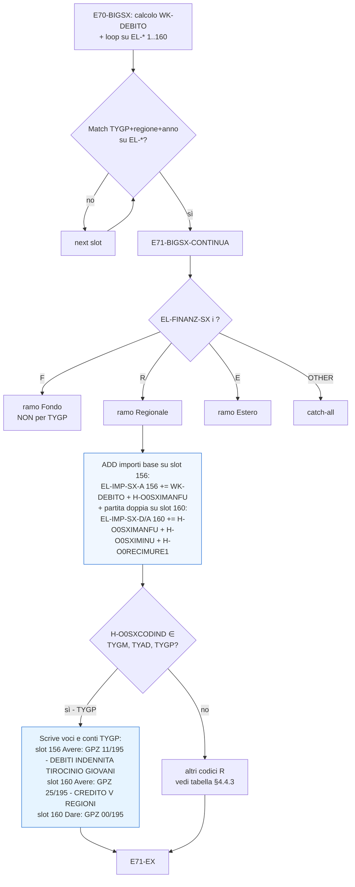

# Reengineering Calcolo e Pagamento Sussidi Straordinari

## Analisi Funzionale

### TYGP – Tirocinio PON Puglia 2023

---

## Premessa

Il presente documento descrive il modello di calcolo e le specifiche relative
alla prestazione **TYGP – Tirocinio PON Puglia 2023**, introdotta nel
sistema legacy il **14 marzo 2025** (rif. commenti `140325` nei sorgenti
COBOL).

La parte preliminare, comune a tutte le prestazioni, è presente nel documento
SPC32-COR-30-201-10834-001_1.0 (`SPCL3_INPS-AnalisiFunzionale`).

L'analisi è il risultato dell'estrazione tematica condotta sui 3 programmi
COBOL/CICS/DB2 della catena legacy:

- [`PIOSX41`](PIOSX41.txt) — calcolo dei sussidi straordinari (SX)
- [`PDSIO13`](PDSIO13.txt) — orchestratore del calcolo dei pagamenti
- [`PDSIO05`](PDSIO05.txt) — produzione del biglietto contabile

I deliverable intermedi consultabili sono:

- Pseudocodifiche AS-IS:
  [Pseudo_PIOSX41.md](Pseudo_PIOSX41.md),
  [Pseudo_PDSIO13.md](Pseudo_PDSIO13.md),
  [Pseudo_PDSIO05.md](Pseudo_PDSIO05.md)
- Estrazione tematica e regole di business:
  [STEP3-RegoleBusiness.md](STEP3-RegoleBusiness.md)
- Metodologia di analisi: [Istruzioni-TISM.md](Istruzioni-TISM.md)

---

# 1. Introduzione

## 1.1 Scopo del documento

Documentare il comportamento AS-IS della prestazione **TYGP – Tirocinio PON
Puglia 2023** nel sistema legacy COBOL/CICS/DB2 di calcolo e pagamento dei
sussidi straordinari, e fornire alla squadra di reingegnerizzazione gli
elementi di analisi necessari per:

1. Replicare correttamente la logica funzionale sulla nuova piattaforma TO-BE.
2. Identificare i punti di refactoring opportuno (debiti tecnici, dipendenze
   da rompere, hard-coding da parametrizzare).
3. Distinguere il trattamento di TYGP dalle prestazioni "cugine" come **TISC**
   (Tirocinio Inclusione Sociale Calabria), già oggetto di documento parallelo
   [2026.05.13.TISC-AnalisiFunzionale.md](2026.05.13.TISC-AnalisiFunzionale.md).

## 1.2 Ambito

L'ambito copre la **catena di esecuzione del calcolo e pagamento** per i
percipienti TYGP:

- Trigger di elaborazione (schedulazione, transazione CICS, COMMAREA in input).
- Calcolo dell'importo di indennità.
- Produzione del biglietto contabile con generazione di **partita doppia**
  (debito v/percipiente + credito v/Regione Puglia).
- Aggiornamento dei riepiloghi di elaborazione.

**Fuori scope**: gestione delle domande lato front-end, validazione
anagrafica, integrazione ARCA, servizi bancari di pagamento (oggetto del
documento comune `SPCL3`).

## 1.3 Glossario

| Termine            | Definizione |
|--------------------|-------------|
| TYGP               | Tirocinio PON Puglia 2023 — prestazione di politica attiva regionale finanziata dalla Regione Puglia (PON 2014-2020 / 2023). |
| PON                | Programma Operativo Nazionale (Fondo Sociale Europeo) — quota co-finanziata dalla Regione. |
| Sussidio Straordinario (SX) | Categoria contabile interna INPS che raggruppa indennità di tirocinio, recupero, anticipi, etc. |
| Biglietto contabile | Scrittura contabile riassuntiva del pagamento, prodotta come righe contabili (Dare/Avere con conto + voce). |
| Partita doppia      | Registrazione contabile con scrittura simultanea su un conto Avere e un conto Dare di pari importo. |
| Credito v/Regione   | Importo che la Regione (Puglia, in caso TYGP) deve rimborsare all'INPS per le indennità anticipate. |
| `EL-FINANZ-SX`      | Campo classificatorio (1 byte) che indica il tipo di finanziamento della prestazione: `F`=Fondo, `R`=Regionale, `E`=Estero/Esonero, SPACES=default. |
| `H-O0SXCODIND`      | Campo del record pagamento che contiene il codice della prestazione (es. `TYGP`). |
| `COMMAREADS`        | Struttura COMMAREA CICS che veicola input/output tra i programmi della catena. |
| Sirio Design System | Sistema di design dell'INPS (font, palette, stile tabellare). |

---

# 2. Quadro generale del programma

## 2.1 Inquadramento funzionale

**TYGP** è una prestazione di **politica attiva del lavoro regionale**
introdotta dalla Regione Puglia con il Programma Operativo Regionale (PON)
2023. L'INPS opera come **soggetto erogatore anticipatore**: paga al
percipiente l'indennità di tirocinio e successivamente recupera l'importo
dalla Regione Puglia tramite una scrittura contabile di credito.

Le caratteristiche distintive di TYGP, rispetto alle altre prestazioni SX
(es. TISC), sono:

1. **Ente finanziatore**: Regione Puglia (categoria contabile `R` =
   Regionale).
2. **Modello contabile**: partita doppia (debito v/percipiente + credito
   v/Regione).
3. **Famiglia di codici "cugini"**: `TYGM` (Garanzia Giovani Master), `TYAD`
   (Apprendistato Duale), `TYRG` (varia per regione), `TYBL` (Basilicata),
   `TYCR` (Calabria — tirocinio diverso da TISC), e — più in generale —
   tutta la famiglia dei **tirocini regionali** (`TG*`, `POR*`, `APA*`,
   `TIRA`, `PIAC`).

## 2.2 Posizionamento nel flusso

```
                ┌──────────────────────────────┐
                │      CICS / Transazione      │
                │   schedulata o utente        │
                └──────────────┬───────────────┘
                               │ LINK COMMAREADS
                               ▼
                ┌──────────────────────────────┐
                │  PDSIO01 (orchestratore)     │
                │  — invocato per ciascuna     │
                │    domanda da elaborare      │
                └─────┬────────────┬───────────┘
                      │            │
              CALL ▼            ▼ CALL
   ┌─────────────────────┐  ┌─────────────────────┐
   │  PDSIO13            │  │  PDSIO05            │
   │  calcolo pagamenti  │  │  biglietto cont.    │
   │  per la domanda     │  │  per la domanda     │
   └──────────┬──────────┘  └─────────────────────┘
              │ CALL (riga 6207) — ramo TYGP/TISC standard
              ▼
   ┌─────────────────────┐
   │  PIOSX41            │
   │  calcolo SX         │
   │  (importi, B99,     │
   │  trigger ricalcoli) │
   └─────────────────────┘
```

## 2.3 Principali interlocutori sistema

| Interlocutore                          | Ruolo |
|----------------------------------------|-------|
| **Regione Puglia**                     | Ente finanziatore. Riceve dall'INPS la rendicontazione delle indennità anticipate e ne effettua il rimborso. |
| **Percipiente** (giovane tirocinante)  | Beneficiario dell'indennità di tirocinio. |
| **Sede INPS territoriale**             | Esegue l'elaborazione (schedulata o manuale) e produce il biglietto contabile. |
| **Sotto-programmi contabili** (`PDSPD05/06/13/16`, `RDSPD05/06`) | Servizi di gestione blocchi, calcoli accessori, fetch dati. |
| **Tabella DB2 categorie contabili**    | Definisce la classificazione `EL-FINANZ-SX` per ciascun codice indennità. |
| **Database DB2** (tabelle `TDSSUSST`, `TDSREPORT`, `TDSDATCO`, `TDSO0*`, etc.) | Sorgente e destinazione dei dati di calcolo. |

---

# 3. Input e trigger di esecuzione

## 3.1 Modalità di esecuzione

L'elaborazione è invocata come **transazione CICS LINK** con passaggio di
`COMMAREADS`. La modalità tipica è **online** (`PROCEDURE DIVISION USING
COMMAREADS`), eventualmente innescata da:

- Processo schedulato a livello di infrastruttura IT (caso d'uso standard,
  cfr. doc TISC §1.1).
- Operatore di sede (richiesta manuale o ristampa).

## 3.2 Caso d'Uso: Calcolo e Pagamento TYGP

| Campo                | Valore |
|----------------------|--------|
| **Nome**             | *Calcolo e Pagamento TYGP* |
| **Id Caso d'uso**    | *UC TYGP-01* |
| **Attori**           | *Timer, Operatore Sede, Supervisore* |
| **Priorità**         | **Media** |
| **PreCondizioni**    | *L'attore esegue il caso d'uso a seguito dell'attivazione di un processo schedulato a livello sistemistico. La tabella DB2 categorie contabili contiene la riga TYGP con `H_FINANZ='R'`.* |

### 3.2.1 Scenario principale

1. Il sistema estrae tutte le domande di tipo **TYGP** con i dati della
   configurazione (filtro: `TDSSUSST.H_SSTCODIND = 'TYGP'`).
2. Per ciascuna domanda:
   - Acquisisce il blocco struttura tramite `CALL PDSPD16`.
   - Esegue il calcolo dei pagamenti via `PDSIO13` → `PIOSX41` (riga 6207).
   - Produce il biglietto contabile via `PDSIO05`.
   - Registra l'esito nel riepiloghi di elaborazione.

### 3.2.2 Scenario alternativo — Ristampa (`L-RICHIESTA = "R"`)

1. Il sistema riproduce il biglietto contabile sulla base dei dati già
   calcolati (`L-RETCODE = "C"`).
2. **Non aggiorna** la tabella di riepiloghi (`A10-AGGIORNA` esce
   immediatamente — vedi RX-02 del §6).

### 3.2.3 Scenario alternativo — Sede speciale `VALTOZAC`

1. Se `L-NOME-SEDE = "VALTOZAC"`, il programma `PDSIO05` esegue `GOBACK`
   immediato in `F00-FINALI` (riga 5408) **senza produrre output né
   aggiornare COMMAREADS-OUT**.
2. Comportamento documentato ma di **finalità non chiara** (rif. PA-27 →
   `Q-08` in App. B).

## 3.3 Parametri di ingresso (`COMMAREADS`)

| Campo            | Tipo   | Valori ammessi          | Uso TYGP                                                                |
|------------------|--------|--------------------------|--------------------------------------------------------------------------|
| `L-CODICE-SEDE`  | `9(04)`| codice sede INPS         | Sede di esecuzione |
| `L-NOME-SEDE`    | `x(22)`| stringa                  | Discriminante speciale: `"VALTOZAC"` → bypass `F00-FINALI` in `PDSIO05` |
| `L-CODICE-STOP`  | `9(02)`| codice struttura         | Struttura territoriale (Stop) |
| `L-NOME-STOP`    | `x(22)`| stringa                  | Nome struttura territoriale |
| `L-PROCEDURA`    | `x(03)`| codice procedura         | Procedura di calcolo (3 caratteri) |
| `L-TIPOCALCOLO`  | `x(01)`| `S`/altri                | `S` = simulazione (attiva il ramo I39-DSPF-M9 di PDSIO13); altri = produzione |
| `L-RICHIESTA`    | `x(01)`| `R`/altri                | `"R"` = ristampa: skippa `A10-AGGIORNA` |
| `L-PROGRESSIVO`  | `9(03)`| numerico                 | Progressivo del biglietto |
| `L-RETCODE`      | `x`    | `N`/`C`/`E`              | Input a `PDSIO05`: stato dell'elaborazione precedente |
| `LCODOPE`        | `x(02)`| codice operatore         | Operatore richiedente |
| `LLIVAUTO`       | `x(01)`| livello autorizzazione   | Profilo autorizzativo |
| `LMATRICOLA`     | `x(08)`| matricola percipiente    | Identificatore del soggetto |
| `L-DATAELABO`    | `9(08)`| `YYYYMMDD`               | Data di elaborazione |
| `FILLER`         | `x(26922)`| —                     | Area di trasporto dati di lavoro tra programmi |

## 3.4 Condizioni di partenza

Per attivare correttamente la logica TYGP, devono essere soddisfatte le
seguenti precondizioni:

| Condizione | Verifica nel codice |
|-----------|---------------------|
| Codice indennità della domanda = `TYGP` (in `H-O0SXCODIND`) | Letto da cursore `E30-DB2-FETCH` di `PDSIO05` |
| Tabella DB2 categorie contabili: riga TYGP presente con `H_FINANZ = "R"`, `H_CONTO1 = "GPZ11195"` (o equivalente) | Letta in `PDSIO05.I05-AZZERO` (riga 5768) e copiata in `EL-FINANZ-SX(i)` |
| Match `EL-COD-SX(i)=TYGP AND EL-REG-SX(i)=H-O0SXREGIND AND EL-ANNO-SX(i)=H-O0SXANNIND` | `PDSIO05.E70-BIGSX` righe 3433-3442 |
| `L-RETCODE` valorizzato dal chiamante (`N`/`C`/`E`) | `PDSIO05.C00-CENTRALI` righe 2513-2517 |
| `W-ERRORE ≠ "S"` | `PDSIO05.C00-CENTRALI` riga 2509 |

---

# 4. Flusso AS-IS

## 4.1 Vista macroscopica

L'elaborazione TYGP si articola in **3 fasi macroscopiche**:

| Fase | Programma | Paragrafi chiave | Output |
|------|-----------|------------------|--------|
| **A. Calcolo SX** | `PIOSX41` | MAIN → B00 (decision tree) → eventuale B99 (ricalcolo retroattivo per TYGP) | Importi calcolati, `OC-RETCODE` |
| **B. Calcolo pagamenti** | `PDSIO13` | MAIN → E24 (hub principale) → CALL `PIOSX41` riga 6207 (ramo standard TYGP/TISC) | Record pagamento popolato in DB2 |
| **C. Biglietto contabile** | `PDSIO05` | MAIN → C00 → E00/E70-BIGSX (loop) → E30/STAMPA-BIGLIETTO → F00 | Biglietto contabile a video DSPF + INSERT `TDSREPORT` |

## 4.2 Fase A — Calcolo SX in `PIOSX41`

Riferimento: [Pseudo_PIOSX41.md](Pseudo_PIOSX41.md) §3.

```
MAIN [righe 0001-XXXX]
  └─ B00 (decision tree): in base al codice prestazione e ai flag,
     instrada il calcolo
     └─ B99 (ricalcolo retroattivo):
        SE codice prestazione ∈ {TYGP, TYGM, TYAD, ...lista tirocini
        regionali...}
           forza ricalcolo dell'importo riferito al mese precedente
        ALTRIMENTI (es. TISC)
           nessun ricalcolo retroattivo
```

> **Regola RC-07** (vedi §6): il trigger B99 è la prima divergenza tra TYGP
> e TISC. Per TYGP, eventuali variazioni anagrafiche/contributive sulla
> Regione richiedono un riallineamento dello storico mensile (perché il
> credito v/Regione deve essere rideterminato). Per TISC, finanziato dal
> Fondo, questo non si verifica.

## 4.3 Fase B — Calcolo pagamenti in `PDSIO13`

Riferimento: [Pseudo_PDSIO13.md](Pseudo_PDSIO13.md) §4 e §7.

```
MAIN
  └─ E24 (hub principale, discrimina W-CODICEDUE = 42/44/45)
     └─ CALL PIOSX41 (3 punti):
        - riga 6185: ramo SXCOVID19
        - riga 6199: ramo TIPOCALCOLO speciale
        - riga 6207: RAMO TYGP/TISC STANDARD ← punto utilizzato per TYGP

  └─ E20-ELABORA20 (riga 2819):
     CALL RDSUT28 per lista codici inclusa {TYGP, TISC, TGOL, POR3-6,
        DLI2, TISM, TGOC, TGOV, TGOS, TGOP, TIRA, PIAC, ...}

  └─ I39-DSPF-M9 (riga 8925, ramo "tirocinio regionale in simulazione"):
     CALL RDSUT28 per lista codici inclusa {TYGP, ...solo tirocini
        regionali...}
     ⚠ TISC NON in lista (by-design: TISC = Fondo nazionale)
     ✅ TYGP in lista
```

> **Regola RX-04** (vedi §6): TYGP è incluso nella lista I39-DSPF-M9 (ramo
> "tirocinio regionale in simulazione"); TISC ne è escluso. Conferma del
> by-design e non bug latente.

## 4.4 Fase C — Biglietto contabile in `PDSIO05`

Riferimento: [Pseudo_PDSIO05.md](Pseudo_PDSIO05.md) §2 e §6.

### 4.4.1 Orchestrazione MAIN

```
MAIN [righe 2015-2019]
  ├─ I00-INIZIALI [5432]      : setup, accessi DB2, lock, popolamento EL-*
  ├─ C00-CENTRALI [2508-2551] : hub, discrimina su L-RETCODE
  └─ F00-FINALI   [5406-5429] : cleanup, GOBACK (con bypass VALTOZAC)
```

### 4.4.2 Hub `C00-CENTRALI`

```
SE W-ERRORE = "S"     -> exit immediato
SE L-RETCODE = "N"    -> loop E00-ELABORA fino W-FINE-ELABORA = "S"
SE L-RETCODE = "C"    -> E30-TOTALIZZA + STAMPA-BIGLIETTO + A10-AGGIORNA
SE L-RETCODE = altro
    SE H-PZEROPAGAM = "S" -> STAMPA-BIGLIETTO + A10-AGGIORNA (ristampa)
    ALTRIMENTI            -> exit silente
```

### 4.4.3 Cuore contabile TYGP: `E70-BIGSX` → `E71-BIGSX-CONTINUA`

**E70-BIGSX** (righe 3407-3454) — calcolo del `WK-DEBITO` e ricerca slot:

```
WK-DEBITO = H-O0SXIMINU + H-O0SXIMRINU
           - H-O0SXIRPEFU - H-O0SXTRASIND
           - H-O0SXADDIZR - H-O0SXADDIZC
           - H-O0SXCONG730 - H-O0SXCONGFIS
           - H-O0SXADDIZRR - H-O0SXADDIZRC

SE H-O0RECIMURE3 > 0:
    WK-DEBITO = WK-DEBITO - H-O0RECIMURE3

Loop IND-SX da 1 a 160:
    SE EL-COD-SX(IND-SX) = H-O0SXCODIND
       E EL-REG-SX(IND-SX) = H-O0SXREGIND
       E EL-ANNO-SX(IND-SX) = H-O0SXANNIND:
        PERFORM E71-BIGSX-CONTINUA
        forza IND-SX = 160 (uscita)
    ADD 1 TO IND-SX
```

**E71-BIGSX-CONTINUA** (righe 3456-4467) — applicazione contabile via
`EVALUATE EL-FINANZ-SX(IND-SX)`:

| Ramo `EVALUATE` | Tipologia | Codici di indennità coinvolti | Effetto per TYGP |
|-----------------|-----------|--------------------------------|------------------|
| `WHEN "F"` (Fondo) | Azioni politica attiva nazionali, esoneri, CIG, mobilità | ~70 codici (FT*, FS*, TR*, EE*, EJ*, EK*, EW*, EY*, EX*, DL76, SOMM, COIP, BRIO, APAF, **TISC**, TISM, ...) | NON applicabile (TYGP è in `R`) |
| **`WHEN "R"` (Regionale)** | Tirocini regionali, POR, APA regionali | ~30 codici (SSEP, **TYGM, TYAD, TYGP**, TYRG, TYBL, TYCR, RATM, RATA, APAR/2/3/4/5/6, DLIA, DLI2, PORM, POR2-6, TIPO, SRPT, SSRO, TGOL, TGOC, TGOV, TGOS, TGOP, TIRA, PIAC) | **Applicato a TYGP** — vedi §4.4.4 |
| `WHEN "E"` | Categoria Estero/Esonero | (lista non analizzata; tutti i codici con `H_FINANZ="E"`) | NON applicabile |
| `WHEN OTHER` | Default catch-all (SPACES o valori non previsti) | — | NON applicabile, ma potenziale fonte di squadrature |

### 4.4.4 Scritture contabili per TYGP (ramo `WHEN "R"`)

Dal codice (righe 3818-3852 di `PDSIO05`):

```cobol
WHEN "R"
*  --- importi sempre applicati (qualunque codice regionale)
   ADD WK-DEBITO       TO EL-IMP-SX-A(156)
   ADD H-O0SXIMANFU    TO EL-IMP-SX-A(156)
   ADD H-O0SXIMANFU    TO EL-IMP-SX-D(160), EL-IMP-SX-A(160)
   ADD H-O0SXIMINU     TO EL-IMP-SX-D(160), EL-IMP-SX-A(160)
   ADD H-O0RECIMURE1   TO EL-IMP-SX-D(160), EL-IMP-SX-A(160)

   IF H-O0SXCODIND = "SSEP"
       ADD H-O0RECIMURE2 TO EL-IMP-SX-D(160), EL-IMP-SX-A(160)
   END-IF

*  --- voci/conti specifici per TYGM/TYAD/TYGP
   IF H-O0SXCODIND = "TYGM" OR "TYAD" OR "TYGP"     [riga 3833-3835, commento 140325]
       MOVE "DEBITI INDENNITA TIROCINIO GIOVARI       "
                                  TO EL-VOCE-SX(156)
       MOVE "GPZ"                 TO EL-ALF-SX-A(156)
       MOVE "11195"               TO EL-NUM-SX-A(156)

       MOVE "CREDITO V/REGIONI INDENN. DI TIROCINIO   "
                                  TO EL-VOCE-SX(160)
       MOVE "GPZ"                 TO EL-ALF-SX-A(160)
       MOVE "25195"               TO EL-NUM-SX-A(160)

       MOVE "GPZ"                 TO EL-ALF-SX-D(160)
       MOVE "00195"               TO EL-NUM-SX-D(160)
   END-IF
```

**Effetto netto sul biglietto contabile** (3 righe scritte su slot 156 e 160):

| Slot | Conto Avere       | Conto Dare        | Importo                                                                | Voce |
|------|-------------------|-------------------|------------------------------------------------------------------------|------|
| 156  | `GPZ 11/195`      | (slot 156 invariato Dare; precaricato `GPZ 00/195` da tabella) | `WK-DEBITO + H-O0SXIMANFU`                                            | "DEBITI INDENNITA TIROCINIO GIOVANI" |
| 160  | `GPZ 25/195`      | `GPZ 00/195`      | `H-O0SXIMANFU + H-O0SXIMINU + H-O0RECIMURE1` (uguale Dare e Avere)    | "CREDITO V/REGIONI INDENN. DI TIROCINIO" |

Il codice numerico `11/195` rappresenta il **mastro 11 / conto 195** (sotto-conto Puglia); `25/195` è il conto credito v/Regione Puglia; `00/195` è la contropartita di Dare.

### 4.4.5 Fasi successive

```
└─ E30-TOTALIZZA  [4468]    : aggrega righe EL-* in totali Avere/Dare
   ├─ E33-TOTSX             : totale sussidi straordinari (incluso TYGP)
   └─ E33-DETSX             : dettaglio
└─ STAMPA-BIGLIETTO [4908]
   └─ EVALUATE WTIPODOM
      └─ WHEN "E" PERFORM STAMPA-SX  (TYGP rientra qui)
   ├─ STAMPA-SINDACATI
   ├─ STAMPA-RECUPERI
   └─ STAMPA-TOTALI
└─ A10-AGGIORNA  [2021]     : update riepiloghi (SKIP se L-RICHIESTA="R")
└─ F00-FINALI    [5406]
   ├─ SE L-NOME-SEDE="VALTOZAC": GOBACK immediato (riga 5408)
   ├─ PERFORM E45-STAMPA-RPT
   ├─ Set OUT-STATUS:
   │     IF OUT-STATUS='96'/'99' -> OUT-MESSAGGIO=VO-DSPFM034
   │     ELSE IF W-ERRORE='S'    -> OUT-STATUS='91' (squadratura)
   │     ELSE                    -> OUT-STATUS='00'
   ├─ MOVE COMMAREADS-OUT TO COMMAREADS
   └─ GOBACK (riga 5429)
```

## 4.5 Diagramma di flusso `E71-BIGSX-CONTINUA` per TYGP



---

# 5. Modello dati

## 5.1 Tabelle DB2 coinvolte

| Tabella           | Operazione | Programma | Scopo |
|-------------------|------------|-----------|-------|
| `TDSSUSST`        | SELECT     | `PDSIO05` (`LEGGI-TAB`, riga 8030) | Stato sussidio per chiave `H_SSTCHIDOM` |
| Tabella **categorie contabili** (sorgente di `I25-DB2-FETCH`) | FETCH cursore | `PDSIO05` (riga 5768) | Popola `EL-*(1..160)` con codice, regione, anno, voce, conto, **finanziamento** (`H-FINANZ`) per le 5 regioni configurate |
| Tabella **pagamenti** (sorgente di `E30-DB2-FETCH`) | FETCH cursore | `PDSIO05` (paragrafo `E20-ELABORA20`) | Legge record pagamento con `H-O0SXCODIND` (= TYGP), `H-O0SXREGIND`, importi |
| `TDSREPORT`       | INSERT     | `PDSIO05` (`S30-INSERT-REPORT`, riga 7595) | Audit del biglietto stampato |
| `TDSDATCO`        | SELECT     | `PDSIO13` (presumibile) | Dati comuni della domanda |
| `TDSDATAN`        | SELECT     | `PDSIO13` | Anagrafica richiedente |
| `TDSSX00`         | SELECT     | `PDSIO13` | Prestazione straordinaria |
| `TDSRECUP`        | SELECT     | `PDSIO13` | Recuperi e acconti |

> **Da chiarire (Q-15)**: lo schema esatto della tabella DB2 categorie
> contabili sorgente di `I25-DB2-FETCH` non è stato analizzato in dettaglio.

## 5.2 Campi chiave del record pagamento (`TDSO0*` o equivalente)

| Campo               | Tipo    | Uso TYGP |
|---------------------|---------|----------|
| `H-O0SXCODIND`      | `X(04)` | Codice indennità = `"TYGP"` |
| `H-O0SXREGIND`      | `X(03)` | Codice regione (atteso `"195"` = Puglia) |
| `H-O0SXANNIND`      | `9(04)` | Anno di competenza |
| `H-O0SXIMINU`       | `S9(11)V99` | Imponibile indennità — addendo principale di `WK-DEBITO` |
| `H-O0SXIMRINU`      | `S9(11)V99` | Imponibile rinuncia |
| `H-O0SXIRPEFU`      | `S9(11)V99` | IRPEF |
| `H-O0SXTRASIND`     | `S9(11)V99` | Trattenute sindacali |
| `H-O0SXADDIZR/C/RR/RC` | `S9(11)V99` | Addizionali regionali, comunali, e recuperi |
| `H-O0SXCONG730`     | `S9(11)V99` | Conguaglio 730 |
| `H-O0SXCONGFIS`     | `S9(11)V99` | Conguaglio fiscale |
| `H-O0SXIMANFU`      | `S9(11)V99` | **Assegno nucleo familiare** — genera partita doppia slot 160 |
| `H-O0RECIMURE1/2/3` | `S9(11)V99` | Recuperi (RE3 sottratto da `WK-DEBITO`; RE1 sempre sommato; RE2 solo se `SSEP`) |

## 5.3 Tabella di lavoro `EL-*(1..160)` (working storage `PDSIO05`)

Struttura ripetuta 160 volte (`OCCURS 160`):

| Sotto-campo       | Tipo     | Semantica |
|-------------------|----------|-----------|
| `EL-COD-SX(i)`    | `X(04)`  | Codice indennità della riga (es. `TYGP`) |
| `EL-REG-SX(i)`    | `X(03)`  | Codice regione (es. `195`) |
| `EL-ANNO-SX(i)`   | `9(04)`  | Anno |
| `EL-FINANZ-SX(i)` | `X(01)`  | Finanziamento: `F`/`R`/`E`/SPACES — discriminante `EVALUATE` |
| `EL-VOCE-SX(i)`   | `X(43)`  | Descrizione contabile (es. "DEBITI INDENNITA TIROCINIO GIOVANI") |
| `EL-PROG-SX(i)`   | `9(03)`  | Progressivo riga |
| `EL-ALF-SX-A(i)`  | `X(03)`  | Sigla conto Avere (es. `GPZ`, `GAU`) |
| `EL-NUM-SX-A(i)`  | `X(05)`  | Conto numerico Avere (es. `11195`) |
| `EL-99-SX-A(i)`   | `X(02)`  | Campo aux Avere |
| `EL-IMP-SX-A(i)`  | `S9(11)V99` | Importo Avere |
| `EL-ALF-SX-D(i)`  | `X(03)`  | Sigla conto Dare |
| `EL-NUM-SX-D(i)`  | `X(05)`  | Conto numerico Dare |
| `EL-99-SX-D(i)`   | `X(02)`  | Campo aux Dare |
| `EL-IMP-SX-D(i)`  | `S9(11)V99` | Importo Dare |

## 5.4 Schema slot riservati

| Slot | Categoria | Esempi |
|------|-----------|--------|
| 1-154 | Categorie caricate dinamicamente da tabella DB2 categorie | tutte le categorie con `H_FINANZ` valorizzato |
| **155** | Slot debito Fondo (Avere) | TISC, TISM |
| **156** | Slot debito Regionale (Avere) | **TYGP**, TYGM, TYAD |
| 157  | Slot debito categoria `E` + OTHER | — |
| 159  | Contropartita categoria `E` | — |
| **160** | Slot credito v/Regioni (Dare + Avere) | **TYGP**, TYGM, TYAD, TYRG, TYBL, TYCR |

## 5.5 Convenzioni di naming

| Prefisso | Significato | Esempi |
|----------|-------------|--------|
| `H-O0*`  | Host variable DB2 da copybook `O0` (record pagamento) | `H-O0SXCODIND`, `H-O0SXIMINU` |
| `L-*`    | Linkage / COMMAREA input | `L-RETCODE`, `L-PROCEDURA` |
| `W-*`, `WK-*` | Working storage / variabili di lavoro | `W-ERRORE`, `WK-DEBITO` |
| `EL-*`   | Elementi tabella biglietto contabile | `EL-COD-SX`, `EL-FINANZ-SX` |
| `OUT-*`  | Output COMMAREA | `OUT-STATUS`, `OUT-MESSAGGIO` |
| `GAU`/`GPZ`/`GVR` | Sigle di gestione contabile (piano dei conti INPS) | `GAU` Fondo / `GPZ` Regionale / `GVR` vari regionali |

---

# 6. Regole di business

Le regole sono classificate secondo la convenzione di
[Istruzioni-TISM.md](Istruzioni-TISM.md):

- `RE-xx` = eligibilità
- `RC-xx` = calcolo
- `RX-xx` = esclusione
- `RS-xx` = soglia
- `RD-xx` = dato/contabile
- `RO-xx` = operativa

## 6.1 Eligibilità (RE)

| ID    | Regola | Fonte |
|-------|--------|-------|
| **RE-01** | TYGP è elaborabile dai 3 programmi a partire dal **14/03/2025** (data introduzione nel sorgente). | Header `PIOSX41`, `PDSIO13`, `PDSIO05` |
| **RE-02** | TYGP è classificato in tabella DB2 categorie contabili con `H_FINANZ = "R"` (Regionale). Tutto il routing nei programmi deriva da questo attributo. | `PDSIO05 I05-AZZERO` riga 5768 |
| **RE-03** | Un codice indennità rientra nel calcolo TYGP solo se trova match esatto su tripla `(EL-COD-SX, EL-REG-SX, EL-ANNO-SX) = ("TYGP", H-O0SXREGIND, H-O0SXANNIND)`. | `PDSIO05 E70-BIGSX` 3433-3442 |
| **RE-04** | La tabella categorie contabili filtra le righe per **fino a 5 regioni configurate** (`H-REGIONE1..5`). Se la regione del soggetto non rientra in queste 5, la categoria TYGP non viene caricata e il biglietto risulta vuoto. | `PDSIO05 I05-AZZERO` righe 5755-5762 |
| **RE-05** | Il chiamante deve valorizzare `L-RETCODE`: `"N"` per calcolo iniziale, `"C"` per stampa/aggiornamento, `"E"` per gestione errore/ristampa. | `PDSIO05 C00-CENTRALI` 2513-2549 |

## 6.2 Calcolo (RC)

| ID    | Regola | Fonte |
|-------|--------|-------|
| **RC-01** | **Formula `WK-DEBITO` (debito al percipiente)**: `WK-DEBITO = H-O0SXIMINU + H-O0SXIMRINU − H-O0SXIRPEFU − H-O0SXTRASIND − H-O0SXADDIZR − H-O0SXADDIZC − H-O0SXCONG730 − H-O0SXCONGFIS − H-O0SXADDIZRR − H-O0SXADDIZRC`. Vale identicamente per TYGP, TISC e tutti i codici SX. | `PDSIO05 E70-BIGSX` 3419-3428 |
| **RC-02** | Correzione `WK-DEBITO`: se `H-O0RECIMURE3 > 0`, sottrarre ulteriormente: `WK-DEBITO −= H-O0RECIMURE3`. | `PDSIO05` 3429-3431 |
| **RC-03** | **Scritture contabili TYGP — slot 156 (debito v/percipiente)**: `EL-IMP-SX-A(156) += WK-DEBITO + H-O0SXIMANFU`. Voce: "DEBITI INDENNITA TIROCINIO GIOVANI", conto Avere `GPZ 11/195`. | `PDSIO05 E71-BIGSX-CONTINUA` ramo `WHEN "R"` 3819-3852 |
| **RC-04** | **Scritture contabili TYGP — slot 160 (credito v/Regione, partita doppia)**: `EL-IMP-SX-A(160) = EL-IMP-SX-D(160) = H-O0SXIMANFU + H-O0SXIMINU + H-O0RECIMURE1`. Voce: "CREDITO V/REGIONI INDENN. DI TIROCINIO", conto Avere `GPZ 25/195`, conto Dare `GPZ 00/195`. | `PDSIO05` 3820-3826, 3842-3851 |
| **RC-05** | TYGP è raggruppato nello stesso `IF` di `TYGM` (Garanzia Giovani Master) e `TYAD` (Apprendistato Duale): medesime voci, medesimi conti. | `PDSIO05` 3833-3852 |
| **RC-06** | **Trigger ricalcolo retroattivo (B99 di `PIOSX41`)**: per TYGP (in lista) viene forzato un ricalcolo dell'importo riferito al mese precedente. | `PIOSX41 B99` |
| **RC-07** | Il calcolo dei pagamenti TYGP utilizza il **ramo standard di `PDSIO13`** (`CALL PIOSX41` riga 6207), discriminato da `W-SXCOVID19=0 AND L-TIPOCALCOLO≠'S' AND W-NIK=0`. | `PDSIO13` 6207 |

## 6.3 Esclusione (RX)

| ID    | Regola | Fonte |
|-------|--------|-------|
| **RX-01** | Bypass sede `VALTOZAC`: se `L-NOME-SEDE = "VALTOZAC"`, `PDSIO05.F00-FINALI` esegue `GOBACK` immediato senza stampa né update. | `PDSIO05` 5407-5409 |
| **RX-02** | Bypass ristampa: se `L-RICHIESTA = "R"`, `A10-AGGIORNA` esce subito (nessun update riepilogo). | `PDSIO05` 2024-2026 |
| **RX-03** | Bypass errore: se `W-ERRORE = "S"`, `C00-CENTRALI` salta a `C00-EX` (nessuna elaborazione né stampa). | `PDSIO05` 2509-2512 |
| **RX-04** | Esclusione TISC dal ramo I39: lista `I39-DSPF-M9` di `PDSIO13` (tirocinio regionale in simulazione) include TYGP ma esclude TISC (TISC è Fondo, non Regionale). Comportamento by-design. | `PDSIO13` riga 8925 |

## 6.4 Soglia (RS)

| ID    | Regola | Fonte |
|-------|--------|-------|
| **RS-01** | Loop `IND-SX` su tabella `EL-*` limitato a 160 elementi (single-match con uscita anticipata `MOVE 160 TO IND-SX`). | `PDSIO05` 3433-3442 |
| **RS-02** | Slot riservati 155-160 in `EL-*` non sono caricabili dalla tabella categorie ma scritti solo da `E71-BIGSX-CONTINUA`. Vincolo strutturale del modello contabile. | `PDSIO05` §14 STEP 2 |
| **RS-03** | Squadratura biglietto: se la somma Avere ≠ somma Dare, `W-ERRORE = "S"` e `OUT-STATUS = '91'`. Per TYGP la partita doppia su slot 160 richiede equilibrio Dare/Avere esatto. | `PDSIO05 F00-FINALI` 5418 |

## 6.5 Dato/contabile (RD)

| ID    | Regola | Fonte |
|-------|--------|-------|
| **RD-01** | **Voce contabile TYGP (slot 156)**: "DEBITI INDENNITA TIROCINIO GIOVANI", conto Avere `GPZ 11/195`. | `PDSIO05` 3836-3841 |
| **RD-02** | **Voce contabile TYGP (slot 160)**: "CREDITO V/REGIONI INDENN. DI TIROCINIO", conto Avere `GPZ 25/195`, conto Dare `GPZ 00/195`. | `PDSIO05` 3842-3851 |
| **RD-03** | Codice regione `"195"` identifica la **Puglia** (TYGP). Codice regione `"232"` è usato da `TYRG` (regione diversa). | inferenza incrociata |
| **RD-04** | `EL-FINANZ-SX(i)` è popolato in `I05-AZZERO` (riga 5768) dal campo `H-FINANZ` letto dalla tabella DB2 categorie. È un **attributo persistente di configurazione**. | `PDSIO05` 5763-5786 |
| **RD-05** | Sigla conto a 3 caratteri: `GPZ` = "Gestione Politiche attive Zonali/regionali". Tutte le scritture TYGP usano `GPZ`. | inferenza incrociata |

## 6.6 Operativa (RO)

| ID    | Regola | Fonte |
|-------|--------|-------|
| **RO-01** | I 3 programmi sono invocati come transazioni CICS `LINK` con `COMMAREADS` come unico parametro. | `PROCEDURE DIVISION USING COMMAREADS` |
| **RO-02** | `PDSIO05` discrimina su `L-RETCODE`: `N`=calcolo, `C`=stampa+update, `E`/altro=ristampa condizionata. | `PDSIO05 C00-CENTRALI` |
| **RO-03** | `PDSIO13` chiama `PIOSX41` 3 volte (righe 6185, 6199, **6207**); per TYGP/TISC standard si usa la 6207. | `PDSIO13 E24` |
| **RO-04** | `PDSIO05` chiama 6 sotto-programmi (`PDSPD16` ×3, `RDSPD05`, `RDSPD06`, `PDSPD13`). Nessuna `CALL` a `PIOSX41` o `PDSIO13` (è un programma "foglia"). | `PDSIO05` |
| **RO-05** | Codici di ritorno `OUT-STATUS` di `PDSIO05`: `'00'`=ok / `'91'`=squadratura / `'96'`=errore funzionale / `'99'`=errore tecnico ereditato. | `PDSIO05 F00-FINALI` |
| **RO-06** | Nessun `COMMIT`/`ROLLBACK` esplicito: la transazione DB2 è gestita dal contenitore CICS / chiamante. Letture `WITH UR` (uncommitted read) tollerate. | `PDSIO05 LEGGI-TAB` 8034 |

---

# 7. Dipendenze

## 7.1 CALL in entrata (chiamanti)

| Programma | Chiamante | Note |
|-----------|-----------|------|
| `PIOSX41` | `PDSIO13` (3 punti confermati) + altri programmi della catena pagamenti | Non analizzato lo stack chiamante completo |
| `PDSIO13` | `PDSIO01` (orchestratore presunto) o transazione CICS utente | Da confermare con DBA / sistemista |
| `PDSIO05` | `PDSIO01` (orchestratore) o transazione CICS di stampa biglietto | Da confermare |

## 7.2 CALL in uscita (sotto-programmi)

| Programma | Sotto-programma | Frequenza | Scopo funzionale |
|-----------|-----------------|-----------|------------------|
| `PIOSX41` | numerosi (vedi [Pseudo_PIOSX41.md](Pseudo_PIOSX41.md) §7) | varia | Calcoli SX, sussidi, lock |
| `PDSIO13` | `PIOSX41` × 3 (righe 6185, 6199, 6207) | 3 | Calcoli SX condizionati |
| `PDSIO13` | `RDSUT28` | varia | Utility recupero (in liste discriminate per TYGP/TISC) |
| `PDSIO13` | `PDSPD04/06/07/13/16`, `RDSPD05/06`, `PIOSU41-44`, `PIOLP41`, `RDSCONT`, `RDSIO12/13`, `PDSIO21` | varia | Calcoli specifici |
| `PDSIO05` | `PDSPD16` (×3) | 3 | Gestione blocco struttura |
| `PDSIO05` | `RDSPD05` | 1 | Servizio ausiliario |
| `PDSIO05` | `RDSPD06` | 1 | Servizio ausiliario |
| `PDSIO05` | `PDSPD13` | 1 | Servizio di finalizzazione |

## 7.3 Sotto-programmi black-box (contratti opachi)

I seguenti sotto-programmi sono trattati come black-box nella presente
analisi; per la riscrittura TO-BE serve documentare separatamente
input/output, side-effects, codici di ritorno:

`PDSPD04`, `PDSPD06`, `PDSPD07`, `PDSPD13`, `PDSPD16`, `RDSPD05`, `RDSPD06`,
`RDSUT11`, `RDSUT14`, `RDSUT27`, `RDSUT28`, `PIOSU41-44`, `PIOLP41`,
`RDSCONT`, `RDSIO12`, `RDSIO13`, `PDSIO21`, `RDSSX41`, `PDSLOCK`,
`POPWMAIN`, `PITIBAN2`, `PNBTBLC2`, `PNBTCFIB`, `PNPGF8E`, `PNPGF110`,
`POPCF61`, `RPNPERR`.

---

# 8. Aspetti operativi

## 8.1 Codici di ritorno

### `PIOSX41` (`OC-RETCODE`)
Valori: `0` (ok), `11`-`20`, `22`, `24` (errori granulari catalogati nei
13 valori della pseudocodifica — vedi [Pseudo_PIOSX41.md](Pseudo_PIOSX41.md) §4).

### `PDSIO13` (`OC-RETCODE` + `OUT-STATUS`)
- `OC-RETCODE = 98` come errore generico
- `OUT-STATUS = '00'`/`'96'`/`'99'`

### `PDSIO05` (`OUT-STATUS` solo, senza `OC-RETCODE`)
| Codice | Origine | Significato |
|--------|---------|-------------|
| `'00'` | `I00-INIZIALI` 5434 / `F00-FINALI` 5423 | Successo |
| `'91'` | `F00-FINALI` 5418 (`IF W-ERRORE = "S"`) | **Squadratura biglietto contabile** (somma Avere ≠ somma Dare). Critico per TYGP per la partita doppia. |
| `'96'` | 9 testi `T*-TESTO*` (6683-6783) + `K10-SALTO1` + `I07-ACCESSO` + `W10-MSGERRORE` | Errore funzionale di controllo |
| `'99'` | mai assegnato direttamente; ereditato dai sotto-programmi | Errore tecnico (DB2, lock, etc.) |

> **Incoerenza tra programmi (debito tecnico)**: `PIOSX41` e `PDSIO13`
> usano `OC-RETCODE`; `PDSIO05` usa solo `OUT-STATUS`. Vedi `Q-11` in
> App. B.

## 8.2 Gestione errori

- **Squadratura contabile (TYGP-critico)**: il flag `W-ERRORE = "S"` è
  impostato in `E30-TOTALIZZA` quando i totali Avere e Dare non quadrano.
  Per TYGP, il modello a partita doppia su slot 160 deve mantenere Dare =
  Avere esattamente, altrimenti il biglietto è respinto con `OUT-STATUS =
  '91'` e messaggio "Squadratura Biglietto Cont.".

- **Errori funzionali**: i 9 testi `T*-TESTO*` impostano `OUT-STATUS = '96'`
  e popolano `OUT-MESSAGGIO` con il testo specifico (da catalogare in fase
  di migrazione).

- **Errori tecnici**: `OUT-STATUS = '99'` proviene dai sotto-programmi
  (`PDSPD05/06/13/16`, `RDSPD*`) ed è propagato in output da `PDSIO05`.

## 8.3 Transazionalità

- **Nessun COMMIT/ROLLBACK esplicito** nei 3 programmi: la transazione DB2
  è gestita dal contenitore CICS (commit alla fine della task) o dal
  chiamante (`PDSIO01`).
- Letture `WITH UR` (Uncommitted Read) in `LEGGI-TAB` di `PDSIO05` (riga
  8034) — tollerano lettura di dati non committati per ridurre lock.
- INSERT in `TDSREPORT` (`S30-INSERT-REPORT`) eseguito senza commit
  esplicito.

## 8.4 Modalità di esecuzione

- **Online (CICS)**: standard per i 3 programmi.
- **Batch**: possibile via job COBOL che simula la transazione CICS, non
  evidenziato direttamente nei sorgenti.
- **Output**: aree DSPF (`TESTASU-O`, `TESTLPU-O`, `TESTSX-O`) per
  visualizzazione + INSERT report DB2 (`TDSREPORT`) per archiviazione.

## 8.5 Tracciamenti

- `S30-INSERT-REPORT` (`PDSIO05` 7595) inserisce righe di audit in
  `TDSREPORT`.
- `WABNDB-LABEL` / `WABNDB-TABL` / `WABNDB-FUNC` valorizzati prima di ogni
  punto di rischio per *abend diagnostics*.
- `DISPLAY` di emergenza su `SQLCODE ≠ 0` (es. `PDSIO05` riga 8039).

---

# 9. Considerazioni TO-BE

> Proposte di refactoring identificate durante l'analisi AS-IS. Le scelte
> di implementazione TO-BE sono di pertinenza del team di progettazione
> della nuova piattaforma; questa sezione fornisce solo gli **input
> conoscitivi**.

## 9.1 Aree di refactoring

### R-01 — Astrazione tabellare degli `IF` codice-prestazione
**Osservazione**: in `PDSIO05.E71-BIGSX-CONTINUA` (e in molti altri
punti) il routing contabile si basa su catene di `IF H-O0SXCODIND =
"XXXX" OR "YYYY" OR ...`. Ogni nuova prestazione (es. `TGOV`, `TGOS`,
`TGOP`, `TIRA`, `PIAC`, `TYGP` stesso) ha richiesto una modifica al
sorgente.

**Proposta TO-BE**: spostare la mappatura *codice prestazione → voce
contabile + conti + slot* in una **tabella di configurazione** (db o
JSON), in modo che nuove prestazioni siano gestibili tramite
configurazione anziché modifica codice. Il campo `H_FINANZ` della
tabella categorie è già un primo passo in questa direzione.

### R-02 — Uniformazione codici di ritorno
**Osservazione**: `PIOSX41`/`PDSIO13` usano `OC-RETCODE`; `PDSIO05` usa
`OUT-STATUS`. Convenzioni eterogenee complicano il debug e il
monitoraggio centralizzato.

**Proposta TO-BE**: definire un **modello unico di response object**
(es. `ResponseDTO { status, errorCode, errorMessage, retCode }`)
condiviso da tutti i micro-servizi della catena.

### R-03 — Eliminazione del bypass `VALTOZAC`
**Osservazione**: `PDSIO05.F00-FINALI` 5407-5409 contiene un bypass
hard-coded per la sede `"VALTOZAC"`, di scopo non documentato.

**Proposta TO-BE**: se è dead code, rimuovere; se è un ambiente di test
attualmente attivo, esternalizzare il discriminante in configurazione
(profili "test"/"prod"). Risoluzione di `Q-08` necessaria prima del
go-live.

### R-04 — Parametrizzazione slot riservati `EL-*(155-160)`
**Osservazione**: lo schema slot 155=Fondo, 156=Regionale, 157=Estero,
159=contropartita-E, 160=credito-v/Regione è **convenzionale e
hard-coded**. Aggiungere una nuova categoria di finanziamento
(ipotetica `EL-FINANZ-SX = "P"` = Pubblico locale) richiederebbe
modifica strutturale del codice.

**Proposta TO-BE**: rendere parametrica la **mappa categoria →
slot/conti** in tabella di configurazione.

### R-05 — Eliminazione dei filler dimensionati hardcoded
**Osservazione**: `FILLER PIC X(26922)` nella `COMMAREADS` riflette il
trasporto di un'area di lavoro di dimensione fissa, indipendente dal
caso d'uso.

**Proposta TO-BE**: passare a strutture dati tipizzate per caso d'uso
(es. DTO TYGP-specifico, DTO TISC-specifico).

### R-06 — Trasformazione "biglietto contabile" in evento contabile
**Osservazione**: il biglietto contabile è generato come stampa DSPF +
INSERT report. È un'**artefatto di processo batch/online sincrono**.

**Proposta TO-BE**: trasformare la generazione del biglietto in un
**evento contabile** (es. messaggio Kafka `accounting.entry.generated`)
consumabile da:
- un servizio di archiviazione (sostituisce `TDSREPORT`),
- un servizio di visualizzazione (sostituisce DSPF),
- un servizio di rendicontazione verso la Regione (per TYGP).

## 9.2 Debiti tecnici evidenziati

| ID    | Debito tecnico | Riferimento |
|-------|----------------|-------------|
| DT-01 | Doppio `IF SSEP` in `PDSIO05.E71-BIGSX-CONTINUA` WHEN "R" (righe 3829 e 4146) — potenziale somma doppia di importi | `Q-05` |
| DT-02 | Catch-all `WHEN OTHER` senza contropartita Dare → potenziale fonte squadrature `'91'` | `Q-07` |
| DT-03 | Bypass `VALTOZAC` non documentato | `Q-08` |
| DT-04 | Convenzioni di ritorno eterogenee tra programmi | `Q-11` |
| DT-05 | Hard-coding di codici regione (`"195"` = Puglia, `"232"` = altra) — non parametrizzato | RD-03 |
| DT-06 | Tabella categorie contabili non documentata (sorgente `I25-DB2-FETCH`) — black-box | `Q-15` |

## 9.3 Dipendenze da rompere

Le seguenti dipendenze rendono fragile la riscrittura **incrementale**:

1. **Accoppiamento sintattico via COMMAREA `x(26922)` filler**: ogni
   modifica al layout di `PDSIO13` impatta `PDSIO05` e viceversa.
2. **Hard-coding del codice indennità** in catene `IF` lunghe (~70 codici
   in WHEN "F", ~30 in WHEN "R").
3. **Dipendenza dalla tabella `EL-*(160)` come "memoria condivisa"** tra
   `I05-AZZERO`, `E70-BIGSX`, `E30-TOTALIZZA`, `STAMPA-BIGLIETTO`.

## 9.4 Opportunità di parametrizzazione

| Area | Parametro | Vantaggio |
|------|-----------|-----------|
| Codici prestazione → voce + conti | Tabella `prestazione_contabile` (CSV/DB) | Aggiunta di nuove prestazioni senza modifica codice |
| Schema slot riservati | Configurazione "policy contabile" | Flessibilità contabile |
| Bypass sede | Profilo ambiente (dev/test/prod) | Eliminazione hard-coding `VALTOZAC` |
| Codici regione | Tabella `regioni_inps` | Localizzazione dei testi e dei conti |

---

# Appendice A — Ambiguità e questioni aperte (PA-XX)

Punti aperti residui dalla pseudocodifica AS-IS dei 3 programmi.

| ID | Programma | Descrizione | Stato |
|----|-----------|-------------|-------|
| PA-10 | `PDSIO05` | Mapping fine dei 10 addendi di `WK-DEBITO` con i campi del copybook `O0` non analizzato in dettaglio | Parziale |
| PA-11 | `PDSIO05` | Semantica precisa di `H-O0RECIMURE1/2/3` (recuperi) | Parziale |
| PA-16 | `PDSIO05` | Chi/quando valorizza `H-PZEROPAGAM` | Aperto |
| PA-19 | `PDSIO05` | Scopo del paragrafo `E45-STAMPA-RPT` (report parallelo) | Aperto |
| PA-20 | `PDSIO05` | Contenuto degli INSERT su `TDSREPORT` (`S30-INSERT-REPORT`) | Aperto |
| PA-23 | `PDSIO05` | Tabella DB2 sorgente di `H-O0SXCODIND` (cursore `E30-DB2-FETCH`) | Aperto |
| PA-24 | tutti | Contratto I/O dei sotto-programmi black-box | Aperto |
| PA-27 | `PDSIO05` | Sede `VALTOZAC` — bypass hard-coded di significato non documentato | Aperto |
| PA-28 | `PDSIO05` | Doppio `IF H-O0SXCODIND = "SSEP"` in WHEN "R" (righe 3829 e 4146) | Aperto |
| PA-29 | `PDSIO05` | TYGP nell'header senza data fine: gestione "a regime" o con scadenza? | Aperto |

---

# Appendice B — Domande funzionali per i business owner

Riformulazione delle ambiguità tecniche in domande funzionali, organizzate
per cluster tematico (rif. [STEP3-RegoleBusiness.md](STEP3-RegoleBusiness.md) §6).

## B.1 Classificazione contabile

- **Q-01** — Conferma classificazione TYGP: TYGP è effettivamente un
  "tirocinio finanziato dalla Regione Puglia con anticipo INPS e rivalsa
  contabile" e quindi correttamente raggruppato con TYGM/TYAD nel ramo
  `WHEN "R"`?
- **Q-03** — Periodo di validità TYGP: la gestione è "a regime"
  (continuativa) o ha scadenza nota?

## B.2 Integrità modello contabile

- **Q-05** — Doppio `IF SSEP` in `PDSIO05` WHEN "R" (righe 3829 e 4146):
  bug o by-design?
- **Q-06** — Categoria `EL-FINANZ-SX = "E"`: lista dei codici attivi?
- **Q-07** — Catch-all `WHEN OTHER`: in quali casi si attiva? Rischio
  squadrature?
- **Q-08** — Sede `"VALTOZAC"`: ambiente di test ancora utilizzato o
  dead code?

## B.3 Coerenza tra programmi

- **Q-10** — Trigger B99 in `PIOSX41`: il ricalcolo retroattivo al mese
  precedente per TYGP è la regola voluta?
- **Q-11** — Convenzione `OC-RETCODE` vs `OUT-STATUS`: uniformare nel
  TO-BE?

## B.4 Dati mancanti

- **Q-15** — Schema della tabella DB2 categorie contabili (sorgente di
  `I25-DB2-FETCH`)?
- **Q-16** — Copybook `O0` (record pagamento) per mapping completo
  campi `H-O0SX*`?
- **Q-17** — Semantica RE1 vs RE2 (solo SSEP) vs RE3 (sottratto da
  `WK-DEBITO`)?
- **Q-18** — Origine di `H-PZEROPAGAM` (input COMMAREA o calcolato)?

## B.5 Evoluzione

- **Q-19** — Nuove gestioni 2025-2026 (TGOV/TGOS/TGOP/TIRA/PIAC) seguono
  pattern coerente con TYGP → opportunità di refactoring tabellare?
- **Q-20** — Schema slot riservato 155-160: tollerabile come
  convenzione o da parametrizzare?

---

# Appendice C — Mapping pseudocodifica → capitoli

Tracciabilità tra il presente documento di Analisi Funzionale e i file
di pseudocodifica AS-IS.

| Capitolo del documento | File pseudocodifica | Sezione/i di riferimento |
|------------------------|----------------------|---------------------------|
| Cap. 1 (Introduzione) | — | Premessa metodologica |
| Cap. 2 (Quadro generale) | [Pseudo_PDSIO05.md](Pseudo_PDSIO05.md) | §1 (sintesi), §18 (sintesi divergenza TYGP/TISC) |
| Cap. 3 (Input e trigger) | [Pseudo_PDSIO05.md](Pseudo_PDSIO05.md) | §3 (LINKAGE COMMAREADS), §10 (F00-FINALI) |
| Cap. 4 (Flusso AS-IS) | [Pseudo_PIOSX41.md](Pseudo_PIOSX41.md), [Pseudo_PDSIO13.md](Pseudo_PDSIO13.md), [Pseudo_PDSIO05.md](Pseudo_PDSIO05.md) | tutte le sezioni "flusso" / Mermaid |
| Cap. 5 (Modello dati) | [Pseudo_PDSIO05.md](Pseudo_PDSIO05.md) | §4 (variabili globali), §13 (popolamento `EL-FINANZ-SX`), §14 (slot riservati) |
| Cap. 6 (Regole business) | [STEP3-RegoleBusiness.md](STEP3-RegoleBusiness.md) | §3 (RE/RC/RX/RS/RD/RO) |
| Cap. 7 (Dipendenze) | [STEP3-RegoleBusiness.md](STEP3-RegoleBusiness.md), [Pseudo_PDSIO05.md](Pseudo_PDSIO05.md) | §4 dipendenze + §7 CALL |
| Cap. 8 (Operativi) | [Pseudo_PDSIO05.md](Pseudo_PDSIO05.md) | §9 (OUT-STATUS), §10 (F00-FINALI) |
| Cap. 9 (TO-BE) | [STEP3-RegoleBusiness.md](STEP3-RegoleBusiness.md) | §6.6 (Q-19/Q-20 evoluzione) |
| App. A (PA-XX) | [Pseudo_PIOSX41.md](Pseudo_PIOSX41.md), [Pseudo_PDSIO13.md](Pseudo_PDSIO13.md), [Pseudo_PDSIO05.md](Pseudo_PDSIO05.md) | §PA-XX di ciascun file |
| App. B (Domande) | [STEP3-RegoleBusiness.md](STEP3-RegoleBusiness.md) | §6 (Q-01÷Q-20) |
| App. C (Mapping) | — | presente |

---

*Fine documento.*

Documento prodotto secondo metodologia [Istruzioni-TISM.md](Istruzioni-TISM.md).
Riferimenti di riga 1-based sui sorgenti
[PIOSX41.txt](PIOSX41.txt) (CHGMBAS),
[PDSIO13.txt](PDSIO13.txt) (PDSNA13bis),
[PDSIO05.txt](PDSIO05.txt).
