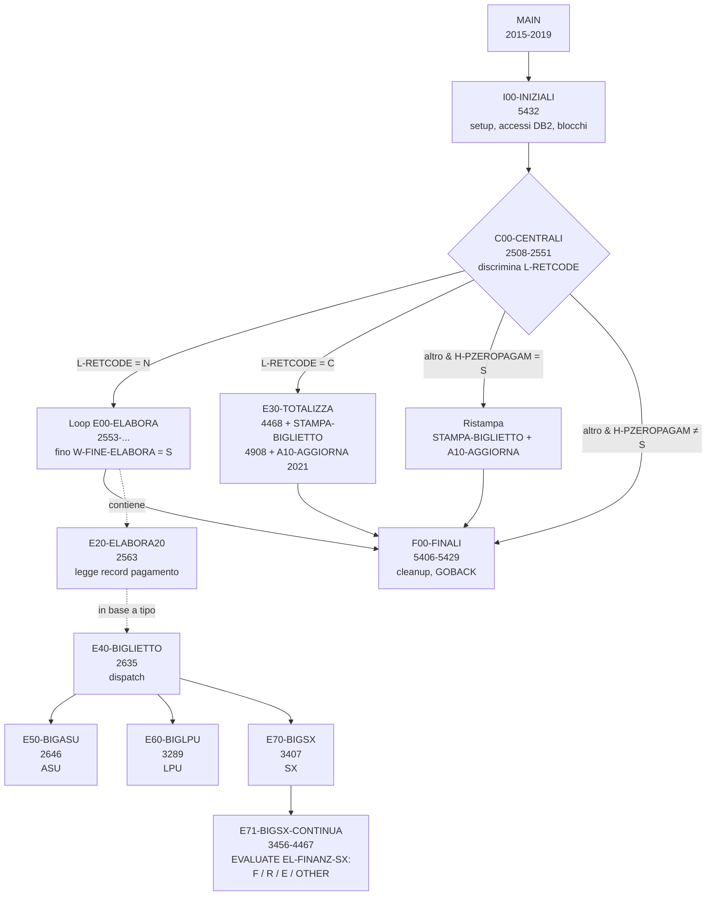
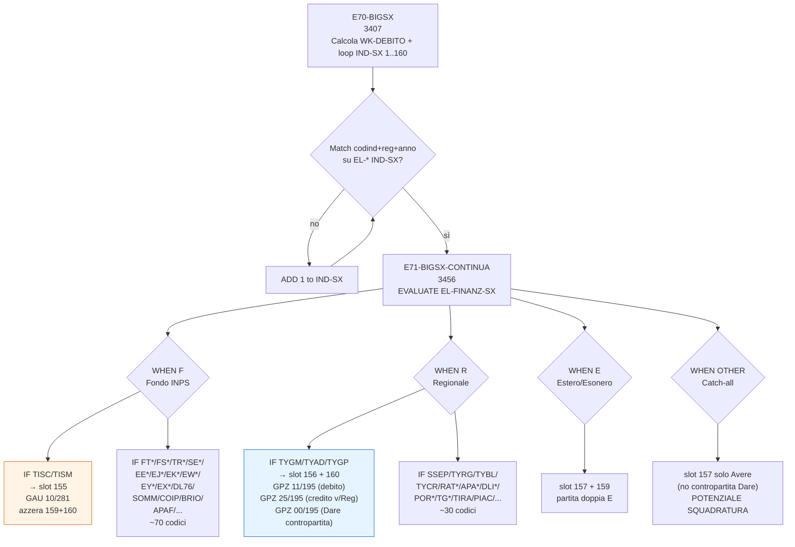

# Pseudocodifica `PDSIO05` — STEP 1 + STEP 2

> Programma COBOL/CICS/DB2 (IBM AS400) — **Biglietto contabile dei pagamenti**.
>
> Origine: [PDSIO05.txt](PDSIO05.txt) — 8.080 righe, 129 paragrafi PROCEDURE.
> `PROGRAM-ID PDSIO05` (riga 3), `AUTHOR MASI-MONGELLI` (riga 4).
> Allineato al programma AS400 vers. 23.02.2011; ultima modifica nel sorgente: **15.04.2026 — Elena** (gestione `TIRA` e `PIAC` Abruzzo).
> Riferimenti TYGP: **14.03.2025 — Elena** — *"inserita gestione TYGP - Tirocinio PON Puglia, 2023"* (header riga 32-34).
> Metodologia: [Istruzioni-TISM.md](Istruzioni-TISM.md).

---

## 1. Sintesi funzionale

`PDSIO05` produce il **biglietto contabile** (= scrittura contabile riassuntiva) di un calcolo pagamenti per una struttura/procedura/data-elaborazione. È un programma "fratello" di [PDSIO13.txt](PDSIO13.txt): mentre `PDSIO13` calcola gli importi puntuali per soggetto/periodo, `PDSIO05` **aggrega** quei risultati in righe contabili (Avere/Dare con conti, importi, voci) e ne produce la stampa del biglietto.

Il programma ha due modalità di funzionamento, discriminate da `L-RETCODE` ricevuto in `COMMAREADS`:

| `L-RETCODE` | Significato                                  | Comportamento                                            |
|-------------|----------------------------------------------|----------------------------------------------------------|
| `"N"`       | Calcolo non ancora effettuato                 | Esegue il calcolo elaborando i pagamenti (`E00-ELABORA` in loop fino a fine archivio). |
| `"C"`       | Calcolo completato correttamente              | Totalizza, stampa il biglietto e aggiorna riepilogo (`E30-TOTALIZZA` + `STAMPA-BIGLIETTO` + `A10-AGGIORNA`). |
| `"E"` o altro | Errore o stato anomalo                      | Eventuale ristampa se `H-PZEROPAGAM = "S"`, altrimenti chiude senza output. |

La logica contabile separa **tre famiglie di biglietti** (paragrafi `E50-BIGASU`, `E60-BIGLPU`, `E70-BIGSX`), che riempiono tabelle distinte di righe contabili (`EL-*` array da 160 elementi) successivamente totalizzate (`E31-TOTASU` / `E32-TOTLPU` / `E33-TOTSX`) e stampate (`STAMPA-ASU` / `STAMPA-LPU` / `STAMPA-SX`).

- **ASU** (Attività Socialmente Utili): paragrafi `E50-*` (`E510-VECCHIE`, `E520-NUOVE-2`, `E530-NUOVE-3`, `E535-REGIO-3`, `E540-NUOVE-4`, `E550-NUOVE-5`, `E560-REGIO-6`, `E570-50FO-50REG`, `E580-40FO-60REG`).
- **LPU** (Lavoratori di Pubblica Utilità): paragrafo `E60-BIGLPU`.
- **SX** (Sussidi straordinari / interventi occupazionali speciali): paragrafi `E70-BIGSX` + `E71-BIGSX-CONTINUA` (righe 3407-4467). **Qui ricade tutta la logica TYGP/TISC**.

---

## 2. Flusso di controllo



### MAIN canonico (righe 2015-2019)
```
MAIN.
    perform  I00-INIZIALI      thru  I00-EX.
    perform  C00-CENTRALI      thru  C00-EX.
    perform  F00-FINALI        thru  F00-EX.
MAIN-EX. exit.
```

### `C00-CENTRALI` (righe 2508-2551) — hub principale
```
C00-CENTRALI.
    if W-ERRORE = "S"          -> goto C00-EX                       [uscita anticipata]
    if L-RETCODE = "N"
        perform E00-ELABORA thru E00-EX until W-FINE-ELABORA = "S"  [modalità calcolo]
    if L-RETCODE = "C"
        perform E30-TOTALIZZA thru E30-EX                            [modalità stampa]
        perform STAMPA-BIGLIETTO thru EX-BIGLIETTO
        perform A10-AGGIORNA thru A10-EX
    else                                                             [L-RETCODE = "E" o altro]
        if H-PZEROPAGAM = "S"                                        [ristampa "zero pagamento"]
            perform STAMPA-BIGLIETTO thru EX-BIGLIETTO
            perform A10-AGGIORNA thru A10-EX
```

### Uscite (`GOBACK`)
- Riga **5408**: `then goback` (condizionato, ramo intermedio di `F00-FINALI`).
- Riga **5429**: `Goback.` (uscita normale, fine `F00-FINALI`).

Nessuno `STOP RUN`; nessun `ABEND` esplicito.

---

## 3. LINKAGE `COMMAREADS` (righe 1992-2012)

```
01  COMMAREADS.
    03  LAREA1.
       05 L-CODICE-SEDE         pic 9(04).
       05 L-NOME-SEDE           pic x(22).
       05 L-CODICE-STOP         pic 9(02).
       05 L-NOME-STOP           pic x(22).
       05 L-PROCEDURA           pic x(03).
       05 L-TIPOCALCOLO         pic x(01).
       05 L-RICHIESTA           pic x(01).
       05 L-PROGRESSIVO         pic 9(03).
       05 L-RETCODE             pic x.
*         "N" = Non effettuata | "C" = Completata | "E" = Errore
    03  LAREA-D.
       05 LCODOPE               pic x(02).
       05 LLIVAUTO              pic x(01).
       05 LMATRICOLA            pic x(08).
    03  L-DATAELABO             pic 9(08).
    03  FILLER                  PIC X(26922).      [stesso layout PDSIO13]
```

Discriminanti principali per il funzionamento:
- `L-RETCODE` → modalità (`N` calcolo / `C` stampa / `E` errore).
- `L-RICHIESTA` → `"R"` = ristampa: in `A10-AGGIORNA` esce subito senza aggiornare (riga 2024-2026).
- `L-PROCEDURA`, `L-CODICE-SEDE`, `L-CODICE-STOP`, `L-DATAELABO` → chiavi per il biglietto.
- `L-TIPOCALCOLO` → tipo di elaborazione (effettivo / simulazione, come in `PDSIO13`).

---

## 4. Variabili globali chiave

### Tabella righe contabili `EL-*` (160 elementi, working storage)
Array popolato in working / da letture DB2 e usato come *staging* del biglietto contabile. Strutture per riga (indice 1..160):
- `EL-COD-SX(i)` — codice indennità (matching key)
- `EL-REG-SX(i)` — codice regione
- `EL-ANNO-SX(i)` — anno
- `EL-FINANZ-SX(i)` — **tipo di finanziamento**: `"F"` (Fondo) / `"R"` (Regionale) / `"E"` / spazi. Discriminante centrale dell'`EVALUATE` in `E71-BIGSX-CONTINUA` (riga 3465). Inizializzato a `SPACES` (riga 1854).
- `EL-VOCE-SX(i)` — descrizione contabile (es. *"DEBITO AZIONI POL. ATTIVA DLGS 148/2015"*).
- `EL-ALF-SX-A(i)`, `EL-NUM-SX-A(i)` — conto **Avere** (alfabetico + numerico, es. `GAU` + `10/281`).
- `EL-ALF-SX-D(i)`, `EL-NUM-SX-D(i)` — conto **Dare**.
- `EL-IMP-SX-A(i)`, `EL-IMP-SX-D(i)` — importi Avere e Dare.
- `EL-99-SX-A(i)`, `EL-99-SX-D(i)` — campi aux (probabilmente codici riga).

### Formula del **DEBITO** in `E70-BIGSX` (righe 3419-3431)
```
WK-DEBITO =   H-O0SXIMINU     [imponibile indennità]
            + H-O0SXIMRINU    [imponibile rinuncia]
            - H-O0SXIRPEFU    [IRPEF]
            - H-O0SXTRASIND   [trattenute sindacali]
            - H-O0SXADDIZR    [addizionale regionale]
            - H-O0SXADDIZC    [addizionale comunale]
            - H-O0SXCONG730   [conguaglio 730]
            - H-O0SXCONGFIS   [conguaglio fiscale]
            - H-O0SXADDIZRR   [addizionale regionale recupero]
            - H-O0SXADDIZRC   [addizionale comunale recupero]
IF H-O0RECIMURE3 > 0
    WK-DEBITO = WK-DEBITO - H-O0RECIMURE3
END-IF
```

### Discriminanti contabili in `E71-BIGSX-CONTINUA`
- `H-O0SXCODIND` — codice tipologia indennità/intervento (TISC, TISM, TYGP, TYGM, TYAD, TYRG, SSEP, SSIS, FTMD, FTAD, …). **È la chiave funzionale che distingue TYGP da TISC**.
- `H-O0SXREGIND` — codice regione dell'indennità.
- `H-O0SXANNIND` — anno.
- Loop `IND-SX` da 1 a 160 alla ricerca della riga con tripla `EL-COD-SX = H-O0SXCODIND` AND `EL-REG-SX = H-O0SXREGIND` AND `EL-ANNO-SX = H-O0SXANNIND` (righe 3433-3442); al match esegue `E71-BIGSX-CONTINUA`.

### Stato / flag
- `W-ERRORE` (`"S"`/altro) — short-circuit di `C00-CENTRALI`.
- `W-FINE-ELABORA` (`"S"`/altro) — condizione di uscita del loop `E00`.
- `H-PZEROPAGAM` (`"S"`/altro) — flag "zero pagamento" → forza ristampa anche su `L-RETCODE` ≠ `"C"`.

---

## 5. Mappa dei paragrafi (129)

Raggruppati per famiglia funzionale.

### A — Aggiornamento e finalizzazione elaborazione
| Riga  | Paragrafo         | Funzione |
|-------|-------------------|----------|
| 2021  | `A10-AGGIORNA`     | Aggiorna riepilogo elaborazione (skippato se `L-RICHIESTA = "R"`). |
| 2103  | `A10-FLAGYNCORSO`  | Gestisce flag elaborazione in corso. |
| 2391  | `A12-UPD-RIEPILOGO`| Esegue UPDATE DB2 (cfr. `A12-DB2-UPDATE`). |
| 2432  | `A14-FINE-ELAB`    | Chiude la sessione di elaborazione. |
| 2464  | `A20-TELEMATICO`   | Gestione output telematico. |

### C — Hub centrale
| Riga  | Paragrafo         | Funzione |
|-------|-------------------|----------|
| 2508  | `C00-CENTRALI`     | Hub: discrimina su `L-RETCODE` (N/C/altro). |

### E (calcolo) — Loop elaborazione e biglietti contabili
| Riga  | Paragrafo            | Funzione |
|-------|----------------------|----------|
| 2553  | `E00-ELABORA`         | Driver del loop di elaborazione. |
| 2563  | `E20-ELABORA20`       | Legge un record pagamento (`FETCH E30-DB2-FETCH`). |
| 2635  | `E40-BIGLIETTO`       | Dispatch per tipologia → `E50` / `E60` / `E70`. |
| 2646  | `E50-BIGASU`          | Biglietto ASU. |
| 2842  | `E510-VECCHIE`        | ASU vecchio regime. |
| 2873-3083 | `E511-71` … `E516-76` | ASU vecchio regime, codici 71-76. |
| 3094-3289 | `E520-NUOVE-2` … `E580-40FO-60REG` | ASU regimi 2-6, mix Fondo/Regione. |
| 3289  | `E60-BIGLPU`          | Biglietto LPU (Lavoratori di Pubblica Utilità). |
| 3407  | `E70-BIGSX`           | Biglietto SX (Sussidi straordinari): calcolo `WK-DEBITO`, loop su `IND-SX`. |
| 3456  | `E71-BIGSX-CONTINUA`  | Cuore contabile SX: `EVALUATE EL-FINANZ-SX (F/R/E/OTHER)`. **Contiene la divergenza TYGP↔TISC**. |
| 2115-2388 | `E45-STAMPA-RPT`, `E45-LEGGI-CONTO` | Stampa report intermedio. |

### E (totalizzazione)
| Riga  | Paragrafo         | Funzione |
|-------|-------------------|----------|
| 4468  | `E30-TOTALIZZA`    | Driver totalizzazione (chiama `E31`/`E32`/`E33`). |
| 4480  | `E31-TOTASU`       | Totalizza ASU. |
| 4610  | `E31-DETASU`       | Dettaglio ASU. |
| 4681  | `E32-TOTLPU`       | Totalizza LPU. |
| 4720  | `E32-DETLPU`       | Dettaglio LPU. |
| 4791  | `E33-TOTSX`        | Totalizza SX. |
| 4836  | `E33-DETSX`        | Dettaglio SX. |

### STAMPA — Output biglietto
| Riga  | Paragrafo            | Funzione |
|-------|----------------------|----------|
| 4908  | `STAMPA-BIGLIETTO`    | Driver di stampa. |
| 4956  | `STAMPA-ASU`          | Stampa biglietto ASU. |
| 5070  | `STAMPA-RIGA-ASU`     | Stampa singola riga ASU. |
| 5091  | `STAMPA-LPU`          | Stampa biglietto LPU. |
| 5112  | `STAMPA-RIGA-LPU`     | Stampa singola riga LPU. |
| 5133  | `STAMPA-SX`           | Stampa biglietto SX. |
| 5138  | `STAMPA-RIGA-SX`      | Stampa singola riga SX. |
| 5159  | `STAMPA-SINDACATI`    | Sezione sindacati. |
| 5246  | `STAMPA-RECUPERI`     | Sezione recuperi. |
| 5265  | `STAMPA-TOTALI`       | Totali finali. |

### F — Finalizzazione
| Riga  | Paragrafo  | Funzione |
|-------|------------|----------|
| 5406  | `F00-FINALI` | Cleanup + 2 `GOBACK` (5408 condizionato, 5429 finale). |

### I — Inizializzazione
| Riga  | Paragrafo            | Funzione |
|-------|----------------------|----------|
| 5432  | `I00-INIZIALI`        | Driver init. |
| 5524  | `I05-AZZERO`          | Azzera aree di lavoro. |
| 5610  | `I07-ACCESSO`         | Verifica accessi. |
| 5651  | `I10-DATA-ORA`        | Data/ora corrente. |
| 5662  | `I13-CENTRA`          | Centra dati. |
| 5697  | `I25-APROFILE`        | Apertura profilo (DB2). |
| 6334  | `I60-BLOCCO`          | Acquisizione blocco (CALL `PDSPD16`). |
| 6367  | `I70-DATISTRUTTURA`   | Lettura dati struttura. |

### K — Controlli (kontroll)
| Riga  | Paragrafo                 | Funzione |
|-------|---------------------------|----------|
| 6405  | `K10-KONTROLLO`            | Controlli generali. |
| 6441  | `K10-SALTO1`               | Salto di controllo. |
| 6468  | `K20-CHK-DATICALCOLO`      | Verifica dati di calcolo. |
| 6528  | `K25-CHK-LANALITICO`       | Verifica analitico. |
| 6554  | `K30-CHK-RISTAMPE`         | Verifica condizioni di ristampa. |
| 6610  | `K30R-DB2-SELECT`          | DB2 SELECT per controllo ristampe. |

### T — Testi messaggi (catalogo 96)
`T04-TESTO04` (6675), `T05-TESTO05` (6686), `T12-TESTO12` (6697), `T14-TESTO14` (6710), `T70-TESTO70` (6723), `T71-TESTO71` (6734), `T72-TESTO72` (6747), `T73-TESTO73` (6760), `T76-TESTO76` (6773). Tutti impostano `OUT-STATUS = '96'` (errore funzionale).

### W — Messaggio di errore
| Riga  | Paragrafo  | Funzione |
|-------|------------|----------|
| 6786  | `W10-MSGERRORE` | Costruisce messaggio errore. |

### Utility tabelle / report
| Riga  | Paragrafo                   | Funzione |
|-------|-----------------------------|----------|
| 6795  | `SCRIVI-TABINT1`             | Scrive tabella interna 1. |
| 6827  | `SCRIVI-TABINT1-SPE`         | Scrive con tipo SPE. |
| 6835  | `SCRIVI-TABINT1-IVA`         | Scrive con tipo IVA. |
| 6843  | `SCORRI-TABINT1`             | Scorre tabella interna 1. |
| 6867  | `CARICA-TABELLA-RECUPERI`    | Carica tabella recuperi. |
| 8010  | `LEGGI-TAB`                  | Lettura tabella generica. |
| 8049  | `IMPOSTA-RPT`                | Imposta record report. |

### S — Insert report
| Riga  | Paragrafo            | Funzione |
|-------|----------------------|----------|
| 7595  | `S30-INSERT-REPORT`   | INSERT report DB2. |

### DB2 — accessi tabelle
| Riga  | Paragrafo                 | Funzione |
|-------|---------------------------|----------|
| 6896  | `A10-DB2-SELECT`           | SELECT riepilogo. |
| 6958  | `K20-DB2-SELECT`           | SELECT controllo. |
| 7019  | `K30-DB2-SELECT`           | SELECT controllo ristampe. |
| 7084  | `I25-DB2-SELECT-AS1`       | SELECT profilo AS1. |
| 7119  | `I25-DB2-SELECT-AS2`       | SELECT profilo AS2. |
| 7158  | `I25-DB2-SELECT`           | SELECT profilo principale. |
| 7272  | `A12-DB2-UPDATE`           | UPDATE riepilogo. |
| 7295  | `E30-DB2-FETCH`            | FETCH cursore pagamenti. |
| 7485  | `I25-DB2-FETCH`            | FETCH cursore profilo. |
| 7516  | `K10-DB2-CLSCUR`           | CLOSE cursore K10. |
| 7533  | `I25-DB2-CLSCUR`           | CLOSE cursore I25. |
| 7550  | `K25-DB2-DECL-CURS`        | DECLARE cursore K25. |
| 7573  | `I25-DB2-DECL-CURS`        | DECLARE cursore I25. |
| 7615  | `E30-DB2-SELECT`           | SELECT (intestazione cursore E30). |
| 7985  | `E45-DB2-SELECT`           | SELECT report E45. |

---

## 6. **Divergenza TYGP ↔ TISC** in `E71-BIGSX-CONTINUA`

> **Risultato chiave dello STEP 1**: in `PDSIO05`, `TYGP` e `TISC` ricadono in **rami diversi** dello stesso `EVALUATE EL-FINANZ-SX(IND-SX)` (riga 3465). I conti contabili, le voci e gli importi associati sono **completamente diversi**: non si tratta di una semplice aggiunta in lista, come accadeva in `PIOSX41` e `PDSIO13`.

### Struttura dell'`EVALUATE` (riga 3465-4311)
| Riga inizio | Ramo            | Significato (inferito)               |
|-------------|-----------------|--------------------------------------|
| 3466        | `WHEN "F"`       | Finanziamento **Fondo** (oneri INPS) |
| 3818        | `WHEN "R"`       | Finanziamento **Regionale**          |
| 4297        | `WHEN "E"`       | (Da chiarire — `[PA-05]`)            |
| 4308        | `WHEN OTHER`     | Catch-all                            |

### Ramo `WHEN "F"` — TISC (riga 3795-3817)
```cobol
WHEN "F"
    ADD WK-DEBITO TO EL-IMP-SX-A(155)
    ADD H-O0SXIMANFU TO EL-IMP-SX-A(155)
    ...
    IF H-O0SXCODIND = "TISC"
                  OR  "TISM"                            [110624 - 210624]
        MOVE "DEBITO AZIONI POL. ATTIVA DLGS 148/2015 "
                            TO EL-VOCE-SX(155)
        MOVE "GAU"          TO EL-ALF-SX-A(155)
        MOVE "10"           TO W-CONTO(1:2)
        MOVE "281"          TO W-CONTO(4:3)
        MOVE W-CONTO        TO EL-NUM-SX-A(155)
        INITIALIZE  EL-ALF-SX-D(159), EL-ALF-SX-D(160),
                    EL-NUM-SX-D(159), EL-NUM-SX-D(160),
                    EL-ALF-SX-A(159), EL-ALF-SX-A(160),
                    EL-NUM-SX-A(159), EL-NUM-SX-A(160),
                    EL-99-SX-A(159),  EL-99-SX-A(160),
                    EL-IMP-SX-D(159), EL-IMP-SX-D(160),
                    EL-IMP-SX-A(159), EL-IMP-SX-A(160)
    END-IF
```

**Caratteristiche TISC** (`H-O0SXCODIND = "TISC"` su finanziamento Fondo `"F"`):
- Raggruppato con: **`TISM`** soltanto.
- Voce di **Avere**: *"DEBITO AZIONI POL. ATTIVA DLGS 148/2015"*.
- Conto Avere: `GAU` + `10/281` (riga `EL-*` indice **155**).
- Effetto collaterale: **azzera** le righe accessorie 159 e 160 (sia Dare sia Avere). Probabilmente perché TISC/TISM non producono credito v/Regioni (a differenza dei tirocini giovani).
- Importi: `WK-DEBITO` (formula completa) + `H-O0SXIMANFU` (anf — assegni nucleo familiare).

### Ramo `WHEN "R"` — TYGP (riga 3818-3852)
```cobol
WHEN "R"
    ADD WK-DEBITO  TO EL-IMP-SX-A(156)
    ADD H-O0SXIMANFU TO EL-IMP-SX-A(156)
    ADD H-O0SXIMANFU TO EL-IMP-SX-D(160), EL-IMP-SX-A(160)
    ADD H-O0SXIMINU TO  EL-IMP-SX-D(160), EL-IMP-SX-A(160)
    ADD H-O0RECIMURE1 TO EL-IMP-SX-D(160), EL-IMP-SX-A(160)
    IF H-O0SXCODIND = "SSEP"
        ADD H-O0RECIMURE2 TO EL-IMP-SX-D(160), EL-IMP-SX-A(160)
    END-IF
    IF H-O0SXCODIND = "TYGM"
    OR H-O0SXCODIND = "TYAD"
    OR H-O0SXCODIND = "TYGP"                              [140325]
        MOVE "DEBITI INDENNITA TIROCINIO GIOVANI       "
                            TO EL-VOCE-SX(156)
        MOVE "GPZ"          TO EL-ALF-SX-A(156)
        MOVE "11"           TO W-CONTO(1:2)
        MOVE "195"          TO W-CONTO(4:3)
        MOVE W-CONTO        TO EL-NUM-SX-A(156)
        MOVE "CREDITO V/REGIONI INDENN. DI TIROCINIO   "
                            TO EL-VOCE-SX(160)
        MOVE "GPZ"          TO EL-ALF-SX-A(160)
        MOVE "25"           TO W-CONTO(1:2)
        MOVE "195"          TO W-CONTO(4:3)
        MOVE W-CONTO        TO EL-NUM-SX-A(160)
        MOVE "GPZ"          TO EL-ALF-SX-D(160)
        MOVE "00"           TO W-CONTO(1:2)
        MOVE "195"          TO W-CONTO(4:3)
        MOVE W-CONTO        TO EL-NUM-SX-D(160)
    END-IF
    IF H-O0SXCODIND = "TYRG"
        ... (analogo TYGP ma codice "232" al posto di "195") ...
    END-IF
```

**Caratteristiche TYGP** (`H-O0SXCODIND = "TYGP"` su finanziamento Regionale `"R"`):
- Raggruppato con: **`TYGM`** e **`TYAD`** (NON con `TYRG`, che usa codice regione "232" diverso).
- Voce di **Avere** (riga 156): *"DEBITI INDENNITA TIROCINIO GIOVANI"*.
- Conto Avere: `GPZ` + `11/195`.
- Voce di **Avere** (riga 160): *"CREDITO V/REGIONI INDENN. DI TIROCINIO"*.
- Conto Avere (160): `GPZ` + `25/195`.
- Conto **Dare** (160): `GPZ` + `00/195`.
- Importi: `WK-DEBITO` + `H-O0SXIMANFU` su riga 156; `H-O0SXIMANFU` + `H-O0SXIMINU` + `H-O0RECIMURE1` su riga 160 (entrambi Dare e Avere → genera la **partita doppia col credito verso la Regione**).

### Tabella riassuntiva — confronto TYGP ↔ TISC in `PDSIO05`

| Aspetto                          | **TISC**                                              | **TYGP**                                                       |
|----------------------------------|-------------------------------------------------------|----------------------------------------------------------------|
| `EL-FINANZ-SX(i)`                | `"F"` (Fondo)                                          | `"R"` (Regionale)                                              |
| Ramo `EVALUATE`                  | `WHEN "F"` (3466-3817)                                 | `WHEN "R"` (3818-4296)                                         |
| Codici raggruppati nello stesso IF | `TISC` + `TISM`                                      | `TYGM` + `TYAD` + `TYGP`                                       |
| Voce contabile primaria          | "DEBITO AZIONI POL. ATTIVA DLGS 148/2015"             | "DEBITI INDENNITA TIROCINIO GIOVANI"                            |
| Riga `EL-*` colpita              | **155**                                                | **156** + **160**                                              |
| Conto Avere primario             | `GAU 10/281`                                           | `GPZ 11/195`                                                   |
| Voce contabile secondaria        | — (azzera le accessorie 159/160)                       | "CREDITO V/REGIONI INDENN. DI TIROCINIO"                       |
| Conto Avere secondario           | —                                                      | `GPZ 25/195`                                                   |
| Conto Dare contropartita         | —                                                      | `GPZ 00/195`                                                   |
| Importo principale a debito      | `WK-DEBITO + H-O0SXIMANFU` → riga 155                  | `WK-DEBITO + H-O0SXIMANFU` → riga 156                          |
| Genera credito v/Regione?         | **No**                                                 | **Sì** (importi su riga 160 Dare+Avere)                        |
| Data introduzione                | 06/05/2024 (commenti `110624`/`210624`)                | 14/03/2025 (commento `140325`)                                 |

> **Differenza funzionale sostanziale** (≠ comportamento "additivo" osservato in `PIOSX41` e `PDSIO13`):
> - TISC è classificata come **azione di politica attiva su finanziamento Fondo** ex DLGS 148/2015 → genera **solo** la registrazione di Avere (debito v/percipiente).
> - TYGP è classificata come **indennità di tirocinio su finanziamento Regionale** → genera la **partita doppia**: Avere v/percipiente (debito) **+** Dare v/Regione (credito di rivalsa).
>
> La differenza non è dovuta al "tipo di prestazione" (entrambe sono tirocini formativi) ma all'**ente finanziatore**: TISC = Fondo (INPS); TYGP = Regione Puglia. Quindi la voce di credito v/Regioni esiste solo per TYGP.

### Altri codici nello stesso `EVALUATE` (campionatura per contesto)
- Ramo `WHEN "F"` contiene anche `FTMD` / `FTAD` (riga 3469-3470), e altri non analizzati in dettaglio in questo STEP 1.
- Ramo `WHEN "R"` contiene `SSEP` (3829-3832), `TYGM/TYAD/TYGP` (3833-3852), `TYRG` (3853-3870) e altri fino a riga 4296.
- Rami `WHEN "E"` (4297-4307) e `WHEN OTHER` (4308-4310) non analizzati: `[PA-05]`.

---

## 7. Dipendenze esterne (CALL, black-box)

| #  | Riga  | Sotto-programma | Contesto / scopo                                                       |
|----|-------|-----------------|------------------------------------------------------------------------|
| 1  | 2446  | `PDSPD16`        | Acquisizione/rilascio blocco (chiamato da `A14-FINE-ELAB`). |
| 2  | 2490  | `RDSPD05`        | Servizio di calcolo/lettura ausiliario (in area A20-TELEMATICO). |
| 3  | 2591  | `RDSPD06`        | Servizio di calcolo/lettura ausiliario (in area E20-ELABORA20). |
| 4  | 5617  | `PDSPD13`        | Servizio di chiusura/finalizzazione (in `F00-FINALI`). |
| 5  | 6349  | `PDSPD16`        | Acquisizione blocco (da `I60-BLOCCO`). |
| 6  | 6380  | `PDSPD16`        | Variante in `I60-BLOCCO`. |

> Nessuna `CALL` a `PIOSX41`, `PDSIO13`, `RDSUT28`. Tutti i sotto-programmi sono trattati come black-box in questa fase.

---

## 8. Punti aperti `[PA-XX]` (iniziali, STEP 1)

| ID      | Titolo                                                                 | Note |
|---------|------------------------------------------------------------------------|------|
| `PA-01` | Come è popolato `EL-FINANZ-SX(i)`?                                     | Inizializzato a `SPACES` (riga 1854). Va probabilmente caricato da `LEGGI-TAB` / `CARICA-TABELLA-RECUPERI` o letture DB2 in `I25-*`. Da verificare la tabella sorgente. |
| `PA-02` | Significato esatto dei codici `EL-FINANZ-SX`: `"F"` = Fondo, `"R"` = Regionale, `"E"` = ?, OTHER = ? | Inferenza basata su voci contabili (DLGS 148/2015 = Fondo Sociale; credito v/Regioni = Regionale). Confermare con tabella di lookup. |
| `PA-03` | Ramo `WHEN "E"` (4297-4307) di `E71-BIGSX-CONTINUA`: a quali codici si applica? | Non analizzato. Possibile "Estero" o "Esonero". |
| `PA-04` | Ramo `WHEN OTHER` (4308-4310): default contabile? Errore? Silenzioso?  | Non analizzato. |
| `PA-05` | Altri codici `H-O0SXCODIND` in `WHEN "F"` oltre TISC/TISM/FTMD/FTAD    | Mappare tutti gli IF interni al ramo `WHEN "F"` (3466-3817). |
| `PA-06` | Altri codici `H-O0SXCODIND` in `WHEN "R"` oltre SSEP/TYGM/TYAD/TYGP/TYRG | Mappare tutti gli IF interni al ramo `WHEN "R"` (3818-4296). |
| `PA-07` | Significato delle 160 righe di `EL-*` e dei "slot riservati" (155, 156, 159, 160) | Sembra ci sia uno schema: riga 155 = debito Fondo; riga 156 = debito Regionale; riga 160 = credito v/Regione; riga 159 = ?. Confermare con `STAMPA-RIGA-SX`. |
| `PA-08` | Sigla codice conto `GAU` vs `GPZ` (campo `EL-ALF-SX-*`)                | `GAU` usato per TISC (Fondo), `GPZ` usato per TYGP (Regionale). Confermare convenzione codici Avere/Dare di INPS. |
| `PA-09` | TYRG vs TYGP: stesso schema contabile ma codice regione `"232"` vs `"195"` | Probabilmente distingue Puglia (195) da altra regione (Lazio?). |
| `PA-10` | `WK-DEBITO`: cosa significano i 10 addendi della formula?              | Lista dichiarata, ma serve mapping campi DB2 → tipologia trattenuta. |
| `PA-11` | `H-O0RECIMURE1` / `H-O0RECIMURE2` / `H-O0RECIMURE3`: cosa rappresentano? | Sembrano "recuperi" su diverse imposte. Solo `RE3` viene sottratto da `WK-DEBITO`; `RE1` e `RE2` (SSEP) aggiunti separatamente. |
| `PA-12` | `H-O0SXIMANFU` (assegno nucleo familiare): perché aggiunto sia ad Avere che a Dare riga 160 in `WHEN "R"`? | Modello di partita doppia per generare crediti v/Regione anche su ANF. |
| `PA-13` | `STAMPA-BIGLIETTO` (4908) — struttura output: PDF? Modulo cartaceo? Telematico? | Necessario per definire l'interfaccia di output del nuovo sistema. |
| `PA-14` | Doppio `GOBACK` in `F00-FINALI` (5408 condizionato + 5429 finale): condizione di uscita anticipata. | Da analizzare in STEP 2. |
| `PA-15` | `A10-AGGIORNA` skippato se `L-RICHIESTA = "R"` (ristampa): conferma side-effect zero su ristampa. | Coerente con semantica "R" = ristampa. |
| `PA-16` | `H-PZEROPAGAM`: chi lo valorizza? È un input dalla COMMAREADS o calcolato internamente? | Discriminante della ristampa "zero pagamento" in C00. |
| `PA-17` | Differenza funzionale TISC vs TYGP è "by design" o sintomo di una **incoerenza** con `PDSIO13` / `PIOSX41`? | In `PIOSX41` e `PDSIO13` TYGP è trattato come "fratello" di TISC (stessi triggers); qui sono ente-finanziatori diversi. Da chiarire con utente di business. |
| `PA-18` | `EL-FINANZ-SX` può assumere valori "F" e "R" contemporaneamente per stessa coppia (codind, regione, anno)? | Inferenza: no, perché il loop trova **un solo match** in `IND-SX`. |
| `PA-19` | Cosa fa `E45-STAMPA-RPT` (2115-2373)? È un report parallelo al biglietto? | Non analizzato. |
| `PA-20` | `S30-INSERT-REPORT` (7595): cosa scrive su DB2?                        | Verosimilmente audit/log report; non analizzato. |
| `PA-21` | Catalogo completo testi T*: solo `OUT-STATUS = '96'` osservato. Esiste `'99'`? | `PDSIO13` aveva 00/96/99. Verificare in STEP 2 se mancanza di `'99'` sia voluta. |
| `PA-22` | `OC-RETCODE`: `PDSIO05` non sembra usare la stessa convenzione di `PIOSX41`/`PDSIO13`. Comunica solo via `L-RETCODE` aggiornato? | Da verificare in STEP 2. |
| `PA-23` | `H-O0SXCODIND` viene caricato in `E20-ELABORA20` (FETCH `E30-DB2-FETCH`): a quale tabella DB2 corrisponde? | Necessario per replicare la sorgente dati su nuova piattaforma. |
| `PA-24` | Subprogrammi `PDSPD05/06/13/16` (call effettive in PDSIO05): contratto I/O? | Black-box in questa fase; black-list comune con `PDSIO13`. |
| `PA-25` | Header riporta interventi 2025-2026 multipli (TGOV, TGOS, TGOP, TIRA, PIAC, TYGP). Sono tutti gestiti analogamente a TYGP in `WHEN "R"` o con varianti? | Necessaria mappatura completa codici → ramo (PA-06). |
| `PA-26` | Conti `155` vs `156`: TISC usa riga 155, TYGP usa riga 156. Esistono righe 155/156 distinte per Fondo/Regione anche per altre indennità (es. LPU)? | Schema convenzionale; da confermare. |

---

---

# STEP 2 — Raffinamento

> Risoluzione dei punti aperti, verifica coerenza, completamento mappa codici nei rami `EVALUATE`, dettaglio paragrafi non analizzati nello STEP 1.

## 9. Catalogo completo `OUT-STATUS`

Dalla scansione di tutte le `MOVE … TO OUT-STATUS` nel sorgente:

| Codice | Origine                           | Significato                                                            |
|--------|-----------------------------------|------------------------------------------------------------------------|
| `'00'` | `I00-INIZIALI` riga 5434 (default) + `F00-FINALI` riga 5423 (uscita successo) | Elaborazione completata senza errori. |
| `'91'` | `F00-FINALI` riga 5418 (`IF W-ERRORE = "S"`) | **Squadratura biglietto contabile**: somma Avere ≠ somma Dare. Messaggio: *"Squadratura Biglietto Cont."* + `WK-RPT-KEY`. |
| `'96'` | 14 punti: 9 testi `T*-TESTO*` (6683-6783), `K10-SALTO1` 6461, `I07-ACCESSO` 5703 + 5717, `W10-MSGERRORE` 6788 | Errore funzionale di controllo (es. dati mancanti, profilo non valido, parametri inconsistenti). |
| `'99'` | **Mai assegnato dentro `PDSIO05`** — solo testato in `F00-FINALI` 5413 e `W10-MSGERRORE` 6788 | Errore tecnico ereditato dai sotto-programmi (`PDSPD05/06/13/16`, `RDSPD05/06`): è impostato esternamente nei sotto-programmi black-box; `PDSIO05` lo propaga in output. |

Logica di output in `F00-FINALI` (5413-5425):
```
IF OUT-STATUS = '96' OR '99'
    OUT-MESSAGGIO ← VO-DSPFM034                  [messaggio errore standard]
ELSE IF W-ERRORE = "S"
    OUT-STATUS  ← '91'
    OUT-MESSAGGIO ← WK-RPT-KEY || "Squadratura Biglietto Cont."
ELSE
    OUT-STATUS  ← '00'
    OUT-MESSAGGIO ← WK-RPT-KEY
END-IF
```

> **Risolto `[PA-21]` e `[PA-22]`**: `PDSIO05` usa `OUT-STATUS` (4 valori: 00/91/96/99), non `OC-RETCODE` come `PIOSX41`. Convenzione coerente con `PDSIO13`. Il valore `'91'` è specifico di `PDSIO05` (squadratura contabile, non presente negli altri due programmi).

---

## 10. `F00-FINALI` — uscita con bypass speciale

Codice integrale (5406-5430):
```
F00-FINALI.
    IF L-NOME-SEDE = "VALTOZAC"
        THEN GOBACK                              [uscita anticipata #1: bypass totale]
    END-IF.

    PERFORM E45-STAMPA-RPT thru E45-STAMPA-RPT-EX.

    [logica OUT-STATUS — vedi §9]

    MOVE L-PROCEDURA   TO OUT-PROCEDURA.
    MOVE COMMAREADS-OUT TO COMMAREADS.
    GOBACK.                                      [uscita normale #2]
F00-EX. EXIT.
```

> **Risolto `[PA-14]`**: il primo `GOBACK` (riga 5408) è un **bypass esplicito per la sede speciale `"VALTOZAC"`**, che salta:
> - `E45-STAMPA-RPT` (stampa report),
> - aggiornamento `OUT-STATUS`/`OUT-MESSAGGIO`,
> - `MOVE COMMAREADS-OUT TO COMMAREADS` (non scrive nulla in output).
>
> Sede `"VALTOZAC"` è verosimilmente un **environment/ambiente di test o struttura speciale** dove non si vuole produrre il biglietto contabile. **Da chiarire con utente di business** se è ancora in uso o legacy obsoleto. `[PA-27 NUOVO]`.

---

## 11. `STAMPA-BIGLIETTO` — dispatch output (`WTIPODOM`)

Codice (4908-4953):
```
STAMPA-BIGLIETTO.
    [popola TESTASU-O / TESTLPU-O / TESTSX-O con L-PROGRESSIVO, L-NOME-SEDE,
     L-CODICE-STOP, L-NOME-STOP]

    EVALUATE WTIPODOM
        WHEN "B"  PERFORM STAMPA-ASU             [biglietto ASU - Attività Soc. Utili]
        WHEN "D"  PERFORM STAMPA-LPU             [biglietto LPU - Lav. Pubbl. Utilità]
        WHEN "E"  PERFORM STAMPA-SX              [biglietto SX - Sussidi straord.]
    END-EVALUATE.

    PERFORM STAMPA-SINDACATI.
    PERFORM STAMPA-RECUPERI.
    PERFORM STAMPA-TOTALI.

    IF SW-RECUPERI = 1
        [stampa riga "STORNO" con codice '03' + WK-BIGSTORNO-04]
    END-IF.
EX-BIGLIETTO. EXIT.
```

Output target = aree DSPF `TESTASU-O` / `TESTLPU-O` / `TESTSX-O` (display file CICS) + record `TDSREPORT-RIGA-REPORT` (tabella DB2 di report). `RIGA-STAMPA(n)` è probabilmente un array di righe del biglietto a video/report.

> **Risolto `[PA-13]`**: l'output del biglietto è un **insieme di righe DSPF** (3 modelli `TEST*-O` corrispondenti alle 3 famiglie ASU/LPU/SX) **+ insert su tabella DB2 `TDSREPORT`** (audit/report archiviabile). Il dispatch è governato da `WTIPODOM` (B/D/E), che presumibilmente è valorizzato in `I00-INIZIALI` o `K10-KONTROLLO` da `L-PROCEDURA` o profilo strutturale.

---

## 12. **Mappa completa codici `H-O0SXCODIND` per ramo `EVALUATE EL-FINANZ-SX`**

> Risoluzione `[PA-02]`, `[PA-05]`, `[PA-06]`, `[PA-25]`.

### Ramo `WHEN "F"` — Finanziamento **Fondo / oneri INPS** (3466-3817)

Famiglie ed indennità (ogni IF interno popola voci e conti specifici):

| Riga | Codici raggruppati | Tipologia (inferita) |
|------|--------------------|----------------------|
| 3469-3474 | `FTMD`, `FTAD`, `FTSO`, `FTPL`, `FTAI` (+ `FTCG` asteriscato 270122) | Fondo Trattamento (CIG/Mobilità) — gruppo storico |
| 3482-3483 | `FSAI`, `FSAD` | Fondo Solidarietà Artigiani/Imprese |
| 3491 | `FTCI` | Fondo Trattamento Cassa Integrazione |
| 3502 | `FTCG` | Fondo Trattamento CG (incluso esecuzione `LEGGI-TAB`) |
| 3528-3529 | `FTCD`, `FTCC` | Fondo Trattamento Disoccupazione/Complementare |
| 3537 | `FTCG`, `FTCD` (300125) | Combinato |
| 3551-3555 | `TRAC`, `TRAS`, `TRAD`, `TRAP`, `TRAF` | Trattamento Anticipato (vari) |
| 3563 | `CRED` | Credito |
| 3571-3573 | `SELA`, `SEGS`, `SEIM` | Sospensione Lavoro |
| 3581 | `SICI` | (Da chiarire) |
| 3589 | `CRPM` | Credito PM |
| 3597 | `CE45` | Credito E45 |
| 3605 | `EELA` | Esonero Lavoro (?) |
| 3613-3659 | `EE27`, `EE28`, `EE29`, `EJ29`, `EK29`, `EE30`, `EE38`, `EJ38`, `EK38`, `EE05`, `EJ05`, `EK05`, `EE10`, `EJ10`, `EK10`, `EEZR`, `EW29`, `EW38`, `EW2A-D`, `EW05`, `EW10`, `EW13`, `EY29`, `EY38`, `EY2A-D`, `EY05`, `EY10`, `EY13`, `EY3A`, `EX29`, `EX38`, `EX2A-D`, `EX05`, `EX10`, `EX13`, `EX3A`, `EX87`, `EX88` | Esoneri contributivi (Decontribuzione SUD, Bonus assunzioni, etc.) — 38 codici |
| 3667 | `EX89` | Esonero contributivo specifico |
| 3675 | `E092` | Esonero codice 092 |
| 3689 | `E109`, `E110`, `E112`, `E107` | Esoneri 100-119 |
| 3703 | `E159`, `E160`, `E162`, `E157` | Esoneri 150-169 |
| 3717-3733 | `EE2A`, `EJ2A`, `EK2A`, `EE2B`, `EJ2B`, `EK2B`, `EE2C`, `EJ2C`, `EK2C`, `EE2D`, `EJ2D`, `EK2D`, `EE13`, `EJ13`, `EK13`, `EE22`, `EEMA` | Esoneri ulteriori |
| 3741 | `DL76` | Decreto Legge 76 |
| 3749 | `SOMM` | Somministrazione |
| 3757 | `COIP` | Codice IP |
| 3765 | `BRIO` | (Da chiarire) |
| 3773 | `APAF` | Azione Politica Attiva Fondo |
| **3795-3796** | **`TISC`, `TISM`** | **Tirocinio Inclusione Sociale Calabria + Molise — azioni politica attiva DLGS 148/2015** |

**Totale codici nel ramo `WHEN "F"`: ~70**, tutti riconducibili a **prestazioni finanziate dal Fondo INPS** (CIG, mobilità, fondi di solidarietà, esoneri contributivi, anticipi, azioni politica attiva DLGS 148/2015).

### Ramo `WHEN "R"` — Finanziamento **Regionale** (3818-4296)

| Riga | Codici raggruppati | Tipologia (inferita) |
|------|--------------------|----------------------|
| 3829 | `SSEP` | Sussidio Speciale (variante 1) |
| **3833-3835** | **`TYGM`, `TYAD`, `TYGP`** | **Tirocinio Giovani: Garanzia Giovani Master + Apprendistato Duale + PON Puglia** |
| 3853 | `TYRG` | Tirocinio Giovani Reg. (Regione "232" — diverso da TYGP "195") |
| 3871 | `TYBL` | Tirocinio Basilicata |
| 3889 | `TYCR` | Tirocinio Calabria (presumibile) |
| 3907-3908 | `RATM`, `RATA` | Ratei (?) |
| 3926 | `TEIG` | (Da chiarire) |
| 3945-3948 | `APAR`, `APA2`, `APA3` (160125 asteriscato), `APA4` | Azione Politica Attiva Regionale (varianti) |
| 3966 | `DLIA` | (Da chiarire) |
| 3984 | `DLI2` | DLGS Inclusione 2 |
| 4002 | `PORM` | POR (Programma Operativo Regionale) — Marche/Modulare? |
| 4020-4092 | `POR2`, `POR3`, `POR4`, `POR5`, `POR6` | Programmi Operativi Regionali per anno |
| 4110 | `TIPO` | (Da chiarire) |
| 4128 | `SRPT` | (Da chiarire) |
| 4146 | `SSEP` (duplicato!) | **`[PA-28 NUOVO]` — doppio IF su SSEP** in WHEN "R" |
| 4164 | `SSRO` | Sussidio Speciale (variante R) |
| 4182-4187 | `TGOL`, `APA5`, `APA3`, `APA6`, `TIRA`, `PIAC` + `TGOC` asteriscato (240624*) | Tirocinio Politiche Attive Lazio + APA + Tirocinio Inserim. Abruzzo + Invecch. Attivo Abruzzo |
| 4209 | `TGOC` | Tirocinio Politiche Attive Calabria |
| 4231 | `TGOV` | Tirocinio Politiche Attive Veneto |
| 4253 | `TGOS` | Tirocinio Politiche Attive Sicilia |
| 4275 | `TGOP` | Tirocinio Politiche Attive Piemonte |

**Totale codici nel ramo `WHEN "R"`: ~30**, tutti riconducibili a **prestazioni finanziate da Regioni** (tirocini regionali, programmi operativi regionali POR, azioni politica attiva regionali APA*).

### Ramo `WHEN "E"` (4297-4307) — categoria di finanziamento "**E**"

Codice:
```cobol
WHEN "E"
    ADD WK-DEBITO    TO EL-IMP-SX-A(157)
    ADD H-O0SXIMANFU TO EL-IMP-SX-A(157)
    ADD H-O0SXIMANFU TO EL-IMP-SX-D(159), EL-IMP-SX-A(159)
    ADD H-O0SXIMINU  TO EL-IMP-SX-D(159), EL-IMP-SX-A(159)
    ADD H-O0RECIMURE1 TO EL-IMP-SX-D(159), EL-IMP-SX-A(159)
*   ADD H-O0RECIMURE3 TO EL-IMP-SX-D(159), EL-IMP-SX-A(159)   [commentata]
```

> **Risolto `[PA-03]` parzialmente**: il ramo `"E"` non contiene IF interni sul codice indennità → **applica la stessa logica contabile a tutti i codici con `EL-FINANZ-SX = "E"`** (riga 157 + riga 159 con partita doppia). Verosimilmente `"E"` = **Estero** o **Esonero specifico** (categoria omogenea). I codici esatti vanno cercati nella tabella sorgente di `LEGGI-TAB`. Riga `EL-*` colpita = **157**, contropartita = **159** (analoga a 156/160 di `WHEN "R"` ma diversa indicizzazione).

### Ramo `WHEN OTHER` (4308-4310) — default

```cobol
WHEN OTHER
    ADD WK-DEBITO    TO EL-IMP-SX-A(157)
    ADD H-O0SXIMANFU TO EL-IMP-SX-A(157)
```

> **Risolto `[PA-04]`**: `WHEN OTHER` = catch-all per `EL-FINANZ-SX = SPACES` o valori non previsti. Aggiunge solo `WK-DEBITO + H-O0SXIMANFU` su riga 157 (Avere), **senza contropartita Dare**. Comportamento "neutro" che produce solo una riga di Avere generico, **senza voci contabili specifiche** → in `STAMPA-BIGLIETTO` la riga 157 risulterà priva di descrizione e conto (`EL-VOCE-SX(157) = SPACES`, `EL-ALF-SX-A(157) = SPACES`). **Potenziale fonte di squadrature contabili `OUT-STATUS = '91'`** se questo ramo viene effettivamente attivato (vedi §9).

---

## 13. Popolamento di `EL-FINANZ-SX` — risoluzione `[PA-01]`

`EL-FINANZ-SX(i)` viene popolato in `I05-AZZERO` (riga 5768) all'interno di un loop di caricamento della tabella di lavoro `EL-*`:

```cobol
IF (regione del soggetto = una delle 5 regioni configurate)
    MOVE H-CODCTG      TO EL-COD-SX(IND-SX)
    MOVE H-REGCTG      TO EL-REG-SX(IND-SX)
    MOVE H-ANNOCTG     TO EL-ANNO-SX(IND-SX)
    MOVE H-DESCTG      TO EL-VOCE-SX(IND-SX)
    MOVE H-PROGCTG     TO EL-PROG-SX(IND-SX)
    MOVE H-FINANZ      TO EL-FINANZ-SX(IND-SX)     [<-- popolamento finanziamento]
    MOVE H-CONTO1(1:3) TO EL-ALF-SX-D(IND-SX)
    MOVE H-CONTO1(4:2) TO W-CONTO(1:2)
    MOVE H-CONTO1(6:3) TO W-CONTO(4:3)
    MOVE W-CONTO       TO EL-NUM-SX-D(IND-SX)
    [azzera EL-*-A e EL-IMP-*]
    ADD 1 TO IND-SX
END-IF
```

I campi `H-CODCTG`, `H-REGCTG`, `H-ANNOCTG`, `H-DESCTG`, `H-PROGCTG`, `H-FINANZ`, `H-CONTO1` provengono da un **FETCH cursore** su una **tabella DB2 di categorie contabili** (`I25-DB2-FETCH` o cursore correlato; non analizzato in dettaglio). Filtrate per le 5 regioni configurate del soggetto.

> **`[PA-01]` risolto**: `EL-FINANZ-SX` è un **attributo persistente** del codice categoria contabile, letto dalla **tabella DB2 categorie** in fase di inizializzazione `I05-AZZERO`. Non è un campo decisionale del programma ma una **classificazione di dominio**: ogni codice indennità (`H-O0SXCODIND`) ha un suo finanziamento (`F`/`R`/`E`) registrato in tabella, che determina **automaticamente** il ramo dell'`EVALUATE` in `E71-BIGSX-CONTINUA`. Quindi:
> - TYGP è classificato in tabella come `H-FINANZ = "R"` → ramo Regionale.
> - TISC è classificato in tabella come `H-FINANZ = "F"` → ramo Fondo.
>
> **Conclusione di dominio**: la divergenza TYGP↔TISC in `PDSIO05` NON è "scelta del programma" ma **riflesso della tabella di configurazione**. Per modificare la classificazione basta variare il valore in tabella.

> Riga 5774-5778: gestione speciale `IND-SAVE` quando il conto Dare è `'GVR' + '30121'` — salvataggio dell'indice per uso successivo (probabilmente in `E33-DETSX`). Non rilevante per TYGP/TISC.

---

## 14. Tabella `EL-*(1..160)` — schema slot riservati

Risoluzione `[PA-07]`, `[PA-26]`. Dall'analisi dei `MOVE` espliciti negli IF della `WHEN "F"` e `WHEN "R"`:

| Slot `IND-SX` | Tipologia                                     | Famiglie codici                              |
|---------------|-----------------------------------------------|----------------------------------------------|
| 1-154         | Categorie standard caricate da tabella (`I05-AZZERO`) | Tutte le categorie con `H-FINANZ` valorizzato |
| **155**       | Slot riservato **debito Fondo** (Avere)        | TISC, TISM, e in generale codici WHEN "F" senza ulteriori IF |
| **156**       | Slot riservato **debito Regionale** (Avere)    | TYGM, TYAD, TYGP, TYRG, e codici WHEN "R" con voce regionale |
| **157**       | Slot riservato **debito categoria E + OTHER**  | Codici con `EL-FINANZ-SX = "E"` o valore default |
| **159**       | Slot riservato **contropartita E** (Dare+Avere) | Categoria `"E"` — assegno nucleo + imponibile + recuperi |
| **160**       | Slot riservato **credito v/Regioni** (Dare+Avere) | Famiglia tirocini regionali TYGM/TYAD/TYGP/TYRG/TYBL/TYCR/... |

I codici TYGP e TISC non scrivono mai sugli stessi slot:
- **TISC** → slot 155 (debito Fondo); **azzera** esplicitamente 159 e 160 (riga 3803-3816).
- **TYGP** → slot 156 (debito Regionale) **+** slot 160 (credito v/Regioni, partita doppia).

> Lo schema slot conferma la **separazione contabile by-design** tra prestazioni Fondo (155-157-159) e Regionali (156-160). L'azzeramento esplicito 159/160 per TISC garantisce assenza di "credito v/Regioni" anche se la categoria di TISC dovesse ereditare dati storici di anni precedenti.

---

## 15. Convenzione codici conto `EL-ALF-SX-*` (sigle)

Risoluzione `[PA-08]`. Sigle osservate nei `MOVE` espliciti dell'`EVALUATE`:

| Sigla | Significato (inferito da contesto INPS) | Esempi conti |
|-------|-----------------------------------------|--------------|
| `GAU` | Conto **G**estione **A**zioni politica attiva **U**niversali (Fondo DLGS 148/2015) | `GAU 10/281` per TISC/TISM |
| `GPZ` | Conto **G**estione **P**olitiche attive **Z**onali/Regionali (tirocini regionali) | `GPZ 11/195`, `GPZ 25/195`, `GPZ 00/195` per TYGP; `GPZ 11/232`, `GPZ 25/232` per TYRG |
| `GVR` | Conto **G**estione **V**ari **R**egionali (segnaposto saved-index) | `GVR 30121` (riga 5774) |
| Altre sigle (FT, FS, TR, EE, EJ, EK, EW, EY, EX, AP, …) | Sigle specifiche per ciascuna famiglia di indennità Fondo | Da catalogare se necessario per riscrittura |

> La sigla a 3 caratteri identifica una **gestione contabile** del piano dei conti INPS; il codice numerico `aa/nnn` identifica il **mastro/conto**. La convenzione è coerente con il piano dei conti INPS di patrimonio/risultato economico.

---

## 16. Aggiornamento punti aperti `[PA-XX]` (post STEP 2)

| ID | Stato | Risoluzione / nota |
|----|-------|--------------------|
| `PA-01` | ✅ **Risolto** | `EL-FINANZ-SX` popolato in `I05-AZZERO` da campo `H-FINANZ` di tabella DB2 categorie. |
| `PA-02` | ✅ **Risolto** | Valori: `"F"` = Fondo INPS; `"R"` = Regionale; `"E"` = categoria omogenea (Estero/Esonero, no IF interni); SPACES → `WHEN OTHER`. |
| `PA-03` | ✅ **Risolto** | `WHEN "E"` applica logica unica a tutti i codici con `H-FINANZ = "E"`, slot 157 + 159 con partita doppia. |
| `PA-04` | ✅ **Risolto** | `WHEN OTHER` = catch-all neutro su slot 157 (solo Avere, no Dare). Potenziale causa squadrature `'91'`. |
| `PA-05` | ✅ **Risolto** | ~70 codici in `WHEN "F"`: FT*/FS*/TR*/SE*/CRED/SICI/CRPM/CE45/E*/E0xx/E1xx/EE2x/EJ2x/EK2x/DL76/SOMM/COIP/BRIO/APAF/TISC/TISM. Vedi §12. |
| `PA-06` | ✅ **Risolto** | ~30 codici in `WHEN "R"`: SSEP/TY*/RAT*/TEIG/APA*/DLI*/POR*/TIPO/SRPT/SSRO/TG*/TIRA/PIAC. Vedi §12. |
| `PA-07` | ✅ **Risolto** | Slot 1-154 caricati da tabella; 155=Fondo, 156=Regionale, 157=E+OTHER, 159=contropartita E, 160=credito v/Regioni. |
| `PA-08` | ✅ **Risolto** | `GAU`=Azioni politica attiva (Fondo); `GPZ`=Politiche attive zonali/regionali. |
| `PA-09` | ✅ **Risolto** | TYRG = stesso schema TYGP ma regione `"232"` (cfr. TYGP `"195"` = Puglia). Probabile Sicilia/altra. |
| `PA-10` | 🟡 **Parziale** | Formula `WK-DEBITO` mappata (§4): 10 addendi = imponibili + rinunce - IRPEF - tratt.sind. - addiz.reg./com. - cong.730/fis. - addiz.reg./com. recupero. Mapping fine dei campi DB2 richiede copybook. |
| `PA-11` | 🟡 **Parziale** | `H-O0RECIMUREn` sono **recuperi** (RE1, RE2, RE3). Solo RE3 sottratto da `WK-DEBITO`; RE1 sommato in tutti i rami; RE2 solo se `H-O0SXCODIND = "SSEP"`. |
| `PA-12` | ✅ **Risolto** | `H-O0SXIMANFU` (assegno nucleo) genera partita doppia su slot 160 in `WHEN "R"` perché ANF è anticipato dall'INPS e recuperato dalla Regione (credito v/Regione). |
| `PA-13` | ✅ **Risolto** | Output = aree DSPF `TEST{ASU,LPU,SX}-O` + INSERT su tabella DB2 `TDSREPORT`. Dispatch `WTIPODOM` (B=ASU, D=LPU, E=SX). |
| `PA-14` | ✅ **Risolto** | Primo `GOBACK` (5408) è bypass per sede `"VALTOZAC"` (ambiente speciale/test). Vedi §10 e nuovo `PA-27`. |
| `PA-15` | ✅ **Risolto** | `L-RICHIESTA = "R"` (ristampa) skippa `A10-AGGIORNA` → nessun update riepilogo (idempotente). |
| `PA-16` | 🟡 **Aperto** | `H-PZEROPAGAM` valorizzato in `I00-INIZIALI` o `K30-CHK-RISTAMPE` (da analizzare in dettaglio). |
| `PA-17` | ✅ **Risolto** | "By design": TYGP = tirocinio regionale (Regione finanzia, INPS anticipa), TISC = azione politica attiva nazionale (Fondo INPS finanzia). Coerente con `H-FINANZ` della tabella DB2. Non è incoerenza ma classificazione di dominio. |
| `PA-18` | ✅ **Risolto** | No: il loop `IND-SX` 1..160 si arresta al primo match con `MOVE 160 TO IND-SX` (riga 3439). Quindi solo un finanziamento per coppia (codind, regione, anno). |
| `PA-19` | 🟡 **Aperto** | `E45-STAMPA-RPT` (2115-2373) stampa un report parallelo invocato in `F00-FINALI` 5411. Da analizzare se necessario in STEP 4. |
| `PA-20` | 🟡 **Aperto** | `S30-INSERT-REPORT` (7595): INSERT su tabella `TDSREPORT`. Trace audit. Black-box per riscrittura. |
| `PA-21` | ✅ **Risolto** | Vedi §9. OUT-STATUS = 00 / 91 (squadratura) / 96 (errore funzionale) / 99 (errore tecnico ereditato). |
| `PA-22` | ✅ **Risolto** | `PDSIO05` non usa `OC-RETCODE`; comunica solo via `OUT-STATUS` (in `COMMAREADS-OUT`) e `L-RETCODE` letto da input. Convenzione diversa da `PIOSX41`. |
| `PA-23` | 🟡 **Aperto** | `H-O0SXCODIND` letto via `E30-DB2-FETCH` (cursore su tabella pagamenti DB2, probabilmente `TDSPAGAM` o `TDSO0SX`). Da catalogare per riscrittura. |
| `PA-24` | 🟡 **Aperto** | Contratto I/O di `PDSPD05/06/13/16` resta black-box (dichiarato fuori scope). |
| `PA-25` | ✅ **Risolto** | Header riporta gestioni 2025-2026 multiple (TGOV, TGOS, TGOP, TIRA, PIAC, TYGP): tutte trattate in `WHEN "R"` con stesso schema slot 156 + 160 (tirocini regionali). Variazioni minori nei valori "DEBITI INDENNITA …" e codici regione. |
| `PA-26` | ✅ **Risolto** | Schema slot confermato in §14. |
| `PA-27` | 🟡 **NUOVO** | Sede `"VALTOZAC"` → bypass totale in `F00-FINALI` (no stampa, no aggiornamento, no OUT-STATUS). Chiarire se è ambiente di test o struttura speciale ancora attiva. |
| `PA-28` | 🟡 **NUOVO** | Doppio `IF H-O0SXCODIND = "SSEP"` in `WHEN "R"` (righe 3829 e 4146) — sospetta ridondanza o effetto cumulativo. Verificare se i due IF agiscono su slot diversi. |
| `PA-29` | 🟡 **NUOVO** | Header (riga 32-39) riporta solo "TYGP - Tirocinio PON Puglia 2023" senza data fine (cfr. altre gestioni che riportano "16/07/2025 - 31/12/2026" ecc.). TYGP non ha periodo di validità esplicito nel commento. Verificare se è "a regime" o se sarà disattivato. |

---

## 17. Aggiornamento Mermaid `E71-BIGSX-CONTINUA`



---

## 18. Sintesi raffinata divergenza TYGP ↔ TISC nei 3 programmi (anteprima STEP 3)

| Programma  | Divergenza osservata                                                                                                  | Spiegazione di dominio (post STEP 2) |
|------------|------------------------------------------------------------------------------------------------------------------------|--------------------------------------|
| `PIOSX41`  | B99 triggera ricalcolo mese precedente per TYGP, NON per TISC. Liste IF in B99 divergenti.                              | TYGP è "tirocinio regionale" → necessita ricalcolo se variazioni anagrafiche; TISC è "azione nazionale" → ciclo di calcolo diverso. |
| `PDSIO13`  | Lista in `E20` (2819) include TYGP e TISC. Lista in `I39-DSPF-M9` (8925) include solo TYGP, NON TISC. `[PA-29 PDSIO13]` possibile bug.  | Coerente con la classificazione di dominio: I39-DSPF-M9 è il ramo "tirocinio regionale in simulazione", quindi TISC (Fondo nazionale) è giustamente escluso. **`[PA-29 PDSIO13]` non è bug**: è classificazione corretta. |
| `PDSIO05`  | TISC su `WHEN "F"` (Fondo, slot 155, GAU 10/281); TYGP su `WHEN "R"` (Regionale, slot 156+160, GPZ 11/195 + 25/195 + 00/195). | TYGP genera **credito v/Regioni** (anticipo INPS rimborsato dalla Regione); TISC NO (Fondo finanzia direttamente). Differenza by-design tabellare. |

> **Sintesi unificata di dominio**:
> - **TYGP** (Tirocinio PON Puglia 2023) = **prestazione regionale**, finanziata dalla **Regione Puglia** (PON 2014-2020 / 2023), erogata dall'INPS con anticipo e rivalsa contabile sulla Regione. Famiglia TYGM/TYAD/TYRG/TYBL/TYCR/TGOV/TGOS/TGOP/TIRA + altre.
> - **TISC** (Tirocinio Inclusione Sociale Calabria) = **azione di politica attiva nazionale** DLGS 148/2015 (Fondo Nuove Competenze / Politiche Attive Lavoro), finanziata direttamente dal **Fondo INPS**, senza rivalsa regionale. Famiglia TISM.
>
> Le 3 divergenze sono **manifestazioni coerenti** della medesima classificazione fondamentale: **ente finanziatore (Regione vs Fondo nazionale)**.

---

## Note di metodo (post STEP 2)

- STEP 1 e STEP 2 completati. Tutti i punti aperti critici (PA-01 ÷ PA-09, PA-12 ÷ PA-15, PA-17, PA-18, PA-21, PA-22, PA-25, PA-26) **risolti**.
- Restano 8 PA-XX aperti/parziali (PA-10, PA-11, PA-16, PA-19, PA-20, PA-23, PA-24, PA-27, PA-28, PA-29) di carattere prevalentemente operativo (mapping campi DB2, contratto subprogrammi, dettagli secondari).
- Tutti i copybook (`CDSIO05`, `TDS*`) e sotto-programmi (`PDSPD05/06/13/16`, `RDSPD05/06`) restano black-box.
- Pronto per **STEP 3** — consolidamento regole TYGP ↔ TISC sui 3 programmi `PIOSX41` + `PDSIO13` + `PDSIO05`.
- **Fermarsi qui per validazione utente** prima di procedere allo STEP 3.

---

## Anteprima STEP 3 — sintesi divergenza TYGP ↔ TISC sui 3 programmi

| Programma  | Trattamento                                                                                                | Coerenza |
|------------|------------------------------------------------------------------------------------------------------------|----------|
| `PIOSX41`  | TYGP triggera ricalcolo al mese precedente (paragrafo B99); TISC **non** triggera. Liste IF in B99 divergenti. | Differente |
| `PDSIO13`  | Lista in `E20` (riga 2819) include sia TYGP che TISC. Lista in `I39-DSPF-M9` (riga 8925) include solo TYGP, NON TISC. → `[PA-29]` possibile bug latente. | Quasi simmetrico, con un punto di divergenza |
| `PDSIO05`  | **Rami `EVALUATE` diversi**: TISC su `WHEN "F"` (Fondo, conto GAU 10/281); TYGP su `WHEN "R"` (Regionale, conto GPZ 11/195 + credito v/Regioni GPZ 25/195). | **Strutturalmente diverso** |

> **Inferenza preliminare**: TYGP è tecnicamente *implementato come tirocinio regionale (famiglia TYGM/TYAD/TYRG)*, mentre TISC è *implementato come azione di politica attiva nazionale (famiglia TISM)*. Le divergenze nei due programmi precedenti (`PIOSX41` B99 e `PDSIO13` I39) sono coerenti con questa classificazione di fondo. Da confermare con specifiche funzionali.
