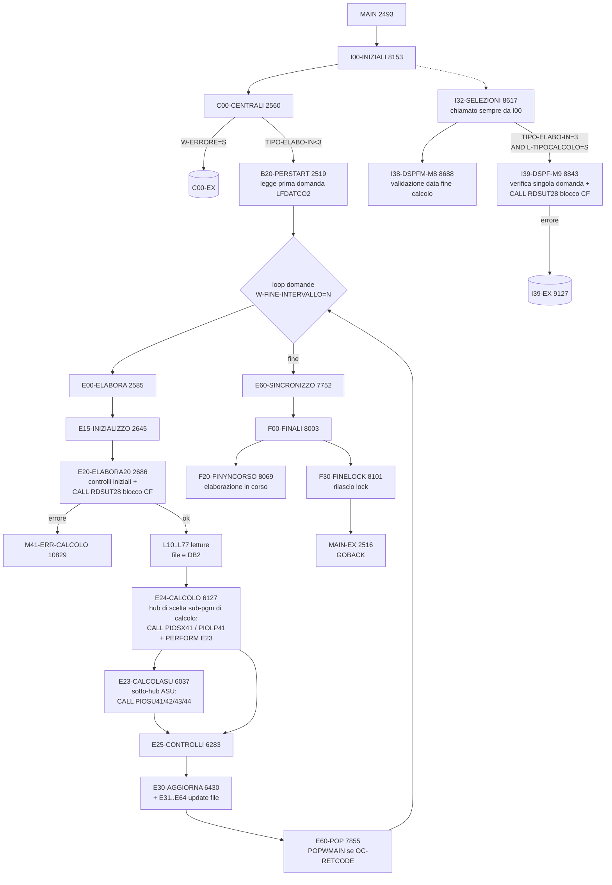

# Pseudocodifica `PDSIO13` — Fase A (STEP 1)

> **Programma**: `PDSIO13` — orchestratore di pagamento sussidi (CICS/DB2 su AS400).
> **Sorgente**: [PDSIO13.txt](PDSIO13.txt) — 14.818 righe.
> **Chiamato da**: `PDSIO01` (transazione CICS gestione pagamento sussidi).
> **Focus analisi**: prestazione **TYGP** (Tirocinio PON Puglia 2023) con confronto rispetto a **TISC** (Tirocinio Inclusione Sociale Calabria).
> **Stato**: Fase A — pseudocodifica osservativa **STEP 2 (raffinata)**.

## Indice

1. [Sintesi del programma](#1-sintesi-del-programma)
2. [Diagramma di flusso orchestratore](#2-diagramma-di-flusso-orchestratore)
3. [Linkage `COMMAREADS` e modi operativi](#3-linkage-commareads-e-modi-operativi)
4. [Discriminazione chiamate sotto-programmi di calcolo](#4-discriminazione-chiamate-sotto-programmi-di-calcolo)
5. [Variabili globali significative](#5-variabili-globali-significative)
6. [Mappa paragrafi (365 paragrafi raggruppati per famiglia)](#6-mappa-paragrafi)
7. [Confronto TYGP ↔ TISC (key deliverable)](#7-confronto-tygp--tisc)
8. [Dipendenze esterne (CALL, copybook DB2)](#8-dipendenze-esterne)
9. [Catalogo `OUT-STATUS` e codici di ritorno](#9-catalogo-out-status-e-codici-di-ritorno)
10. [Ambiguità e domande aperte (PA-XX)](#10-ambiguità-e-domande-aperte)

---

## 1. Sintesi del programma

`PDSIO13` è un programma COBOL/CICS/DB2 di **circa 14.800 righe** con **365 paragrafi** procedurali. Riceve la `COMMAREADS` da `PDSIO01` (lunghezza > 27 KB) e svolge il ruolo di **orchestratore di tutto il processo di pagamento sussidi**: lettura dati comuni e ausiliari, controlli di ammissibilità, calcolo importi (delegando il dettaglio a `PIOSX41`, `PIOSU41-44`, `PIOLP41`), aggiornamento di tutti i file/tabelle DB2 coinvolti, gestione delle quadrature in euro e lire, gestione lock e sincronizzazione finale.

A differenza di `PIOSX41` (un solo `MAIN` lineare), `PDSIO13` ha **un singolo punto di uscita** (`MAIN-EX` riga 2517, unico `GOBACK` attivo); ogni errore è gestito posizionando flag (`W-ERRORE = 'S'`, `OUT-STATUS = '96'/'99'`, `OUT-MESSAGGIO`) e saltando ai paragrafi `*-EX` per propagarsi fino al `MAIN`.

Il programma serve **due flussi distinti** discriminati da `TIPO-ELABO-IN` (campo di `KARAMETRI-IN`):
- **`TIPO-ELABO-IN ∈ {1,2}`** ("tutte" o "Da..A") → ramo `C00-CENTRALI → B20-PERSTART → loop E00-ELABORA → E20…E64` (pagamento massivo, reale o simulato);
- **`TIPO-ELABO-IN = 3 AND L-TIPOCALCOLO = 'S'`** (elaborazione **singola in simulazione**) → ramo `I32-SELEZIONI → I39-DSPF-M9` (verifica/calcolo simulato di una singola domanda).

Il valore `K-TIPOCALCOLO` / `L-TIPOCALCOLO` (`S`=simulazione lista controllo, `R`=reale pagamento) modula il comportamento all'interno di entrambi i rami.

> **Nota di chiarezza (STEP 2)**: i campi `K-RICHIESTA` / `L-RICHIESTA` di commarea sono **dichiarati** (righe 2382 e 2447) ma **mai testati** nel codice procedurale. I commenti header [righe 2447-2451] descrivono valori `I/C/E/F` ma il flusso reale è discriminato esclusivamente da `TIPO-ELABO-IN` e `L-TIPOCALCOLO`. Incoerenza tra documentazione interna e codice — vedi PA-32.

### Punti d'interesse rilevati in fase di mappatura
- **Sole 5 occorrenze** dei codici TYGP/TISC nel sorgente (vs 19/15 in `PIOSX41`): segno che la gestione specifica di prestazione è quasi tutta delegata ai sotto-programmi.
- **Due liste di prestazioni** che attivano la `CALL RDSUT28` (verifica blocco pagamenti per Codice Fiscale): una in `E20-ELABORA20` (riga 2819, ramo calcolo massivo) e una in `I39-DSPF-M9` (riga 8925, ramo elaborazione singola simulata). **Le due liste NON sono identiche** — vedi [§7](#7-confronto-tygp--tisc).
- 28 `CALL` attive verso sotto-programmi/utility; alcune con `CICS LINK` (es. `PDSLOCK`).
- 17 cursori SQL dichiarati (15 paragrafi `*-DB2-DECL-CURS` + `*-DB2-FETCH` + `*-DB2-CLSCUR`).
- **Hub di calcolo**: il paragrafo che decide quale sub-programma chiamare è **`E24-CALCOLO`** [6127-6280], non `E23-CALCOLASU`. `E23` gestisce solo il sotto-caso ASU (`W-CODICEDUE = 42`) e discrimina tra 4 sub-programmi PIOSU41-44 in base a `W-OPZIONE`. Vedi [§4](#4-discriminazione-chiamate-sotto-programmi-di-calcolo).

## 2. Diagramma di flusso orchestratore



> **Ramo `I39-DSPF-M9` chiarito in STEP 2**: `I32-SELEZIONI` è chiamato **sempre** da `I00-INIZIALI` (riga 8209) per popolare aree e validare la data di fine calcolo via `I38-DSPFM-M8`. Il `PERFORM I39-DSPF-M9` (riga 8682) avviene **solo se `TIPO-ELABO-IN = 3 AND L-TIPOCALCOLO = 'S'`**, ovvero **elaborazione singola in simulazione**. Non è quindi un "ramo informazione" indipendente, ma un sotto-ramo di simulazione per una singola domanda.

## 3. Linkage `COMMAREADS` e modi operativi

Struttura `COMMAREADS` (linkage section, righe 2430-2486):

```cobol
01 COMMAREADS.
   02 K-AREA.
      05 K-CODICE-SEDE       pic 9(04).
      05 K-NOME-SEDE         pic X(22).
      05 K-CODICE-STOP       pic 9(02).
      05 K-NOME-STOP         pic X(22).
      05 K-PROCEDURA         pic X(03).
      05 K-TIPOCALCOLO       pic X(01).   * 'S'=simulazione 'R'=reale
      05 KAGA-ELABO-IN       pic X(01).   * 'S'=successive 'P'=prime 'T'=tutte
      05 K-RICHIESTA         pic X(01).   * 'I' 'C' 'E' 'F'
      05 K-PROGRESSIVO       pic 9(03).
      05 K-RETCODE           pic X(01).   * 'E' 'C' 'D' 'N'
   02 KAREA-D.
      05 KCODOPE             pic X(02).
      05 KLIVAUTO            pic X(01).
      05 KMATRICOLA          pic X(08).
   02 KARAMETRI-IN.
      05 KATA-ELABO-IN       pic 9(08).
      05 KIPO-ELABO-IN       pic X(01).   * '1'=tutte '2'=Da..A '3'=singola
      05 K1-ELEMENTO occurs 8 times.
         07 K1-PRESTAZIONE   pic X(02).
         07 K1-OPZIONE       pic X(01).
      05 KERIODI-IN.
         07 KLE-PERIODI occurs 6.
            09 KNNO-DAL-IN-LK    pic 9(04).
            09 KUMERO-DAL-IN-LK  pic 9(06).
            09 KNNO-AL-IN-LK     pic 9(04).
            09 KUMERO-AL-IN-LK   pic 9(06).
   02 KASUSST.
      07 KLE-ASUSSST occurs 5.
         09 KCODIND          pic X(04).
         09 KANNIND          pic 9(02).
         09 KREGIND          pic 9(02).
   02 FILLER                 pic X(26744).
```

> **Output**: il programma popola la sotto-struttura `COMMAREADS-OUT` (Working) e poi `MOVE COMMAREADS-OUT TO COMMAREADS` a riga 2514 prima del `GOBACK`. Campi tipici di ritorno: `OUT-STATUS` (96=ko gestito, 99=errore DB2 grave, 00/0X=ok), `OUT-MESSAGGIO`, `OUT-PROCEDURA`.

### Modi operativi (verificati in STEP 2)

**Discriminante effettivo `TIPO-ELABO-IN`** (campo `KIPO-ELABO-IN` in `KARAMETRI-IN`):

| `TIPO-ELABO-IN` | Significato (commento) | Flusso reale osservato |
| :---: | --- | --- |
| `1` | Elabora tutte | `C00 → B20 → loop E00` (anno = `ANNO-DAL-IN-LK(1)`) |
| `2` | Elabora Da..A | `C00 → B20 → loop E00` + `I39-SELF-CURS` posiziona cursore |
| `3` | Elabora singola | **non entra in `C00`/loop** → solo `I32→I38`; se `L-TIPOCALCOLO='S'` esegue `I39-DSPF-M9` |

**`K-TIPOCALCOLO` / `L-TIPOCALCOLO`**:
- `S` = **simulazione** (lista di controllo, niente scritture DB2 reali, niente lock);
- `R` = **reale** (esecuzione pagamento, con scritture e lock via `PDSLOCK`).

**Combinazioni:**

| TIPO | TIPOCALCOLO | Flusso |
| :---: | :---: | --- |
| 1 | S | calcolo massivo simulato (lista controllo) |
| 1 | R | **pagamento massivo reale** |
| 2 | S | simulazione su intervallo domande |
| 2 | R | pagamento reale su intervallo |
| 3 | S | **verifica singola domanda simulata via `I39-DSPF-M9`** |
| 3 | R | non gestito direttamente — vedi PA-03 |

> **`K-RICHIESTA` non utilizzato**: vedi nota in §1 e PA-32.

## 4. Discriminazione chiamate sotto-programmi di calcolo

Verificato in STEP 2 leggendo `E23-CALCOLASU` [6037-6124] e `E24-CALCOLO` [6127-6280].

### `E24-CALCOLO` — hub principale (chiamato da `E00-ELABORA`)

Decisione su quale sub-programma di calcolo invocare in base a `W-CODICEDUE` (tipo prestazione codificato):

| `W-CODICEDUE` | Famiglia | Azione | Sub-programma |
| :---: | --- | --- | --- |
| `42` | ASU | `PERFORM E23-CALCOLASU` (sotto-hub) | vedi tabella sotto |
| `44` | LPU | `CALL PIOLP41` (riga 6159) | `PIOLP41` |
| `45` | SUS (sussidio straordinario) | `CALL PIOSX41` (3 punti) | `PIOSX41` — **flusso TYGP/TISC** |

### `E23-CALCOLASU` — sotto-hub ASU (chiamato da `E24` quando `W-CODICEDUE=42`)

Decisione su quale `PIOSU4x` invocare in base a `W-OPZIONE`:

| `W-OPZIONE` | Descrizione (commento sorgente) | Sub-programma | Riga CALL |
| :---: | --- | --- | :---: |
| `1` | ASU Fondo Occupazione (tipo fin. 3,6) | `PIOSU43` | 6063 |
| `2` | ASU convenzione Enti (tipo fin. 2) | `PIOSU42` | 6074 |
| `3` | Transitoristi ex F.O. (tipo fin. 7) | `PIOSU44` | 6085 |
| `4` | ASU/LSU/LPU fino al 2000 (tipo fin. 1,2,3,4,5) | `PIOSU41` | 6097 |
| `5`, `6` | (storici) | accorpati in `4` | (commentati 6107-6123) |

**Vincolo aggiuntivo per `W-OPZIONE=1` [righe 6041-6068]**: se `W-DTBLOCCO-36 = 0` (regione non autorizzata) **e** `L-TIPOCALCOLO='S'` **e** `TIPO-ELABO-IN=3` → emette messaggio "regione non autorizzata" con `OUT-STATUS='96'`. Se è in elaborazione massiva (TIPO-ELABO-IN ≠ 3) salta semplicemente (`GO TO E23-EX`).

### Le 3 CALL `PIOSX41` (cuore del flusso TYGP/TISC)

Tutte e tre dentro `E24-CALCOLO` nel ramo `IF W-CODICEDUE = 45`, sub-tree controllato dai flag `W-SXCOVID19`, `L-TIPOCALCOLO`, `W-NIK` [righe 6176-6213]:

```text
IF W-CODICEDUE = 45 THEN
  IF W-SXCOVID19 = 'S' THEN
    IF L-TIPOCALCOLO = 'R' THEN
      IF W-NIK = 'S' THEN
          CALL PIOSX41  -- riga 6185 -- COVID19 reale via NIK
      ELSE
          OC-RETCODE = 98  -- riga 6191 -- blocco "pagamento centralizzato"
          GO TO E24-EX
      END-IF
    ELSE       -- simulazione COVID19
      CALL PIOSX41  -- riga 6199 -- COVID19 simulato
    END-IF
  ELSE         -- W-SXCOVID19 = 'N'
      CALL PIOSX41  -- riga 6207 -- caso STANDARD (TYGP/TISC e tutte le altre prestazioni straordinarie non-COVID)
  END-IF
END-IF
```

| Riga | Condizioni | Caso d'uso | Rilevanza TYGP/TISC |
| :---: | --- | --- | :---: |
| 6185 | `W-SXCOVID19='S' AND L-TIPOCALCOLO='R' AND W-NIK='S'` | Pagamento reale COVID19 (canale NIK) | n.a. |
| 6199 | `W-SXCOVID19='S' AND L-TIPOCALCOLO='S'` | Simulazione COVID19 | n.a. |
| 6207 | `W-SXCOVID19='N'` | **Calcolo standard non-COVID** | ✅ **questo è il ramo per TYGP e TISC** |

> **Conseguenza per la riscrittura**: tutta la divergenza funzionale TYGP↔TISC documentata in `PIOSX41` (B99 forced calcolo al mese precedente, e tutta la logica di `T20`/`M30`/`I10-IMPOSTA-IRPEF`) si propaga in `PDSIO13` **esclusivamente** attraverso la CALL di riga 6207. Le altre due CALL a `PIOSX41` (6185, 6199) sono ristrette al ramo COVID19 (`W-SXCOVID19='S'`).

> `[DA_CHIARIRE PA-33]`: come viene popolato `W-SXCOVID19`? Probabilmente in `L11-DATICOMUNI` o in `L75-TIPOASU`/`L77-TIPOSST` in base al codice prestazione. Mappare in fase B.

> `[DA_CHIARIRE PA-34]`: come viene popolato `W-NIK`? È un flag di tipo di canale ("Nuovo Insediamento Karst"? "Naspi Integrazione Karst"?) — verificare con business owner.

## 5. Variabili globali significative

(Working-Storage va da riga 549 a 2430 — quasi 1900 righe; di seguito le strutture chiave per la pseudocodifica.)

| Variabile | Tipo / contenuto | Uso |
| --- | --- | --- |
| `L-AREA` | copia di lavoro di `K-AREA` | usata ovunque (`L-CODICE-SEDE`, `L-CODICE-STOP`) |
| `PARAMETRI-IN` | copia di `KARAMETRI-IN` | accesso ai periodi/prestazioni richieste |
| `LAREA-D` | copia di `KAREA-D` | dati operatore |
| `COMMAREADS-OUT` | struttura output | `OUT-STATUS` `OUT-MESSAGGIO` `OUT-PROCEDURA` |
| `W-ERRORE` | `pic X(01)` `'S'/'N'` | flag globale di errore; testato in `C00`, `E00`, `I39`, ovunque |
| `W-CHK-CAMPI` | `pic X(nn)` | descrizione dell'ultimo controllo fallito |
| `WB-ANNO/WB-NUMERO/WB-DOMANDA` | chiave domanda | navigazione `LFDATCO2` |
| `WIC-ANNO/WIC-NUMERO/WIC-DOMANDA` | chiave domanda corrente | usata da B20/E00 |
| `H-DCO…` | copybook `TDSDATCO` (dati comuni domanda) | `H-DCOCOTIDO` tipo, `H-DCOULESSP` stato, `H-DCOCOSEGR` sede, `H-DCOCODFIS` CF |
| `H-SSTCODIND` | codice prestazione (TYGP/TISC/…) | discriminante in tutti i `WHEN/IF` |
| `H-NEWSUSS` (introdotto 29/07/2025) | flag "nuova procedura" | indirizza alcune logiche su nuovo motore |
| `IC-AREA` / `OC-AREA` | struttura input/output verso `PIOSX41` | popolata in `E23` e letta dopo CALL |
| `W-FINE-INTERVALLO` / `W-FINE-ELABORA` | flag loop | governano `C00`/`E00` |
| `DCLTDS…` | strutture DCLGEN copybook DB2 | una per ogni tabella letta |
| `LK-RISP` `LK-CODFIS` | aree di interfaccia a `RDSUT28` | verifica blocco CF |
| `WK_VERSIO` | etichetta di versione (Working) | aggiornato ad ogni rilascio |
| `SQLCODE` | standard DB2 | testato dopo ogni FETCH/SELECT |

### Cursori SQL dichiarati
| Paragrafo `*-DB2-DECL-CURS` | Tabella sorgente | Uso |
| --- | --- | --- |
| `B20-DB2-DECL-CURS` [11924] | `LFDATCO2` (dati comuni domande) | navigazione domande di una sede |
| `L16-DB2-DECL-CURS` [12011] | recuperi (`TDSRECUP`) | letture recuperi domanda |
| `L25-DB2-DECL-CURS` [12030] | deleghe (`TDSDELSI`) | letture deleghe |
| `L28-DB2-DECL-CURS` [12049] | dati ANF (`TDSDATAN`) | dati anagrafici familiari |
| `L49-DB2-DECL-CURS` [12068] | sospensioni (`TDSSOSPE`) | letture sospensioni |
| `E43-DB2-DECL-CURS` [12087] | recuperi update | aggiornamento recuperi |
| `L70-DB2-DECL-CURS` [12106] | tabella periodi (`TDSPERIO`) | letture periodi |

## 6. Mappa paragrafi

I 365 paragrafi sono raggruppati per famiglia di prefisso. (Solo i paragrafi `*-EX` di chiusura/exit omessi nella tabella per brevità.)

### Famiglia `MAIN` / control flow
| # | Paragrafo | Righe | Scopo |
| --- | --- | --- | --- |
| 1 | `MAIN` | 2493-2516 | Ingresso, copia commarea, perform `I00`/`C00`/`F00`, ricopia output |
| 2 | `MAIN-EX` | 2516-2517 | **Unico `GOBACK`** attivo |
| 3 | `C00-CENTRALI` | 2560-2582 | Orchestratore principale; loop su domande |

### Famiglia `B` — B-Start
| `B20-PERSTART` | 2519-2557 | Posizionamento sul primo record `LFDATCO2`; gestione `TIPO-ELABO-IN=1` |

### Famiglia `E` — Elabora (cuore del pagamento)
| Paragrafo | Righe | Scopo principale |
| --- | --- | --- |
| `E00-ELABORA` | 2585-2642 | Ciclo per domanda |
| `E15-INIZIALIZZO` | 2645-2683 | Reset working areas e DCLGEN |
| `E20-ELABORA20` | 2686-2970 | Controlli iniziali, **lista codici per `CALL RDSUT28`** (riga 2819, **include TISC e TYGP**) |
| `E23-CALCOLASU` | 6037-6124 | **Sotto-hub ASU** (solo `W-CODICEDUE=42`): discrimina `W-OPZIONE` 1/2/3/4 → chiama `PIOSU43/42/44/41` |
| `E24-CALCOLO` | 6127-6280 | **Hub di calcolo principale**: discrimina su `W-CODICEDUE` (42/44/45) e su `W-SXCOVID19/L-TIPOCALCOLO/W-NIK`; contiene le **3 CALL a `PIOSX41`** (righe 6185/6199/6207) e la CALL a `PIOLP41` (6159) — vedi [§4](#4-discriminazione-chiamate-sotto-programmi-di-calcolo) |
| `E25-CONTROLLI` | 6283-6358 | Controlli post-calcolo |
| `E30-AGGIORNA` | 6430-6500 | Avvio fase di aggiornamento |
| `E31-ANAGRAFICA` | 6503-6656 | Update anagrafica (chiama `PNBTCFIB` IBAN, `PITIBAN2`) |
| `E312-TITOLARITA` | 6659-6701 | Controllo titolarità |
| `E33-DATI-APPOGGIO` | 6704-6913 | Dati di appoggio per `PIOSX41` |
| `E35-UPD-FILE` | 6917-7018 | Update file domanda |
| `E39-UPD-DATICOMUNI` | 7021-7028 | UPDATE `TDSDATCO` |
| `E40-UPD-FILE40` | 7032-7049 | UPDATE `TDSAPIO0` |
| `E42-UPD-FILE42` | 7052-7070 | UPDATE `TDSDELSI` |
| `E43-UPD-RECUPERI` | 7073-7153 | UPDATE `TDSRECUP` |
| `E44-UPD-IMPORTI` | 7156-7271 | UPDATE importi (chiama `PDSPD07`) |
| `E441-WRT-STOREC` | 7274-7298 | Scrittura storico recuperi |
| `E45-DLT-EFFEROGATI` | 7301-7306 | DELETE effettivamente erogati |
| `E46-WRT-EFFEROGATI` | 7309-7323 | INSERT effettivamente erogati |
| `E47-UPD-SITUAZIODO` | 7326-7332 | UPDATE situazione domanda |
| `E47A-UPD-FILE47` | 7335-7362 | UPDATE/INSERT file47 ASU |
| `E47S-UPD-FILE47` | 7365-7390 | UPDATE/INSERT file47 SST |
| `E48-UPD-FILE48` | 7393-7426 | UPDATE/INSERT file48 |
| `E49-UPD-FILE49` | 7429-7607 | UPDATE/INSERT file49 (chiama `PDSPD04`/`PDSPD06`) |
| `E51-UPD-FILE51` | 7610-7647 | UPDATE file51 |
| `E52-UPD-FILE52` | 7650-7673 | UPDATE file52 |
| `E53-UPD-FILE53` | 7676-7706 | UPDATE file53 |
| `E55-WRT-STOANF` | 7709-7729 | Scrittura storico ANF |
| `E56-WRT-STOSOS` | 7732-7749 | Scrittura storico SOS |
| `E60-SINCRONIZZO` | 7752-7852 | Sincronizzazione fine elaborazione; chiama `PDSPD16` e `RDSTART` |
| `E60-POP` | 7855-7892 | Chiamata `POPWMAIN` (popola main) |
| `E62-SCRIVO` | 7895-7970 | INSERT su `TDSPAG` |
| `E64-RISCRIVO` | 7973-8000 | UPDATE su `TDSPAG` |

### Famiglia `L` — Letture (file/DB2)
| Paragrafo | Righe | Tabella/Scopo |
| --- | --- | --- |
| `L10-LETTURA` | 2973-3121 | Hub letture (chiama L11, L16, L19, L22, L25, L28…) |
| `L11-DATICOMUNI` | 3124-3447 | Lettura dati comuni; chiama `PITIBAN2`, `PNBTBLC2`, `RDSCONT`, `RDSUT27` |
| `L16-RECUPERI` | 3475-3506 | Apertura cursore recuperi |
| `L17-CHKFLD-RECUPERI` | 3509-3672 | Controllo campi recuperi |
| `L18-SOMMA-RECUPERI` | 3675-3713 | Sommatoria recuperi |
| `L19-SITUAZIODO` | 3716-3812 | Lettura situazione domanda |
| `L22-ANAGRAFICI` | 3815-3900 | Lettura anagrafici |
| `L25-DELEGHE` | 3903-3931 | Apertura cursore deleghe |
| `L26-CHKFLD-DELEGHE` | 3934-3965 | Controllo campi deleghe |
| `L27-CARICA-DELEGHE` | 3968-4027 | Caricamento deleghe |
| `L28-DATIANF` | 4030-4109 | Apertura cursore ANF |
| `L29-CHKFLD-DATIANF` | 4112-4221 | Controllo campi ANF |
| `L30-CARICOANF` | 4224-4271 | Caricamento ANF |
| `L49-FILE66` | 4274-4300 | Apertura cursore sospensioni |
| `L50-CHKFLD-SOSPE` | 4303-4345 | Controllo campi sospensioni |
| `L51-CARICOSOS` | 4348-4365 | Caricamento sospensioni |
| `L61-FILE51` | 4367-4875 | Lettura file51 |
| `L62-FILE40` | 4878-4899 | Lettura `TDSAPIO0` |
| `L63-FILE42` | 4902-4959 | Lettura `TDSDELSI` |
| `L64-FILE52` | 4962-5198 | Lettura file52 |
| `L67-FILE53` | 5201-5687 | Lettura file53 (chiama `RDSUT11`) |
| `L70-FILE64` | 5690-5716 | Apertura cursore periodi |
| `L71-CHKFLD-PERIO` | 5719-5771 | Controllo periodi |
| `L72-CARICOPER` | 5774-5795 | Caricamento periodi |
| `L73-FILE65` | 5798-5832 | Lettura file65 |
| `L75-TIPOASU` | 5835-5890 | Discriminazione tipo ASU |
| `L77-TIPOSST` | 5894-6034 | Discriminazione tipo SST |

### Famiglia `I` — Informazione / Inizializzazioni / Index
| Paragrafo | Righe | Scopo |
| --- | --- | --- |
| `I00-INIZIALI` | 8153-8212 | Init principali |
| `I03-ASSEGNAZIONI` | 8215-8245 | Assegnazioni iniziali |
| `D50-INFORMAZIONE` | 8248-8262 | Output informazione |
| `I07-ACCESSO` | 8265-8288 | Controlli di accesso |
| `I10-DATA-ORA` | 8291-8301 | Data/ora corrente |
| `I13-CALCOLO-AL` | 8304-8544 | Calcolo data fine elaborazione |
| `I14-DATABLOCCO` | 8813-8840 | Data blocco pagamenti |
| `I30-CHK-PAGAMENTO` | 8547-8614 | Controllo stato pagamento |
| `I32-SELEZIONI` | 8617-8685 | Selezione per ramo informazione |
| `I38-DSPFM-M8` | 8688-8779 | Display/menu M8 |
| `I39-SELF-CURS` | 8782-8809 | Self-cursor su domanda |
| `I39-DSPF-M9` | 8843-9127 | **Display M9 (informazione domanda) — contiene la seconda lista `CALL RDSUT28` (riga 8925) che include TYGP ma NON TISC** |
| `I41-PERSVA` | 9130-9155 | Verifica perservativa |
| `I60-BLOCCO` | 9158-9235 | Apertura lock con `PDSLOCK` (CICS LINK) |
| `I62-INIZIOLOCK` | 9238-9288 | Lock di inizio elaborazione |

### Famiglia `J` — quadrature/conversioni euro/lire
| Paragrafo | Righe | Scopo |
| --- | --- | --- |
| `J10-QUADRATURA` | 9292-9471 | Quadratura totali importi |
| `J12-QUADRAFISCO` | 9474-9523 | Quadratura componenti fiscali |
| `J20-MUOVIEURO` | 9526-9563 | Conversioni euro generiche |
| `J22-ASUEURO` | 9566-9785 | Quadratura ASU in euro |
| `J24-LPUEURO` | 9788-9990 | Quadratura LPU in euro |
| `J26-SSTEURO` | 9993-10253 | Quadratura SST in euro |
| `J30-MUOVILIRE` | 10256-10289 | Conversioni lira (storiche) |
| `J32-ASULIRE` | 10292-10420 | Quadratura ASU in lire |
| `J34-LPULIRE` | 10423-10551 | Quadratura LPU in lire |
| `J36-SSTLIRE` | 10554-10687 | Quadratura SST in lire |

### Famiglia `K` / `M` — gestione kite e messaggi errore
| Paragrafo | Righe | Scopo |
| --- | --- | --- |
| `K25-KITE` | 6359-6401 | Gestione anomalia "kite" |
| `M39-DSPF-M13B` | 10717-10825 | Display M13B (riepilogo) |
| `M41-ERR-CALCOLO` | 10829-10900 | Errore calcolo |
| `M43-READ-ERROR` | 10903-11013 | Errore lettura archivio |

### Famiglia `F` — Finali
| Paragrafo | Righe | Scopo |
| --- | --- | --- |
| `F00-FINALI` | 8003-8066 | Hub di chiusura |
| `F20-FINYNCORSO` | 8069-8098 | Marca elaborazione "in corso" (chiama `PDSIO21`) |
| `F30-FINELOCK` | 8101-8150 | Rilascio lock (chiama `PDSPD16`) |

### Famiglia `S` — Stampe
`S05-STAMPA-2` `S10-STAMPA` `S20-ELENCA` `S30-STAMPA` `S32-REPORTASU` `S34-REPORTLPU` `S36-REPORTSST` `S40-IMPOSTAZIONI` [11016-11426]

### Famiglia `T` — Testi messaggi (T04..T91)
22 paragrafi che caricano testi di errore parametrizzati (`T04-TESTO04`..`T91-TESTO91`) [11445-11675].

### Famiglia `W` — Avvisi
| `W10-MSGERRORE` | 11699-11713 | Compone messaggio errore |

### Famiglia DB2 (cursori, fetch, select, update, insert)
~50 paragrafi tecnici tutti suffissati `-DB2-CLSCUR`, `-DB2-DECL-CURS`, `-DB2-FETCH`, `-DB2-SELECT`, `-DB2-UPDATE`, `-DB2-INSERT`, `-DB2-DELETE` [11726-14760]. Strutturati uno per tabella/cursore.

### Famiglia utility data
| `CAMBIADATA-DA10-A8` | 14794-14800 | Riformatta data AAAA-MM-GG → AAAAMMGG |
| `CAMBIADATA-DA8-A10` | 14803-14811 | Riformatta data AAAAMMGG → AAAA-MM-GG |
| `IMPOSTA-RPT` | 14763-14791 | Imposta riga di report |

## 7. Confronto TYGP ↔ TISC

In `PDSIO13` la differenza TYGP/TISC si concentra in **due IF/lista codici** che governano la `CALL RDSUT28` (verifica blocco pagamenti per Codice Fiscale tramite tabella di blocco DUSL/DUSL2 — black-box).

Schema comune (uguale in entrambi i punti):
```text
IF  H-DCOCOTIDO = 'E' AND (H-SSTCODIND IN { lista codici }) THEN
    CONTINUE              -- niente check blocco
ELSE
    CALL RDSUT28 USING ...  -- verifica blocco CF
    IF LK-RISP = 'S' THEN
        OUT-STATUS = '96'
        OUT-MESSAGGIO = 'Pagamenti Bloccati per il Codice Fiscale'
        W-ERRORE = 'S'  (solo I39 / GO TO E20-EX)
    END-IF
END-IF
```

### Confronto delle due liste

| Codice | E20-ELABORA20 [2819-2920] (ramo calcolo) | I39-DSPF-M9 [8925-9012] (ramo informazione) | Differenza |
| --- | :---: | :---: | --- |
| TYGM, DL76, TIPO, TYAD, SSEP, TYRG, TYBL, TYCR, APAF, APAR, BRIO, EELA | ✅ | ✅ | uguali |
| EE27..EE38, EE2A..EE2D, EE05, EE10, EE13, EE22, EEZR, EEMA | ✅ | ✅ | uguali |
| EJ29..EJ13 (9 codici) | ✅ | ✅ | uguali |
| EK29..EK13 (9 codici) | ✅ | ✅ | uguali |
| EW29..EW13 (9 codici) | ✅ | ✅ | uguali |
| EY29..EY3A (10 codici) | ✅ | ✅ | uguali |
| EX29..EX89 (13 codici) | ✅ | ✅ | uguali |
| E092, E109, E110, E112, E107, E159, E160, E162, E157 | ✅ | ✅ | uguali |
| **TGOL** | ✅ (riga 2906) | ❌ | **solo E20** |
| **POR3, POR4, POR5, POR6** | ✅ (righe 2907-2910) | ❌ | **solo E20** |
| **DLI2** | ✅ (riga 2911) | ❌ | **solo E20** |
| **TISC** | ✅ (riga 2912) | ❌ | **solo E20** ⚠️ |
| **TISM** | ✅ (riga 2913) | ❌ | **solo E20** |
| **TGOC** | ✅ (riga 2914) | ❌ | **solo E20** |
| **TGOV** | ✅ (riga 2915) | ❌ | **solo E20** |
| **TGOS** | ✅ (riga 2916) | ❌ | **solo E20** |
| **TGOP** | ✅ (riga 2917) | ❌ | **solo E20** |
| **TYGP** | ✅ (riga 2918) | ✅ (riga 9012) | **uguali** |
| **TIRA, PIAC** | ✅ (righe 2919-2920) | ❌ | **solo E20** |

### Sintesi interpretativa

- Nel **ramo calcolo (`E20`)**: TYGP **e** TISC sono entrambi inclusi nella lista → per **entrambe** le prestazioni si **salta** il check `RDSUT28` (no blocco pagamento per CF in calcolo).
- Nel **ramo informazione (`I39`)**: TYGP è incluso, TISC **no** → per TISC (e per tutte le altre prestazioni "fratello" introdotte dopo 2023: TISM, TGOC, TGOV, TGOS, TGOP, TIRA, PIAC, oltre a TGOL, POR3-6, DLI2) **si esegue** il check `RDSUT28`, mentre per TYGP il check viene saltato.
- **[DA_CHIARIRE PA-29]**: la lista in `I39-DSPF-M9` sembra non essere stata aggiornata per ~10 codici prestazione introdotti tra 2023 e 2026, mentre TYGP **sì** (inserito il 14/03/2025). Possibile **bug latente**: per TISC/TISM/TGOC/TGOV/TGOS/TGOP/TIRA/PIAC il ramo informazione tenta sempre la verifica blocco CF, anche quando funzionalmente non dovrebbe.
- **[BUSINESS_RULE]**: la condizione `H-DCOCOTIDO = 'E'` (tipo domanda "E" — sussidio straordinario) discrimina l'attivazione del check su tutta la lista.

### Altri riferimenti a TYGP/TISC nel sorgente
- Header commenti righe 50, 55 (TYGP), 75 (TISC) — solo doc.
- Working `01 W-GESTISCI` riga 2006 — il match testuale di "TISC" è interno a "GESTISCI", non riferimento al codice.
- Riga 6358 — falso positivo "gestiscoDef" (deceduti).

**Conclusione**: in `PDSIO13` la divergenza TYGP↔TISC è limitata al check blocco pagamenti del ramo informazione (`I39`). Tutta la differenza di logica funzionale (calcolo, B99, IRPEF, ecc.) è demandata a `PIOSX41` chiamato in `E23-CALCOLASU`.

## 8. Dipendenze esterne

### CALL attive (28 occorrenze)
| # | Sotto-programma | Riga CALL | Paragrafo | Scopo (interpretato) |
| --- | --- | --- | --- | --- |
| 1 | `RDSUT28` | 2924 | `E20-ELABORA20` | Verifica blocco pagamenti CF (calcolo) |
| 2 | `PITIBAN2` | 3353 | `L11-DATICOMUNI` | Validazione IBAN |
| 3 | `PNBTBLC2` | 3462 | `L11-DATICOMUNI` | Verifica blocco / lock |
| 4 | `RDSCONT` | 3580 | `L11-DATICOMUNI` | Controlli configurazione |
| 5 | `RDSUT27` | 3974 | `L27-CARICA-DELEGHE` | Utility deleghe |
| 6 | `RDSUT11` | 5649 | `L67-FILE53` | Utility file53 |
| 7 | `PIOSU43` | 6063 | `E23-CALCOLASU` | Calcolo specifico (sotto-tipo 43) |
| 8 | `PIOSU42` | 6074 | `E23-CALCOLASU` | Calcolo specifico (sotto-tipo 42) |
| 9 | `PIOSU44` | 6085 | `E23-CALCOLASU` | Calcolo specifico (sotto-tipo 44) |
| 10 | `PIOSU41` | 6097 | `E23-CALCOLASU` | Calcolo specifico (sotto-tipo 41) |
| 11 | `PIOLP41` | 6159 | **`E24-CALCOLO`** | Calcolo LPU (`W-CODICEDUE=44`) |
| 12 | **`PIOSX41`** | 6185, 6199, 6207 | **`E24-CALCOLO`** | **Calcolo sussidio straordinario** (`W-CODICEDUE=45`) — discriminate da `W-SXCOVID19`/`L-TIPOCALCOLO`/`W-NIK`; ramo TYGP/TISC = **riga 6207** |
| 13 | `RDSIO12` | 6216 | **`E24-CALCOLO`** | Utility I/O (verifica date) post-calcolo |
| 14 | `RDSUT14` | 6525 | `E31-ANAGRAFICA` | Utility anagrafica |
| 15 | `PNBTCFIB` | 6676 | `E31-ANAGRAFICA` | Estrazione/verifica CFIB |
| 16 | `PDSPD07` | 7277 | `E44-UPD-IMPORTI` | Aggiornamento importi |
| 17 | `PDSPD04` | 7712 | `E49-UPD-FILE49` | Aggiornamento file49 (storico ANF) |
| 18 | `PDSPD06` | 7735 | `E55-WRT-STOANF` | Scrittura storico ANF |
| 19 | `PDSPD16` | 8083, 8567, 9216 | `F00-FINALI`/`E60`/`I60-BLOCCO` | Rilascio lock / sincronizzazione |
| 20 | `PDSPD13` | 8278 | `E60-SINCRONIZZO` | (probabile aggiornamento finale storico) |
| 21 | `RDSTART` | 8349 | `E60-SINCRONIZZO` | Avvio transazione collegata |
| 22 | `PDSIO21` | 8826 | `F20-FINYNCORSO` | Marcatura "in corso" |
| 23 | `RDSUT28` | 9016 | `I39-DSPF-M9` | Verifica blocco pagamenti CF (informazione) |
| 24 | `PIOLP41` | 9073 | `I39-DSPF-M9` | Calcolo LPU per informazione |
| 25 | `PIOSX41` | 9083 | `I39-DSPF-M9` | Calcolo straordinario per informazione |
| 26 | `RDSIO12` | 9132 | `I41-PERSVA` | Utility I/O |
| 27 | `RDSIO13` | 9144 | `I41-PERSVA` | Utility I/O |

> Tutti i sotto-programmi sono trattati **black-box** in Fase A (mancano i sorgenti / copybook interfaccia).

### CICS LINK
- `PDSLOCK` invocata via `EXEC CICS LINK` (in `I60-BLOCCO` riga 9158 e seguenti — black-box).
- Possibili `EXEC CICS SYNCPOINT` commentate (es. righe 8913-8915 `GGAS`).

### Tabelle DB2 lette/aggiornate (DCLGEN inclusi in copybook)
`TDSDATCO`, `TDSRECUP`, `TDSPEERE`, `TDSAPIO0`, `TDSDATAN`, `TDSDELSI`, `TDSMODAN`, `TDSSOSPE`, `TDSASU`, `TDSASU2`, `TDSLIST`, `TDSLAV`, `TDSPAG`, `TDSATTSU`, `TDSLAVPU`, `TDSSUSST`, `TDSPERIO` (vedi `E15-INIZIALIZZO` riga 2654-2670 per la lista completa).

## 9. Catalogo `OUT-STATUS` e codici di ritorno

Verificato in STEP 2: il programma usa `OUT-STATUS` (campo X(02) in `COMMAREADS-OUT`) come canale di stato verso `PDSIO01`. I valori letterali identificati nel sorgente sono:

| Valore | Occorrenze | Significato | Esempi di riga |
| :---: | :---: | --- | --- |
| `00` | 1 (init) | OK / nessun errore | 8155 (`I00-INIZIALI`) |
| `96` | 35+ | **Errore gestito di business** (regola non superata, blocco CF, dati mancanti, stato domanda incompatibile) | 2553 (B20 fetch KO), 6057 (regione non autorizzata), 7785/7809 (E60 errori finali), 8139/8145 (F30 lock), 8575/8584 (I30), 8869 (I39 domanda non presente), 8891/8903 (I39 prestazione/stato), 9022 (I39 blocco CF) … |
| `99` | 1 | **Errore tecnico DB2** (SQLCODE ≠ 0 inatteso) | 8874 (I39-DB2-SELECT) |

In aggiunta a `OUT-STATUS`, il programma usa:
- **`OC-RETCODE`** (struttura `OC-AREA` passata a `PIOSX41`/`PIOLP41`/`PIOSU4x`): vedi tabella PA-01 di [Pseudo_PIOSX41.md](Pseudo_PIOSX41.md). Valori 0, 11-24, e in più **`98`** impostato in `PDSIO13` stesso (E24 righe 6191/6255/6270/6276 — "Anomalia Calcolo/Pagamento/Definizione" o "pagamento centralizzato").
- **`W-ERRORE`** (flag `'S'`/`'N'`): flag interno di propagazione errore tra paragrafi.
- **`OUT-MESSAGGIO`**: messaggio testuale visualizzato all'operatore.

> **Catalogo non esaustivo**: l'enumerazione automatica delle `MOVE 'nn' TO OUT-STATUS` ha intercettato solo `00/96/99` con sintassi `MOVE '..'`. Eventuali `MOVE` con valori variabili (es. `MOVE WS-STATUS TO OUT-STATUS`) o sintassi alternative non sono stati catturati e vanno verificati in fase B.

## 10. Ambiguità e domande aperte

| ID | Localizzazione | Domanda |
| --- | --- | --- |
| ~~PA-01~~ | — | **RISOLTO in STEP 2**: il flusso non discrimina su `K-RICHIESTA` ma su `TIPO-ELABO-IN`/`L-TIPOCALCOLO`. Vedi PA-32 per l'incoerenza documentazione/codice. |
| PA-02 | `MAIN` riga 2497 | `MOVE SPACES TO COMMAREADS-OUT` cancella tutto l'output prima dell'elaborazione: i campi `K-AREA` di input vengono comunque preservati perché sono copiati subito in `L-AREA` (2499). Confermare. |
| PA-03 | `C00-CENTRALI` 2568, `I32-SELEZIONI` 8679 | **PARZIALMENTE RISOLTO in STEP 2**: `TIPO-ELABO-IN = 3` non entra nel loop `E00`; viene invece gestito da `I32 → I39-DSPF-M9` **ma solo se `L-TIPOCALCOLO = 'S'`** (riga 8680). **Restano scoperti**: caso `TIPO-ELABO-IN = 3 AND L-TIPOCALCOLO = 'R'` (singola in reale) — flusso non identificato; probabile errore di configurazione o caso non gestito. |
| PA-04 | `E00-ELABORA` | Loop `PERFORM E00 UNTIL W-FINE-INTERVALLO='S'`: dove esattamente viene aggiornato `W-FINE-INTERVALLO`? Dipende da fine fetch di `B20`. |
| PA-05 | `E20-ELABORA20` riga 2691-2698 | Controllo `IF WIC-DOMANDA < W-DOMANDA-DAL` + `IF TIPO-ELABO-IN = 1 AND H-DCOANVEPR = ANNO-DAL-IN-LK(1) → GO TO E20-EX`. Filtro su "anno diverso da anno1" — confermare semantica funzionale. |
| ~~PA-06~~ | — | **RISOLTO in STEP 2**: `E24-CALCOLO` discrimina su `W-CODICEDUE` (42=ASU→`E23`, 44=LPU→`PIOLP41`, 45=SUS→`PIOSX41`). `E23-CALCOLASU` discrimina su `W-OPZIONE` (1→PIOSU43, 2→PIOSU42, 3→PIOSU44, 4→PIOSU41). Vedi [§4](#4-discriminazione-chiamate-sotto-programmi-di-calcolo). |
| ~~PA-07~~ | — | **RISOLTO in STEP 2**: le 3 CALL `PIOSX41` sono in **`E24-CALCOLO`** (non `E23`) e discriminano su `W-SXCOVID19`/`L-TIPOCALCOLO`/`W-NIK`. Il ramo TYGP/TISC è la riga **6207** (`W-SXCOVID19='N'`). |
| PA-08 | tutto il programma | **PARZIALMENTE RISOLTO in STEP 2**: solo 3 valori letterali identificati (`00`/`96`/`99`) — vedi [§9](#9-catalogo-out-status-e-codici-di-ritorno). Esiste un catalogo formale lato chiamante `PDSIO01`? `91`/`93` ipotizzati in STEP 1 non sono presenti come letterali. |
| PA-09 | `E31-ANAGRAFICA` riga 6676 | `CALL PNBTCFIB`: scopo (estrazione codice fiscale italiano bonificato?). Da chiarire. |
| PA-10 | `E60-SINCRONIZZO` righe 8278/8349 | `CALL PDSPD13` + `CALL RDSTART` — `PDSPD13` non è un programma trovato altrove; verificare. |
| PA-11 | `J30-MUOVILIRE` etc. (righe 10256-10687) | Conversioni lira: probabilmente codice storico residuo (post-2002); ancora invocato? Mappare in STEP 2 chi richiama questi paragrafi. |
| PA-12 | `J22-ASUEURO`/`J24-LPUEURO`/`J26-SSTEURO` | Tre paragrafi enormi (200+ righe ciascuno): rappresentano regole di quadratura per tipo prestazione — necessaria pseudocodifica dettagliata in STEP 2. |
| PA-13 | `K25-KITE` riga 6359 | Cosa significa "kite" in questo contesto? Anomalia di tipo "frode/contraffazione"? |
| PA-14 | `I13-CALCOLO-AL` 8304-8544 | Paragrafo da 240 righe per calcolo "data al" (fine elaborazione): mappare regole. |
| PA-15 | `I14-DATABLOCCO` 8813-8840 | Logica blocco temporale — interagisce con `RDSUT28` o è alternativa? |
| PA-16 | header riga 7 | `Per le variazioni in sospeso cerca: ***RIVEDERE` — esistono punti `***RIVEDERE` non implementati? Cercare nello STEP 2. |
| PA-17 | `E20-ELABORA20` riga 2688 | Commento `*--- RIVEDERE Inserisci gestione domande definite con soli ANF da pagare: codice 'K'`: feature non implementata. |
| PA-18 | header riga 40-42, riga 13545 | **PARZIALMENTE RISOLTO in STEP 2**: `H_NEWSUSS` ha 1 sola occorrenza nel sorgente, riga 13545 (interna a uno statement DB2 SELECT — probabilmente nel WHERE/select-list di un cursore). Il flag è usato per **filtrare a livello SQL** quali domande rientrano nella "nuova procedura", senza ulteriore logica COBOL. Verificare lato DB il dominio di valori. |
| PA-19 | header riga 46 | "Inserito blocco in presenza di sinonimi da arca" (14/07/2025): dove è il blocco? |
| PA-20 | DCL include riga 2654-2670 | 16 strutture DCLGEN — esistono campi che derivano da copybook non disponibili (CDSIO13)? Per la riscrittura tutto va riacquisito. |
| PA-21 | tutti i paragrafi `*-DB2-SELECT` | Versione SQL `EXEC SQL` puro: occorre riportare il testo SQL preservando WHERE/JOIN — STEP 2. |
| PA-22 | `M41-ERR-CALCOLO` 10829-10900 | Quali codici errore raggiungono questo paragrafo? Catalogare in STEP 2. |
| PA-23 | `S30-STAMPA` / S40 | Report stampati su `TDSREPORT`? Output di lista controllo (simulazione)? |
| PA-24 | header tag autori | Riga commento 11-12 cita `1° rilascio xx/10/2004 - NICOLA` e `ALLINEATO PGM AS400 DEL 09.05.2012` — esistono ramificazioni AS400 vs CICX da considerare? |
| PA-25 | `F30-FINELOCK` 8101-8150 | Rilascio lock: chiama `PDSPD16`; in caso di errore precedente lo lock viene sempre rilasciato? Idempotenza? |
| PA-26 | `E45-DLT-EFFEROGATI` | DELETE seguito da INSERT in `E46`: pattern delete-then-insert — comportamento in caso di rollback parziale? |
| PA-27 | `I60-BLOCCO`/`I62-INIZIOLOCK` 9158-9288 | Doppio lock (CICS LINK + lock applicativo)? Mappare. |
| PA-28 | `MAIN-EX` | Unico `GOBACK`: come si propaga `K-RETCODE` a `PDSIO01`? Tramite `OUT-STATUS` o `K-RETCODE` esplicito? In `I00-INIZIALI` viene impostato? |
| PA-29 | **`I39-DSPF-M9` riga 8925-9012** | **Lista codici per `CALL RDSUT28` non aggiornata** per TGOL/POR3-6/DLI2/TISC/TISM/TGOC/TGOV/TGOS/TGOP/TIRA/PIAC (presenti in `E20-ELABORA20`). TYGP invece **sì** aggiornato. È un bug latente o una scelta consapevole? |
| ~~PA-30~~ | — | **RISOLTO in STEP 2**: `I32-SELEZIONI` è chiamato **sempre** da `I00-INIZIALI` (riga 8209) per popolare aree e validare data di fine calcolo (`I38-DSPFM-M8`). Il `PERFORM I39-DSPF-M9` (8682) si attiva **solo se `TIPO-ELABO-IN=3 AND L-TIPOCALCOLO='S'`**. Non esiste un "ramo informazione" distinto. |
| PA-31 | header riga 30-31 | "Controllo coerenza gg pagare / periodo: non va fatto se deca = deco" — localizzare il controllo specifico (probabilmente `E25-CONTROLLI`). |
| PA-32 | linkage 2382/2447, commenti 2447-2451 | **Incoerenza documentazione/codice**: `K-RICHIESTA` (e `L-RICHIESTA`) sono dichiarati e descritti nei commenti (`I/C/E/F`) ma **mai testati nel codice procedurale**. Probabile retaggio di una versione precedente. Per la riscrittura: rimuovere o reintrodurre la logica. |
| PA-33 | `E24-CALCOLO` riga 6178 | Come viene popolato `W-SXCOVID19`? Probabilmente in `L11-DATICOMUNI`/`L75`/`L77` in base al codice prestazione. Verificare. |
| PA-34 | `E24-CALCOLO` riga 6182 | Come viene popolato `W-NIK`? Significato del flag (canale di pagamento centralizzato COVID?). |
| PA-35 | `E24-CALCOLO` riga 6128, 6191, 6255, 6270, 6276 | Valore `OC-RETCODE = 98` impostato 4 volte in `E24` ("Anomalia" o "pagamento centralizzato"). Confrontare con codici di `PIOSX41` (`PA-01` in `Pseudo_PIOSX41.md`): `98` non figura nella tabella di `PIOSX41` — è un codice **specifico di `PDSIO13`**. |
| PA-36 | 7 punti `RIVEDERE` (righe 8, 2244, 2687, 2772, 2948, 6925, 9089, 10690) | Lista TODO esplicita lasciata in codice: gestione "K" solo ANF (`E20`), opzione 01 (`E20-ELABORA20`), "serve???" su scrivi anagrafica (`E33`), eliminare codice di test post (`I39`), ecc. |

---

> **Stato STEP 1**: mappatura strutturale completata. Le tabelle/diagrammi sono volutamente **non interpretativi**: si limitano a riportare paragrafi, righe, chiamate e liste osservate. Le **31 PA** consolidate andranno chiarite/risolte nello STEP 2 prima di passare alla Fase B di consolidamento per il documento finale.
