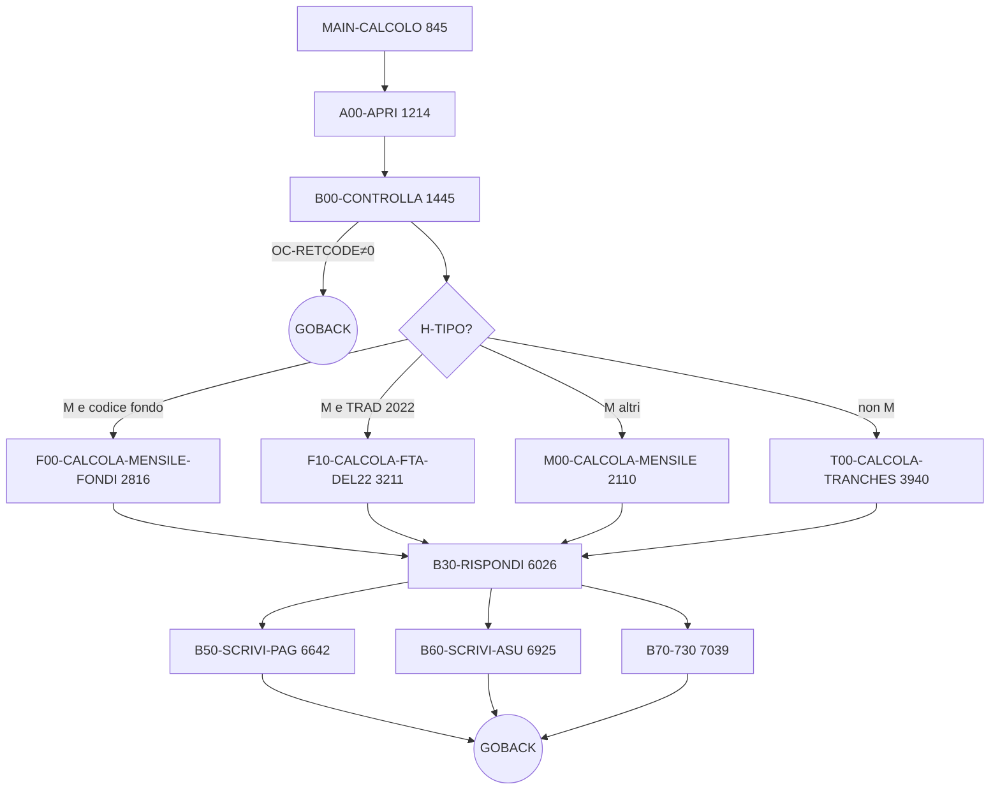

# Pseudocodifica AS-IS — `PIOSX41`

> **Programma**: `PIOSX41` — calcolo sussidio straordinario
> **Sorgente**: [PIOSX41.txt](PIOSX41.txt) — 9.771 righe
> **Chiamante**: `PDSIO13` (orchestratore pagamento)
> **Focus analisi**: prestazione **TYGP** (Tirocinio PON Puglia 2023, gestione introdotta 14/03/2025), con confronto rispetto a **TISC** (Tirocinio Inclusione Sociale Calabria, gestione introdotta 06/05/2024).
> **Stato**: Fase A — pseudocodifica osservativa, **STEP 2 (raffinata)**.

## Indice

1. [Sintesi del programma](#1-sintesi-del-programma)
2. [Diagramma di flusso orchestratore](#2-diagramma-di-flusso-orchestratore)
3. [Codici di ritorno `OC-RETCODE`](#3-codici-di-ritorno-oc-retcode)
4. [Variabili globali significative](#4-variabili-globali-significative)
5. [Mappa paragrafi (pseudo per paragrafo)](#5-mappa-paragrafi)
6. [Confronto TYGP ↔ TISC (key deliverable)](#6-confronto-tygp--tisc)
7. [Dipendenze esterne (CALL, EXEC CICS, copybook DB2)](#7-dipendenze-esterne)
8. [Ambiguità e domande aperte (PA-XX)](#8-ambiguità-e-domande-aperte)

---

## 1. Sintesi del programma

`PIOSX41` riceve in `COMMAREADS` (copy `CDSIO13`) una domanda di sussidio
straordinario già preparata da `PDSIO13` e ne calcola l'importo netto, le
componenti fiscali, le trattenute sindacali, gli eventuali ANF, i recuperi di
indebito/acconto e i conguagli 730. Restituisce in `COMMAREADS` l'esito
(`OC-RETCODE`, `OC-MESSAGGIO`) e l'area pagamento (`OC-*`, `OC-F*`).

Punti di ingresso/uscita:

- Ingresso unico: `PROCEDURE DIVISION USING COMMAREADS` → `MAIN-CALCOLO` [riga 842]
- Uscite: numerosi `GOBACK` distribuiti (almeno 9 nel range 927–1541 più la
	chiusura normale). Ogni `GOBACK` intermedio porta con sé un `OC-RETCODE`
	non zero e un `OC-MESSAGGIO` impostato. → vedi [PA-01](#7-ambiguità-e-domande-aperte).

Logica di alto livello (orchestrazione `MAIN-CALCOLO`):

1. `A00-APRI` — inizializza area output e finestra fiscale.
2. `B00-CONTROLLA` — controlli di ammissibilità e blocchi; può uscire con `OC-RETCODE` 11–20.
3. In base a `IC-SSTCODIND` e a `H-TIPO` ("M"/altro), instrada verso:
		- `F00-CALCOLA-MENSILE-FONDI` (famiglie FT*/CRED/FTAI/FSAI/TYGP/TISC/…)
		- `F10-CALCOLA-FTA-DEL22` (`TRAD` dic-2022)
		- `M00-CALCOLA-MENSILE` (mensile generico)
		- `T00-CALCOLA-TRANCHES` (a tranche / bonus)
4. `B30-RISPONDI` — consolida stato, scrive pagamento (`B50`/`B60`), gestisce 730 (`B70`).

## 2. Diagramma di flusso orchestratore



### Sotto-flusso `B00-CONTROLLA` (paragrafo critico con 17 uscite anticipate)

Il paragrafo `B00-CONTROLLA` [righe 1445-2059] contiene la maggioranza dei `GOBACK` intermedi. Sequenza dei controlli (ordine osservato nel codice):

```mermaid
flowchart TD
		IN([Entry B00-CONTROLLA]) --> Q1{IC-DCOPESTDI = N?}
		Q1 -->|sì| E11[RC=11 PRATICA NON ATTIVA — riga 1684]
		Q1 -->|no| Q2{Codice = WTWM e regione 06?}
		Q2 -->|sì| EB98[PERFORM B98]
		Q2 -->|no| Q3{Codice in lista B99-trigger\nINCLUDE TYGP, NON TISC}
		Q3 -->|sì| EB99[PERFORM B99 = forza mese precedente]
		Q3 -->|no| Q4
		EB98 --> Q4
		EB99 --> Q4{Domanda già elaborata oggi?}
		Q4 -->|sì| E13[RC=13 — riga 1692/1711]
		Q4 -->|no| Q5{Sospensioni coerenti?}
		Q5 -->|no| E16[RC=16 — righe 1746/1751/1756/1761]
		Q5 -->|sì| Q6{IBAN valido?}
		Q6 -->|no| E17[RC=17 — riga 1767]
		Q6 -->|sì| Q7{Sovrapposizione bonus su CF\n(CURBONUS)?}
		Q7 -->|sì| E18[RC=18 — riga 1776]
		Q7 -->|no| Q8{Allineamento PSR/integrata ok?}
		Q8 -->|no| E14[RC=14 — riga 1837]
		Q8 -->|sì| Q9{Stanziamento H-CONTO5 ok?}
		Q9 -->|no| E15[RC=15 — riga 1887]
		Q9 -->|sì| Q10{Domanda collegata ok?}
		Q10 -->|no| E12[RC=12/19 — righe 1909/1916/2039]
		Q10 -->|sì| Q11{Codice prest. attivo?}
		Q11 -->|no| E20[RC=20 — riga 2029]
		Q11 -->|sì| OK([Esce: OC-RETCODE=0\nritorna al MAIN])
```

> Nota: oltre a `B00`, le righe `1006/1036/1056/1081/1110/1203/1541/1572` impostano `RC=18` per duplicati CF rilevati in `EX-CNTR-PAGDUPLI` [righe 1039-1211] richiamato da `A00-APRI`.

## 3. Codici di ritorno `OC-RETCODE`

Mappatura completa dei `GOBACK` non commentati con il `RETCODE` corrispondente (estratta da `PIOSX41.txt` in modo esaustivo).

| RC | Significato osservato | Righe `GOBACK` | Paragrafo | Categoria |
| --- | --- | --- | --- | --- |
| 0 | Calcolo OK | 927 (uscita normale) | `MAIN-CALCOLO` | successo |
| 11 | `PRATICA NON ATTIVA` (`IC-DCOPESTDI = N`) | 1684 | `B00-CONTROLLA` | blocco di stato |
| 12 | Domanda collegata DS non trovata / incoerente | 1909, 2039 | `B00-CONTROLLA` | dati mancanti |
| 13 | Domanda già elaborata oggi (anti-doppione tecnico) | 1692, 1711 | `B00-CONTROLLA` | blocco anti-doppione |
| 14 | Allineamento PSR / integrata KO | 1837 | `B00-CONTROLLA` | coerenza |
| 15 | Stanziamento (`H-CONTO5`) esaurito o data blocco | 1887 | `B00-CONTROLLA` | budget |
| 16 | Errore sospensioni (presente anche errore SQL cursore) | 1746, 1751, 1756, 1761, 7695, 7761 | `B00-CONTROLLA` / `M35` / `M31` | dati |
| 17 | IBAN non valido | 1767 | `B00-CONTROLLA` | anagrafico |
| 18 | Pagamento duplicato per stesso CF | 1006, 1036, 1056, 1081, 1110, 1203, 1541, 1572, 1776 | `EX-CNTR-PAGDUPLI` / `B00-CONTROLLA` | anti-doppione |
| 19 | Coerenza domanda collegata (variante) | 1916 | `B00-CONTROLLA` | coerenza |
| 20 | Codice prestazione non attivo / non gestito | 2029 | `B00-CONTROLLA` | configurazione |
| 22 | Errore motore fiscale (`PNPGF8E`) | (in `I00-IRPEF`) | `I00-IRPEF` | fiscale |
| 24 | Errore riepilogo IRPEF (`PNPGF-RP-NUOVO`) | 4380 (**morto** — vedi PA-13) | `I10-IMPOSTA-IRPEF` | fiscale |
| n.d. | Errore senza RC esplicito (solo `OC-MESSAGGIO`) | 5029 | `I00-IRPEF` | da chiarire (vedi PA-27) |

## 4. Variabili globali significative

Solo i campi usati per decisioni di business o per output finale (escluso il
rumore tecnico).

### Area COMMAREADS (copy `CDSIO13`)

Aree principali:

- `IC-*` — input domanda: `IC-SSTCODIND` (codice prestazione), `IC-DCOCHIDOM`,
	`IC-DCOCODFIS`, `IC-DCOPESTDI`, `IC-DCODTDECSP`, `IC-DCODTADEC`,
	`IC-SSTDADEC`, `IC-SSTNUML1`/`IC-SSTNUML2` (importo/giornate base),
	`IC-SSTALFL1` (flag posizionali), `IC-GGSUSS`, array `IC-SOS*`, `IC-ANF*`.
- `OC-*` — area output con stato (`OC-RETCODE`, `OC-MESSAGGIO`, `OC-DCOULESSP`)
	e tracciato pagamento (`OC-SST*`, `OC-F*`, `OC-PEE*`, `OC-ASU*`).
- `H-*` — anagrafica categoria caricata da `B00-DB2-SELECT` su `TDSSX00`:
	`H-TIPO` (M/T/...), `H-TFISCALE` ("NO"/"13"/"RA"/"SS"/...), `H-CONTO5`,
	`H-CONTO6`, `H-TRA1..4`, `H-GGSUSS`, `H-ANFSN`.
- `O-*` — dati domanda PSR collegata: `O-DCOULESPP`, `O-PMEINDTOGG`,
	`O-AASIMPORTO`, `O-AASGGSPE`, `O-PMEINDTOTE`, `O-PMEINDUIME`.

### Working storage chiave

| Variabile | Tipo | Uso |
| --- | --- | --- |
| `WK-IMP-MENSILE` | 9(6)V9(6) | Importo mensile categoria |
| `PERIODO-TOTALE`, `WPERIODO` | 9(4) | Giorni utili in pagamento |
| `IMPORTO-TOTALE`, `WIMPORTO` | 9(7)V99 | Lordo spettante |
| `IMPORTO-SPETTANTE`, `IMPNETTO` | S9(7)V99 | Netto progressivo |
| `DATA-TER-CAL`, `DATA-TERMINE`, `DATA-INIZIO` | 9(8) | Finestre calcolo |
| `WK-CONGUAGLIO-730` | S9(7)V9(2) | Conguaglio 730 locale |
| `FAC*`, `FAP*` | vari | Componenti fiscali corrente/separata |
| `WK-CONTO5`, `WK-CONTO6` | 9(8) | Date blocco da stanziamento |
| `RIMB-ISOLA` | S9(7)V99 | Caso storico "Progetto ISOLA" |

### Cursori SQL dichiarati (working)

- `CURSOS` — sospensioni domanda DS collegata su `TDSSOSPE`.
- `CURBONUS` — verifica domande sovrapposte su stesso CF su `TDSDATCO`+`TDSSUSST`.

## 5. Mappa paragrafi

> Ogni scheda ha il formato richiesto dalla metodologia: range righe, scopo,
> input/output, DB I/O, CALL, decisioni chiave, e dove rilevante annotazioni
> TYGP/TISC e marcatori `[DA_CHIARIRE]`.

### MAIN-CALCOLO [righe 845-1038]
- Scopo: orchestrare il flusso completo di calcolo pagamento, scegliendo il ramo mensile/fondi/tranche in base a `H-TIPO` e `IC-SSTCODIND`.
- Output: invoca paragrafi di calcolo e risposta; termina con `GOBACK`; eventuali `OC-RETCODE`/`OC-MESSAGGIO` sono ereditati dai paragrafi chiamati.
- Decisioni chiave: `IF OC-RETCODE=0`; `IF H-TIPO="M"` → fondi (`F00`) per ampia famiglia codici, altrimenti `TRAD→F10`, altrimenti `M00`; se `H-TIPO≠"M"` usa `T00`; sempre `B30-RISPONDI` a valle.
- **TYGP**: ramo fondi a riga 909 (`OR IC-SSTCODIND = "TYGP"`).
- **TISC**: ramo fondi a riga 904 — stessa famiglia di TYGP.
- `[DA_CHIARIRE PA-02]`: lista codici hardcoded molto lunga, potenzialmente esternalizzabile in tabella.

### EX-CNTR-PAGDUPLI [righe 1039-1211]
- Scopo: verificare pagamenti duplicati per stesso CF su stessa famiglia bonus, escludendo la domanda corrente.
- Output: in caso duplicato `OC-RETCODE=18`, `OC-MESSAGGIO="ERRORE PAG DUPLICATO PER STESSO CF"`, `GOBACK`.
- DB I/O: `SELECT H_O0DCOCODFIS FROM TDSAPIO0 WHERE H_O0CFISCALE=:IC-CODFISARCA AND H_O0DCOCHIDOM!=:IC-DCOCHIDOM AND (H_O0RECPAGATO='S' OR (='A' AND H_O0RECIMURE1>0)) AND H_O0SXCODIND IN (...)`; stessa query su `TDSSPIO0`.
- Decisioni chiave: mapping E107/E109/E110/E112 e E157/E159/E160/E162 in gruppo omogeneo; considera duplicato anche `SQLCODE -811`.
- `[DA_CHIARIRE PA-03]`: trattamento `SQLCODE=-811` come duplicato certo può mascherare anomalia dati multipli non attesa.

### EX-CONTROLLI [righe 1212-1213]
- Scopo: exit point tecnico — nessuna logica.

### A00-APRI [righe 1214-1444]
- Scopo: inizializzare il contesto di calcolo (date fiscali, accumulatori, area output) e copiare stato iniziale domanda.
- Input: campi `IC-*` (prestazione, importi, recuperi, date, anagrafici).
- Output: popola massivamente `OC-AREA` (`OC-SST*`, `OC-REC*`, `OC-PEE*`, `OC-ASU*`), resetta `OC-RETCODE=0`, `OC-MESSAGGIO` blank.
- Decisioni chiave: finestra fiscale differenziata (`CRED/FTAI/FSAI`, `SARB`, `TYAD`); correttivi `COIP` su giornate e limite senza IBAN.
- `[DA_CHIARIRE PA-04]`: regole fiscali iniziali hardcoded per codice con anni fissi.

### B00-CONTROLLA [righe 1445-2059]
- Scopo: applicare i controlli di ammissibilità domanda/categoria, blocchi per stato pratica, sovrapposizioni, duplicati, e preparare parametri calcolo/fiscale.
- Output: può impostare `OC-RETCODE`/`OC-MESSAGGIO` con `GOBACK` (codici 11–20); aggiorna `DATA-TER-CAL`, `H-TFISCALE`.
- DB I/O: `OPEN/FETCH/CLOSE CURBONUS` (periodi sovrapposti su stessa persona); `SELECT H_WEBGIOLAV FROM TDSWSCRR WHERE H_WEBCODFIS=:IC-DCOCODFIS`; `PERFORM B00-DB2-SELECT` su `TDSSX00`.
- CALL: `CALL RDSSX41 USING ... I-SX41-AREA O-SX41-AREA`; `CALL RDSUT27 USING ... PER-RDSUT27`.
- Decisioni chiave: blocco se `IC-DCOPESTDI="N"`; blocco se già elaborata oggi; eccezioni `B99/B98` per `CALCOLOAL`; validazioni allineamento PSR/integrata; controllo stanziamento via `H-CONTO5`.
- **TYGP**: incluso nel ramo eccezione `B99` a riga 1670 (`OR IC-SSTCODIND = "TYGP"`). [BUSINESS_RULE]
- **TISC**: ❌ NON incluso in questa lista — **divergenza key**.
- `[DA_CHIARIRE PA-05]`: molte uscite `GOBACK` intermedie rendono difficile distinguere errore tecnico da regola business.

### B98-ECCEZIONE-CALCOLOAL [righe 2060-2088]
- Scopo: calcolare `DATA-TER-CAL` per eccezione WTW Veneto, consentendo pagamento mese precedente con slittamento prima del 16. Non applicabile a TYGP/TISC.

### B99-ECCEZIONE-CALCOLOAL [righe 2089-2109]
- Scopo: **forzare il termine di calcolo al mese precedente** per categorie specifiche.
- Logica: se `MM-SIS-AMG <= MM-TER-CAL` allora `DATA-TER-CAL` viene retrocessa al fine-mese precedente (gestendo cambio anno e bisestile su febbraio).
- Effetto sul calcolo: nessun pagamento del mese corrente; si lavora solo fino a fine mese N-1. [BUSINESS_RULE TYGP]
- **TYGP**: triggera questo paragrafo da `B00` (riga 1670), `M00` (riga 2216) e `T00` (riga 4014) — quindi il pagamento si chiude sempre al mese precedente.
- **TISC**: ❌ non triggera mai `B99` — può quindi pagare anche il mese corrente.
- **Conferma equivalenza delle 3 liste trigger** (verificato in STEP 2): le tre IF nei paragrafi `B00`, `M00`, `T00` sono praticamente identiche (35 codici, stesso set incluso TYGP, stesse esclusioni `APAF/APAR/APA2/DLIA/COIP/BRIO` commentate). Conferma che la regola B99 è una scelta **per famiglia di prestazione**, non un effetto collaterale di un paragrafo specifico.
- `[DA_CHIARIRE PA-06]`: condizione `IF MM-SIS-AMG <= MM-TER-CAL` non intuitiva (probabilmente evita di "tornare indietro" se il termine è già nel passato).
- `[DA_CHIARIRE PA-06b]`: codici commentati nelle liste (`APAF/APAR/APA2/DLIA/COIP/BRIO`): in passato erano triggerati da B99 e poi rimossi? Storia da ricostruire.

### M00-CALCOLA-MENSILE [righe 2110-2512]
- Scopo: calcolare importo spettante per prestazioni mensili non a tranche, inclusi recuperi, IRPEF, trattenute sindacali, ANF e anticipo.
- Output: aggiorna `IMPORTO-TOTALE`, `IMPORTO-SPETTANTE`, `PERIODO-TOTALE`, componenti fiscali (`FAC*`,`FAP*`), recuperi e ANF.
- Decisioni chiave: part-time ridimensiona mensile; limite termine per decadenza/pensione; eccezioni `B99/B98`; calcolo periodo via `M20`; IRPEF (`T40` se `H-TFISCALE="NO"` altrimenti `I10`); anticipo con `M22`; trattenute sindacali escluse su famiglie EE/EJ/EK/EW/EY/EX.
- **TYGP**: incluso nei codici con eccezione `B99` a riga 2216.
- **TISC**: ❌ NON incluso — vedi sezione [confronto](#5-confronto-tygp--tisc).
- `[DA_CHIARIRE PA-07]`: logica Progetto Isola con CF/domanda esclusi hardcoded.

### F01-CALCOLA-TERMINE [righe 2513-2687]
- Scopo: calcolare la data termine teorica prestazione considerando giornate massime e sospensioni.
- CALL: `RDSUT20` (giorni tra date), `RDSUT55` (aggiunta giorni a data).
- Decisioni chiave: massimali giorni diversi (FT*, FSAD, CRED/FTAI/FSAI); estensione per sospensioni aperte; limite massimo 48 mesi (esclusi FTAI/FSAI).
- TYGP/TISC: non citati esplicitamente — usano i default delle tirocini.

### F02-CALCOLA-RET-SET-MOB [righe 2688-2715]
- Scopo: calcolare retribuzione settimanale e recupero rinuncia per `FTMD`. Non applicabile a TYGP/TISC.
- DB I/O: `SELECT H_IDMORTECO,H_IDMREORE FROM TDSINDIM WHERE H_IDMCHIDOM=:WK-IDMCHIDOM`.

### F03-CALCOLA-RET-SET-NASPI [righe 2716-2790]
- Scopo: calcolare `RETSET` per `FTAD/FSAD` collegata a NASPI, con massimale annuale.
- DB I/O: `SELECT H_DCOANVEPR FROM TDSDATCO ...`; `SELECT H_NASTREU4A,H_NASNSELA4 FROM TDSNASPI ...`; `SELECT H_TMODTADAL,H_TMOIMPMASE FROM TDSTAMAO ...`.
- Decisioni chiave: confronto retribuzione media con `1.4 * massimale`. Non applicabile a TYGP/TISC.

### F04-CALCOLA-RET-SET-ASPI [righe 2791-2815]
- Scopo: calcolare `RETSET` da importo mensile ASPI. Non applicabile a TYGP/TISC.

### F00-CALCOLA-MENSILE-FONDI [righe 2816-3210]
- Scopo: calcolare importi per prestazioni fondo/integrative (incluse CRED/FTAI/FSAI) con percorsi dedicati anno corrente, periodo, fiscalità e recuperi.
- Decisioni chiave: determinazione `WK-IMP-MENSILE` distinta per famiglie; percorso `C10/C20/C21/F20/M10` e `C30/C31/F30/M20`; gestione arretrati FT* (corrente/separata); IRPEF con `T40` o `I10`.
- **TYGP**: codici “importo da pagare in `IC-SSTNUML1`” a riga 2860 e calcoli a riga 3087.
- **TISC**: stesso ramo a riga 2855 e riga 3082 — comportamento identico.
- `[DA_CHIARIRE PA-08]`: duplicazione `OR IC-SSTCODIND = "FTMD"` e numerosi rami commentati.

### F10-CALCOLA-FTA-DEL22 [righe 3211-3403]
- Scopo: calcolo speciale `TRAD`/FTA dicembre 2022. Non applicabile a TYGP/TISC.

### C10-CREDITO [righe 3404-3481]
- Scopo: allineare termine/calcolo integrazione `CRED/FTAI/FSAI` allo stato della domanda collegata. Non applicabile a TYGP/TISC.
- `[DA_CHIARIRE PA-09]`: logica “ripristino” basata su posizione carattere in `IC-SSTALFL1`.

### M10-CALCOLA-ANNO-IN-CORSO [righe 3482-3782]
- Scopo: calcolare imponibile anno corrente (`IMPORTO-T-AC`) con regole fiscali per codice prestazione.
- Decisioni chiave: data inizio anno fiscale variabile (01/01, 01/12, date fisse 2014/2018/2019); scorrimento sospensioni via `M30`/`M31`.
- **TYGP**: trattato come famiglia tirocini con start fiscale 2014 (riga 3616 e 3716).
- **TISC**: stesso raggruppamento tirocini (riga 3611 e 3711) — identico.
- `[DA_CHIARIRE PA-10]`: molte regole storiche datate hardcoded (2014, 2018, 2019).

### C20-CALCOLA-ANNO-IN-CORSO [righe 3783-3849] · C21-CALCOLA-ANNO-IN-CORSO-RIP [righe 3850-3889] · F20-CALCOLA-ANNO-IN-CORSO [righe 3890-3939]
- Scopo: calcolare imponibile anno corrente per CRED/FTAI/FSAI in vari stati. Non applicabile a TYGP/TISC.

### T00-CALCOLA-TRANCHES [righe 3940-4149]
- Scopo: calcolare prestazioni pagate a tranche (una o più rate) con fiscalità dedicata.
- Decisioni chiave: imposta termine con eccezioni `B99/B98`; periodo da `T20`; IRPEF scelta con `EVALUATE H-TFISCALE` (`T40/T50/T60/T70/T30`).
- **TYGP**: incluso tra codici che forzano `B99` a riga 4014.
- **TISC**: ❌ NON incluso — divergenza.
- `[DA_CHIARIRE PA-11]`: `T20` contiene grande logica COVID/codice; separazione dominio/flusso sarebbe opportuna.

### D00-DETRAGGO-RECUPERO [righe 4150-4178]
- Scopo: applicare recupero indebito al lordo spettante e aggiornare residuo recupero.

### D10-DETRAGGO-ACCONTO [righe 4179-4241]
- Scopo: detrarre acconto dal **netto** (`IMPNETTO`) anziché dal lordo (correzione 10.03.2025).
- `[DA_CHIARIRE PA-12]`: `IMPORTO-SPETTANTE` non viene riallineato a `IMPNETTO` nel paragrafo.

### I10-IMPOSTA-IRPEF [righe 4242-4903]
- Scopo: preparare richiesta a motore fiscale, calcolare imponibile corrente/separata, giornate detrazioni e conguagli.
- Output: popola `FAC*`,`FAP*`,`FCODPROCED`, `FCODCALCOLO`, `IMPTASSATO`; può impostare `OC-RETCODE=24` e messaggio errore riepilogo.
- CALL: `PERFORM PNPGF-RP-NUOVO`; `PERFORM I30-CALCOLA-GG-PREST`.
- Decisioni chiave: scelta procedura fiscale (`G09/G10/G11/G12/G22/G24/V01/V02`); split imponibile corrente/separata rispetto `IMPORTO-T-AC`; correttivi giorni FT*.
- **TYGP**: ramo procedura `G22` a riga 4309 e a riga 4559.
- **TISC**: stesso ramo `G22` a riga 4304 e 4554 — identico.
- `[DA_CHIARIRE PA-13]`: **codice morto confermato in STEP 2**. Riga 4366: `IF FDATAAL > FDATAAL` — confronto di una variabile con sé stessa, sempre falsa. Conseguenze:
	- la `PERFORM PNPGF-RP-NUOVO` a riga 4368 non viene mai eseguita,
	- il ramo `ELSE` a riga 4382 viene sempre eseguito → `IMPTASSATO=0`, `RIEPILOGO-GG-DETRAZ=0`,
	- il `GOBACK` a riga 4380 con `OC-RETCODE=24` è irraggiungibile,
	- l'intero paragrafo `PNPGF-RP-NUOVO` [9776-9808] (riepilogo fiscale storico) è di fatto **inattivo** (era l'unico chiamante).
	Ipotesi: la condizione corretta dovrebbe essere `IF FDATAAL > 0` o simile. Da verificare con business owner se il riepilogo fiscale storico è gestito esternamente o se è un bug latente.

### I20-IMPOSTA-IRPEF-R [righe 4904-4919]
- Scopo: impostare componenti fiscali per quota anticipo/rinuncia (`R`) quando presente.

### I00-IRPEF [righe 4920-5189]
- Scopo: eseguire la chiamata effettiva al motore fiscale (`PNPGF8E`) e consolidare imposte/detrazioni.
- CALL: `PERFORM PNPGF-AL-NUOVO`; `CALL PNPGF8E USING WDFHEIBLK RICHIESTA`; `PERFORM PNPGF-DAL-NUOVO`.
- Output: `FACIMPNETTA`, `FAPIMPNETTA`, detrazioni/addizionali/conguagli, `IMPTASSATO`; in errore `OC-RETCODE=22` + messaggio.
- `[DA_CHIARIRE PA-14]`: ampio blocco detrazioni alternative interamente commentato; comportamento dipende totalmente da GF.

### I30-CALCOLA-GG-PREST [righe 5190-5239]
- Scopo: calcolare giornate prestazione utili a fini detrazione fiscale.
- CALL: `CALL RDSUT21 USING ... PIU-GIORNI`; `CALL RDSUT20 USING ... WK-PER-SPET`.

### M22-CALCOLA-ANTICIPO [righe 5240-5304]
- Scopo: calcolare quota anticipo residua e relativo impatto su importo corrente/recupero/sindacato. Non rilevante per TYGP/TISC (no anticipo).

### T30-IRPEF [righe 5305-5473] · T40-NO-IRPEF [righe 5474-5602] · T50-13-IRPEF [righe 5603-5776] · T60-RA-IRPEF [righe 5777-5873] · T70-SS-IRPEF [righe 5874-6025]
- Scopo: cinque varianti di preparazione fiscale per tranche, selezionate da `H-TFISCALE` in `T00-CALCOLA-TRANCHES`.
- **TYGP** e **TISC**: entrambi entrano nel ramo procedura `G22` in tutte le varianti (T30 righe 5397/5402, T40 righe 5537/5542, T50 righe 5696/5701, T70 righe 5911/5916). Comportamento identico.
- `[DA_CHIARIRE PA-15]`: `T40-NO-IRPEF` valorizza codici procedura fiscale anche in percorso “NO IRPEF”.

### B30-RISPONDI [righe 6026-6641]
- Scopo: consolidare esito calcolo, aggiornare stato domanda, importi cumulati, scegliere se scrivere pagamento/enti e definire codice ritorno finale.
- Decisioni chiave: definizione stato `OC-DCOULESSP` (`L/D`); soglia minima pagamento (`>2`); blocco importo eccessivo su famiglie tirocinio.
- **TYGP**: nel controllo importo eccessivo a riga 6555 (`OR IC-SSTCODIND = "TYGP"`).
- **TISC**: stesso controllo a riga 6550 — identico.
- `[DA_CHIARIRE PA-16]`: doppia valorizzazione `OC-DCOULESSP` nello stesso paragrafo può introdurre sovrascritture inattese.

### B50-SCRIVI-PAG [righe 6642-6924]
- Scopo: comporre il record pagamento finale (netto, periodi fiscali, recuperi, conguagli, codici pagamento).
- `[DA_CHIARIRE PA-17]`: numerosi reset condizionati possono azzerare blocchi fiscali dopo calcoli complessi.

### B60-SCRIVI-ASU [righe 6925-7038]
- Scopo: popolare i tracciati ASU/ASU2/ASU7/ASU9 per ente, periodi e importi da esporre.

### B70-730 [righe 7039-7176]
- Scopo: applicare recupero conguaglio 730 sul netto pagabile mantenendo soglia minima residua.
- `[DA_CHIARIRE PA-18]`: intera integrazione esterna 730 commentata/bypassata, recupero ora solo su variabile locale `WK-CONGUAGLIO-730`.

### M20-CALCOLA-PERIODO [righe 7177-7207]
- Scopo: calcolare periodo/importo spettante generale con eventuale gestione ANF.
- Decisioni chiave: se `PARM/SARV/WTWM` con flag S usa `M31`, altrimenti `M30`.
- TYGP/TISC: entrambi entrano in `M30-SCORRI-SOSPENSIONI` (path standard).

### C30-CALCOLA-PERIODO [righe 7208-7271] · C31-CALCOLA-PERIODO-RIP [righe 7272-7305] · F30-CALCOLA-PERIODO [righe 7306-7381]
- Scopo: calcolo periodo per CRED/FTAI/FSAI in vari stati. Non applicabile a TYGP/TISC.
- `[DA_CHIARIRE PA-19]`: in `F30` la logica su `O-PMEINDUIME < 0` stratificata con `continue` può essere fragile.

### M30-SCORRI-SOSPENSIONI [righe 7382-7675]  ⚠️ **paragrafo critico TYGP/TISC**
- Scopo: scorrere sospensioni e calcolare giornate utili e importo effettivo, con cap specifici per codice prestazione.
- Struttura: due `EVALUATE IC-SSTCODIND`. Per ogni famiglia: `MOVE IC-SSTNUML2 TO WPERIODO` (cap giorni) e `MOVE IC-SSTNUML1 TO WIMPORTO` (importo fisso).
- **TYGP** [righe 7485-7486]: posizionato nella famiglia `TYGM/TIPO/DL76/TYRG/TYBL/TYCR`.
		Effetto: `MOVE IC-SSTNUML2 TO WPERIODO` (l'`IF WPERIODO > IC-SSTNUML2` originale è **commentato**, quindi assegna sempre).
- **TISC** [righe 7522-7534]: posizionato nella famiglia `APAF/TGOL/DLI2/TISM/TGOC/TGOV/TGOS/TGOP/TIRA/PIAC`.
		Effetto: `MOVE IC-SSTNUML2 TO WPERIODO` — **stesso effetto netto** di TYGP.
- **TYGP** [riga 7619] secondo EVALUATE famiglia TYGM: `MOVE IC-SSTNUML1 TO WIMPORTO`.
- **TISC** [riga 7635] secondo EVALUATE famiglia APAF/TGOL/TISM/TGOC: `MOVE IC-SSTNUML1 TO WIMPORTO`.
- → Per `M30` TYGP e TISC sono in **famiglie sintatticamente diverse ma con effetto identico**. Vedi PA-20.
- `[DA_CHIARIRE PA-20]`: famiglie distinte ma stesso effetto suggeriscono che la separazione sia storica/cronologica (TYGM/DL76 sono vecchi tirocini, TISC/TGOC/TGOS/… sono i nuovi). Confermare con business owner se la separazione ha o avrà significato.

### M35-SCORRI-SOSPENSIONI-DS [righe 7676-7767]
- Scopo: scorrere sospensioni della domanda DS collegata via cursore DB e sommare periodo utile. Non applicabile a TYGP/TISC.
- DB I/O: `OPEN/FETCH/CLOSE CURSOS` su `TDSSOSPE`.

### M31-NON-SCORRERE [righe 7768-7838]
- Scopo: calcolare periodo/importo senza sottrarre sospensioni (regola speciale).
- Decisioni chiave: cap su `IC-GGSUSS` (728 per CRED/FTAI/FSAI con tipo U); override importo fisso su famiglia tirocini/POR/TG*.
- **TYGP**: incluso nel ramo override periodo/importo a riga 7828.
- **TISC**: stesso ramo a riga 7823.
- Effetto netto: identico.

### M40-ANF [righe 7839-7890] · M41-CALCOLA-ANF [righe 7891-7913]
- Scopo: calcolare componenti ANF per sottoperiodi validi, con taglio per entrata in vigore AU. TYGP/TISC: non specifico (segue regole generali).

### T20-CALCOLA-PERIODO [righe 7914-9302]
- Scopo: calcolare importo/periodo per prestazioni a tranche e bonus COVID con molte tabelle decisionali per codice e decorrenza/decadenza.
- Decisioni chiave: grandi `IF/EVALUATE` per famiglie `EE*`, `EJ*`, `EK*`, `EW/EY`, `EX*`, `E092`, `E10x`, `E15x`; regole specifiche “no IBAN” con pagamento di una mensilità.
- TYGP/TISC: **non citati direttamente in questo paragrafo**. I `WHEN TYGP/TISC` rilevati alle righe 7486/7525 e 7619/7635 appartengono a `M30-SCORRI-SOSPENSIONI` [7382-7675] (risolto in STEP 2).

### T21-COVID-SOSPE [righe 9303-9383]
- Scopo: rilevare sospensioni mensili COVID (maggio/giugno/luglio) per modulare importi bonus COVID. Non applicabile a TYGP/TISC.

### R00-TOGLI-UNO [righe 9384-9419] · R10-AGGIUNGI-UNO [righe 9420-9469]
- Scopo: utility data ±1 giorno.
- `[DA_CHIARIRE PA-22]`: regola bisestile semplificata (`/4` senza eccezione secoli).

### B00-DB2-SELECT [righe 9470-9567]
- Scopo: caricare anagrafica categoria/sussidio da `TDSSX00` con chiave `H-CODCTG/H-REGCTG/H-ANNOCTG`.
- Output: popola tutti i campi `H-*`.

### PNPGF-CC-NUOVO [righe 9571-9655]
- Scopo: richiedere al componente fiscale i conguagli/acconti addizionali.
- CALL: `CALL RDSUT29 USING ... RICHIESTA LINK-CONGUAGLIO`.
- `[DA_CHIARIRE PA-23]`: uso di `WK-CONGUAGLIO-730` senza persistenza esterna.

### PNPGF-AL-NUOVO [righe 9659-9729]
- Scopo: preparare area richiesta calcolo fiscale (`CT`) con dati anagrafici/comune/conguaglio.
- CALL: `CALL RDSUT17 USING ... L-AREA-COMUNE`.

### PNPGF-DAL-NUOVO [righe 9733-9769]
- Scopo: trasferire output del motore fiscale ai campi interni.
- `[DA_CHIARIRE PA-24]`: parte addizionali contrassegnata `GG*` commentata, verificare fonte valorizzazione ufficiale.

### PNPGF-RP-NUOVO [righe 9776-9808]
- Scopo: richiedere riepilogo fiscale storico (`RP`) per imponibile già tassato e giorni detrazione pregressi.
- CALL: `CALL PNPGF8E USING WDFHEIBLK RICHIESTA`.
- Decisioni chiave: considera ok anche ritorni `000000100` e `-000000305`.
- `[DA_CHIARIRE PA-25]`: nel chiamante `I10` il trigger della `PERFORM PNPGF-RP-NUOVO` è legato a una condizione apparentemente impossibile (`FDATAAL > FDATAAL`) → paragrafo di fatto morto?

## 6. Confronto TYGP ↔ TISC

> Sintesi del confronto tra le due prestazioni come trattate da `PIOSX41`.
> Legenda: ✅ comportamento identico · ⚠️ presente in entrambi ma in famiglie diverse · ❌ divergenza funzionale.

| Punto di codice | Riga TYGP | Riga TISC | Esito | Note |
| --- | --- | --- | --- | --- |
| `MAIN-CALCOLO` — ramo fondi | 909 | 904 | ✅ stessa famiglia, stesso flusso | `F00-CALCOLA-MENSILE-FONDI` |
| `B00-CONTROLLA` — trigger `B99-ECCEZIONE-CALCOLOAL` | **1670** | **assente** | ❌ **divergenza** | TYGP forza pagamento al mese precedente |
| `M00-CALCOLA-MENSILE` — trigger `B99` | **2216** | **assente** | ❌ **divergenza** | idem |
| `F00-CALCOLA-MENSILE-FONDI` — importo da `IC-SSTNUML1` | 2860 | 2855 | ✅ | stesso branch |
| `F00-CALCOLA-MENSILE-FONDI` — calcolo successivo | 3087 | 3082 | ✅ | |
| `M10-CALCOLA-ANNO-IN-CORSO` — start fiscale 2014 (tirocini) | 3616, 3716 | 3611, 3711 | ✅ | famiglia tirocini |
| `T00-CALCOLA-TRANCHES` — trigger `B99` | **4014** | **assente** | ❌ **divergenza** | idem |
| `I10-IMPOSTA-IRPEF` — ramo procedura `G22` | 4309, 4559 | 4304, 4554 | ✅ | |
| `T30-IRPEF` — ramo `G22` | 5402 | 5397 | ✅ | |
| `T40-NO-IRPEF` — ramo `G22` | 5542 | 5537 | ✅ | |
| `T50-13-IRPEF` — ramo `G22` | 5701 | 5696 | ✅ | |
| `T70-SS-IRPEF` — ramo `G22` | 5916 | 5911 | ✅ | |
| `B30-RISPONDI` — controllo importo eccessivo tirocini | 6555 | 6550 | ✅ | |
| `M30-SCORRI-SOSPENSIONI` — cap `WPERIODO` (1° EVALUATE) | 7486 (fam. TYGM) | 7525 (fam. APAF/TGOL/TISM) | ⚠️ famiglie diverse, **stesso effetto netto** | `MOVE IC-SSTNUML2 TO WPERIODO` in entrambe |
| `M30-SCORRI-SOSPENSIONI` — cap `WIMPORTO` (2° EVALUATE) | 7619 (fam. TYGM) | 7635 (fam. APAF/TGOL/TISM) | ⚠️ famiglie diverse, **stesso effetto netto** | `MOVE IC-SSTNUML1 TO WIMPORTO` in entrambe |
| `M31-NON-SCORRERE` — override importo | 7828 | 7823 | ✅ | stesso branch |

### Sintesi del confronto

1. **Unica divergenza funzionale netta**: TYGP è inserito nelle tre liste che
		triggerano `B99-ECCEZIONE-CALCOLOAL` (in `B00`, `M00`, `T00`), mentre TISC
		non lo è. **Conseguenza**: per TYGP il calcolo è sempre chiuso al mese
		precedente; per TISC il calcolo può chiudere anche al mese corrente.
		[BUSINESS_RULE TYGP-vs-TISC]
2. **Divergenza sintattica senza effetto**: in `M30-SCORRI-SOSPENSIONI` e
		nei vari `T*-IRPEF` le due prestazioni stanno in `WHEN`/branch diversi ma
		eseguono le stesse istruzioni. Possibile heritage storico (TYGP è
		raggruppato con i tirocini "vecchi" TYGM/DL76; TISC con i tirocini "nuovi"
		TGOL/TGOC/TGOS/…).
3. **Per tutto il resto del flusso le due prestazioni sono trattate in modo identico**:
		stessa procedura fiscale (`G22`), stesso ramo `F00-CALCOLA-MENSILE-FONDI`,
		stessa logica importo (`IC-SSTNUML1` = lordo, `IC-SSTNUML2` = giornate),
		stesso controllo soglia massima in `B30`.

### Domanda chiave per il business owner

→ La differenza TYGP-vs-TISC sulla finestra di pagamento (mese precedente sì/no)
è **intenzionale** o è una **lacuna**? Le altre prestazioni della stessa
"generazione" (TGOV/TGOC/TGOS/TGOP/TIRA/PIAC) sono tutte allineate a TISC, non
a TYGP. Quindi o TYGP è l'eccezione voluta, o è un errore di inserimento
quando è stato aggiunto il 14/03/2025.

## 7. Dipendenze esterne

### Sottoprogrammi chiamati (CALL)

| Programma | Tipo | Scopo apparente | Stato |
| --- | --- | --- | --- |
| `RDSSX41` | CALL | dati DS ordinario (Fondo Credito) | black-box |
| `RDSUT17` | CALL | denominazione comune | black-box |
| `RDSUT20` | CALL | giorni tra due date / indennizzabili | black-box |
| `RDSUT21` | CALL | calcolo periodo in giorni | black-box |
| `RDSUT27` | CALL | aliquote trattenute sindacali | black-box (copy `CDSUT27`) |
| `RDSUT29` | CALL | conguagli/acconti fiscali addizionali | black-box |
| `RDSUT55` | CALL | aggiungi giorni a data iniziale | black-box |
| `PNPGF8E` (alias `PNPGF110`) | CALL | motore fiscale (richiesta `CT`/`RP`) | black-box |
| `POPCF61` | CALL | (calcoli 730 — commentata) | dormiente |
| `POPWMAIN` | EXEC CICS LINK | (conguaglio 730 — commentata) | dormiente |
| `RDSUT55` | EXEC CICS LINK | (commentata) | dormiente |

### Tabelle DB2 referenziate

`TDSDATCO`, `TDSSUSST`, `TDSNASPI`, `TDSASPI`, `TDSINDIM`, `TDSTAMAO`,
`TDSSOSPE`, `TDSSX00`, `TDSSPIO0`, `TDSDATAN`, `TDSWSCRR`, `TDSPEERT`,
`TDSPEERE`, `TDSANTAS`, `TDSAPIO0` (lettura indiretta da copybook),
`VCAPSEDI` (commentata).

### Copybook inclusi

`CDSIO13` (linkage), `CDSSX41`, `CDSUT27`, `CDSGFOLD`, `DSGFCOPY`, `DSWABNDB`,
`CDSABNDB`, `SQLCA`. Tutti dichiarati black-box (non presenti nel workspace).

## 8. Ambiguità e domande aperte

> Consolidamento dei marcatori `[DA_CHIARIRE]`. Da riformulare come domande
> funzionali in Fase B.

| ID | Riferimento | Domanda |
| --- | --- | --- |
| PA-01 | tutto il programma | **28 `GOBACK` non commentati** mappati su 11 codici `OC-RETCODE` distinti (0/11/12/13/14/15/16/17/18/19/20/22/24): vedi [§3 Codici di ritorno](#3-codici-di-ritorno-oc-retcode). Esiste un catalogo ufficiale dei codici di ritorno verso `PDSIO13`? |
| PA-02 | `MAIN-CALCOLO` | Lista codici prestazione hardcoded molto lunga. È esternalizzabile in tabella di configurazione nella riscrittura? |
| PA-03 | `EX-CNTR-PAGDUPLI` | Trattamento `SQLCODE=-811` come duplicato certo: comportamento atteso o workaround per dati non univoci? |
| PA-04 | `A00-APRI` | Date fiscali iniziali hardcoded per codice (anni fissi 2014/2018/2019): regole storiche da preservare o da parametrizzare? |
| PA-05 | `B00-CONTROLLA` | Molte uscite `GOBACK` intermedie: distinzione errore tecnico vs business non sempre chiara. |
| PA-06 | `B99-ECCEZIONE-CALCOLOAL` | Condizione `IF MM-SIS-AMG <= MM-TER-CAL` (non intuitiva) — confermare semantica. |
| PA-07 | `M00-CALCOLA-MENSILE` | Logica "Progetto Isola" con CF/domanda esclusi hardcoded — ancora attiva? |
| PA-08 | `F00-CALCOLA-MENSILE-FONDI` | Duplicazione `OR IC-SSTCODIND = "FTMD"` e numerosi rami commentati. |
| PA-09 | `C10-CREDITO` | Flag "ripristino" basato su posizione carattere in `IC-SSTALFL1`: documentare significato dei singoli byte. |
| PA-10 | `M10-CALCOLA-ANNO-IN-CORSO` | Regole storiche date fisse (2014/2018/2019) — vanno mantenute o sono codice morto? |
| PA-11 | `T00-CALCOLA-TRANCHES` | Forte accoppiamento dominio/flusso da rompere nel TO-BE. |
| PA-12 | `D10-DETRAGGO-ACCONTO` | `IMPORTO-SPETTANTE` non riallineato a `IMPNETTO` dopo la correzione 10.03.2025 — voluto? |
| PA-13 | `I10-IMPOSTA-IRPEF` [riga 4366] | **Codice morto confermato**: `IF FDATAAL > FDATAAL` sempre falsa → `PNPGF-RP-NUOVO` mai eseguito, `OC-RETCODE=24` irraggiungibile, intero paragrafo `PNPGF-RP-NUOVO` inattivo. Bug latente o intenzionale (riepilogo gestito altrove)? |
| PA-14 | `I00-IRPEF` | Ampio blocco detrazioni commentato — confermare che la logica risiede totalmente in GF. |
| PA-15 | `T40-NO-IRPEF` | Codici procedura fiscale valorizzati anche su percorso "NO IRPEF" — necessario? |
| PA-16 | `B30-RISPONDI` | Doppia valorizzazione `OC-DCOULESSP`: rischio sovrascritture. |
| PA-17 | `B50-SCRIVI-PAG` | Reset condizionati di blocchi fiscali — confermare i casi. |
| PA-18 | `B70-730` | Integrazione esterna 730 commentata: il recupero attuale è solo su variabile locale `WK-CONGUAGLIO-730`. Confermare. |
| PA-19 | `F30-CALCOLA-PERIODO` | Logica `O-PMEINDUIME < 0` con `continue` stratificata — rivedere. |
| PA-20 | `M30-SCORRI-SOSPENSIONI` | TYGP e TISC in famiglie sintattiche diverse ma effetto identico: separazione voluta o reliquia storica? |
| ~~PA-21~~ | — | **RISOLTO in STEP 2**: i `WHEN TYGP/TISC` sono in `M30-SCORRI-SOSPENSIONI`, non in `T20`. |
| PA-22 | `R00`/`R10` | Bisestile semplificata (`/4`): voluta o da correggere? Per le date attese (≥2000) il problema secoli non si presenta. |
| PA-23 | `PNPGF-CC-NUOVO` | `WK-CONGUAGLIO-730` non persistito esternamente: il valore è ricalcolato a ogni run? |
| PA-24 | `PNPGF-DAL-NUOVO` | Addizionali contrassegnate `GG*` commentate — confermare fonte. |
| ~~PA-25~~ | — | **MERGED con PA-13**: stesso problema (condizione impossibile in `I10` rende `PNPGF-RP-NUOVO` dead code). |
| PA-26 | **TYGP vs TISC — B99** | TYGP trigge­ra `B99` (calcolo al mese precedente), TISC no. **Intenzionale o errore di inserimento al 14/03/2025?** Le altre prestazioni "fratello" (TGOV/TGOC/TGOS/TGOP/TIRA/PIAC) sono allineate a TISC. |
| PA-27 | `I00-IRPEF` [riga 5029] | `GOBACK` senza assegnazione esplicita di `OC-RETCODE` (eredita valore precedente o resta 0). Verificare il path che lo raggiunge e l'`OC-RETCODE` atteso. |
| PA-28 | `B99` trigger lists | I codici commentati (`APAF/APAR/APA2/DLIA/COIP/BRIO`) erano in passato in lista B99: quando e perché sono stati rimossi? Implicito significato funzionale. |

---

**Fine STEP 1 — Pseudocodifica AS-IS `PIOSX41`.** Ferma per validazione prima di passare a STEP 2 (raffinamento) o a STEP 1 su `PDSIO13`.
