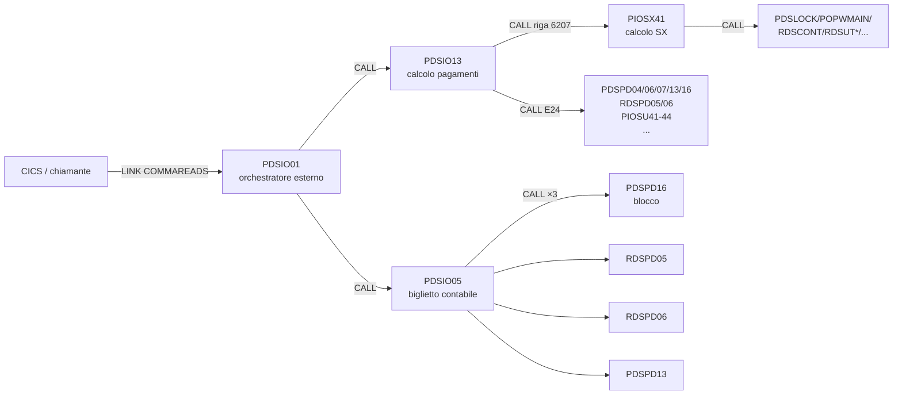

# STEP 3 — Estrazione regole e gap analysis TYGP ↔ TISC

> Estrazione tematica consolidata dai 3 programmi COBOL analizzati:
> [Pseudo_PIOSX41.md](Pseudo_PIOSX41.md), [Pseudo_PDSIO13.md](Pseudo_PDSIO13.md), [Pseudo_PDSIO05.md](Pseudo_PDSIO05.md).
>
> **Formato richiesto da [Istruzioni-TISM.md](Istruzioni-TISM.md)**: gap analysis testuale, NON documento finale. Da rivedere insieme prima di passare allo STEP 4 (`.docx`).
>
> **Convenzioni di codifica regole**:
> - `RE-xx` = eligibilità (chi è in scope)
> - `RC-xx` = calcolo (come si computa l'importo)
> - `RX-xx` = esclusione (chi/quando si esclude)
> - `RS-xx` = soglia (vincoli quantitativi/temporali)
> - `RD-xx` = dato/contabile (classificazione contabile, conti, voci)
> - `RO-xx` = operativa (orchestrazione, trigger, modalità di esecuzione)

---

## 1. Quadro funzionale TYGP vs TISC

Le due prestazioni sono entrambe **tirocini formativi con indennità**, ma si differenziano per **ente finanziatore**:

| Caratteristica | **TYGP** | **TISC** |
|----------------|----------|----------|
| Denominazione (commenti sorgente) | "Tirocinio PON Puglia, 2023" | "Tirocinio Inclusione Sociale Calabria" |
| Data introduzione nei programmi | 14/03/2025 (`PIOSX41`, `PDSIO13`, `PDSIO05`) | 06/05/2024 (`PIOSX41`, `PDSIO13`); 11/06/2024-21/06/2024 (`PDSIO05`) |
| Ente finanziatore | **Regione Puglia** (PON 2014-2020 / 2023) | **Fondo INPS** (DLGS 148/2015) |
| Categoria contabile (`EL-FINANZ-SX`) | `"R"` (Regionale) | `"F"` (Fondo) |
| Famiglia codici "cugini" | `TYGM` (Garanzia Giovani), `TYAD` (Apprendistato Duale), `TYRG`, `TYBL`, `TYCR` | `TISM` (Tirocinio Inclusione Sociale Molise) |
| Modello contabile | **Partita doppia**: debito v/percipiente + credito v/Regione | **Solo debito** v/percipiente |
| Voce contabile | "DEBITI INDENNITA TIROCINIO GIOVANI" + "CREDITO V/REGIONI INDENN. DI TIROCINIO" | "DEBITO AZIONI POL. ATTIVA DLGS 148/2015" |
| Conto Avere primario | `GPZ 11/195` | `GAU 10/281` |
| Periodo di validità | Non esplicitato nel commento sorgente (`PDSIO05` riga 32-34: solo "2023") | Implicito (presumibile chiusura 2025-2026 da contesto) |

> **Inferenza fondamentale di dominio**:
> *TYGP è una prestazione di **politica attiva regionale** (Regione Puglia), TISC è una prestazione di **politica attiva nazionale** (Fondo INPS ex DLGS 148/2015). Sono "cugini funzionali" (entrambi tirocini) ma "estranei contabili" (Regione vs Fondo).*

---

## 2. Entità dati

### 2.1 Tabelle DB2 lette/scritte (inferite dal codice)

| Tabella     | Programma     | Operazione | Scopo |
|-------------|---------------|------------|-------|
| `TDSSUSST`  | `PDSIO05`     | SELECT (`LEGGI-TAB` 8030-8035) | Letture stato sussidio (campo `H_SSTALFL2` su chiave `H_SSTCHIDOM`) |
| `TDSREPORT` | `PDSIO05`     | INSERT (`S30-INSERT-REPORT` 7595) | Audit report stampa biglietto |
| Cursore `E30-DB2-FETCH` | `PDSIO05` | FETCH | Pagamenti da elaborare (sorgente di `H-O0SXCODIND`, `H-O0SXREGIND`, `H-O0SXANNIND`, `H-O0SXIMINU`, etc.) |
| Cursore `I25-DB2-FETCH` | `PDSIO05` | FETCH | Categorie contabili (sorgente di `H-CODCTG`, `H-REGCTG`, `H-ANNOCTG`, `H-FINANZ`, `H-CONTO1`, `H-DESCTG`) — popola `EL-*` |
| `TDSPD13` / cursori in `PDSIO13` | `PDSIO13` | FETCH/SELECT | Calcoli pagamenti puntuali (dettaglio non analizzato) |
| Database CICS COMMAREA | tutti e 3 | LINK input/output | Comunicazione inter-programma |

### 2.2 Strutture dati chiave

#### `COMMAREADS` (Linkage Section)
Layout comune nei 3 programmi (con varianti per programma):

| Campo            | Tipo   | Uso TYGP/TISC                                                                |
|------------------|--------|------------------------------------------------------------------------------|
| `L-CODICE-SEDE`  | `9(04)`| Sede INPS di elaborazione |
| `L-NOME-SEDE`    | `x(22)`| Discriminante speciale: `"VALTOZAC"` → bypass `F00-FINALI` (`PDSIO05`) |
| `L-CODICE-STOP`  | `9(02)`| Codice struttura territoriale (Stop) |
| `L-PROCEDURA`    | `x(03)`| Procedura di calcolo |
| `L-TIPOCALCOLO`  | `x(01)`| `S` = simulazione; altri = produzione. Discriminante per ramo I39 in `PDSIO13` |
| `L-RICHIESTA`    | `x(01)`| `"R"` = ristampa: skippa `A10-AGGIORNA` |
| `L-RETCODE`      | `x`    | Input a `PDSIO05`: `N`=non eseguita, `C`=completata, `E`=errore |
| `L-DATAELABO`    | `9(08)`| Data di elaborazione |

#### Tabella di lavoro `EL-*(1..160)` in `PDSIO05`
Slot riservati per famiglia di finanziamento:

| Slot | Famiglia | Codici TYGP/TISC coinvolti |
|------|----------|-----------------------------|
| 1-154 | Categorie caricate dinamicamente da `I25-DB2-FETCH` | Tutte le categorie contabili attive |
| **155** | Debito Fondo (Avere) | **TISC**, TISM |
| **156** | Debito Regionale (Avere) | **TYGP**, TYGM, TYAD |
| 157  | Debito categoria `"E"` + OTHER (Avere) | — |
| 159  | Contropartita categoria `"E"` (Dare+Avere) | — |
| **160** | Credito v/Regioni (Dare+Avere) | **TYGP**, TYGM, TYAD |

#### Campi chiave del record pagamento
- `H-O0SXCODIND` (cod. indennità: TYGP, TISC, TISM, …)
- `H-O0SXREGIND` (cod. regione, es. `"195"`=Puglia, `"232"`=altra, `"281"`=Calabria…)
- `H-O0SXANNIND` (anno di competenza)
- `H-O0SXIMINU` (imponibile indennità — addendo primario di `WK-DEBITO`)
- `H-O0SXIMRINU` (imponibile rinuncia)
- `H-O0SXIRPEFU`, `H-O0SXADDIZR/C/RR/RC`, `H-O0SXCONG730/FIS`, `H-O0SXTRASIND` (trattenute)
- `H-O0SXIMANFU` (assegno nucleo familiare — genera partita doppia su slot 160 per TYGP)
- `H-O0RECIMURE1/2/3` (recuperi)

### 2.3 Convenzioni di naming

- **`H-O0*`** = host variable DB2 derivante dal copybook `O0` (probabilmente `TDSO0*` tabella pagamenti).
- **`L-*`** = campi Linkage (input COMMAREA).
- **`W-*`** / **`WK-*`** = campi di working storage / lavoro.
- **`EL-*`** = elementi della tabella biglietto contabile (160 slot).
- **`H-`** generico = host variable di una qualunque tabella DB2 letta.
- **`OUT-*`** = campi di output della COMMAREA (status, messaggio, procedura).
- **Sigla conto a 3 caratteri** (`EL-ALF-SX-*`): `GAU`=Gestione Azioni politica attiva Universali (Fondo); `GPZ`=Gestione Politiche attive Zonali/regionali; `GVR`=Gestione Vari Regionali.

---

## 3. Regole di business consolidate

### 3.1 Regole di **eligibilità** (RE-xx)

| ID    | Descrizione | Fonte (programma → paragrafo → riga) |
|-------|-------------|---------------------------------------|
| `RE-01` | **TYGP è elaborabile dai 3 programmi solo a partire dal 14/03/2025** (data introduzione nel sorgente). | `PIOSX41`, `PDSIO13`, `PDSIO05` header |
| `RE-02` | **TISC è elaborabile dal 06/05/2024** (`PIOSX41`/`PDSIO13`) e dal **11/06/2024** in `PDSIO05`. | header sorgenti |
| `RE-03` | TYGP appartiene alla **categoria contabile `EL-FINANZ-SX = "R"`** (tirocinio regionale) — discriminante derivato dalla tabella DB2 `I25-DB2-FETCH` campo `H-FINANZ`. | `PDSIO05` → `I05-AZZERO` riga 5768 |
| `RE-04` | TISC appartiene alla **categoria contabile `EL-FINANZ-SX = "F"`** (azione politica attiva Fondo). | `PDSIO05` → `I05-AZZERO` riga 5768 |
| `RE-05` | Un codice indennità rientra in TYGP/TISC ammissibile se trova match `EL-COD-SX(i)=H-O0SXCODIND AND EL-REG-SX(i)=H-O0SXREGIND AND EL-ANNO-SX(i)=H-O0SXANNIND` nella tabella `EL-*` (loop 1..160 in `E70-BIGSX`). | `PDSIO05` → `E70-BIGSX` 3433-3442 |

### 3.2 Regole di **calcolo** (RC-xx)

| ID    | Descrizione | Fonte |
|-------|-------------|-------|
| `RC-01` | **`WK-DEBITO` (debito al percipiente)** = `H-O0SXIMINU + H-O0SXIMRINU − H-O0SXIRPEFU − H-O0SXTRASIND − H-O0SXADDIZR − H-O0SXADDIZC − H-O0SXCONG730 − H-O0SXCONGFIS − H-O0SXADDIZRR − H-O0SXADDIZRC`. Vale **identicamente per TYGP e TISC**. | `PDSIO05` → `E70-BIGSX` 3419-3428 |
| `RC-02` | Se `H-O0RECIMURE3 > 0`, sottrarre ulteriormente: `WK-DEBITO = WK-DEBITO − H-O0RECIMURE3`. | `PDSIO05` → 3429-3431 |
| `RC-03` | **TISC (Fondo)**: `EL-IMP-SX-A(155) ← WK-DEBITO + H-O0SXIMANFU`. **Nessuna contropartita Dare** (no credito v/Regione). Le righe 159 e 160 vengono **azzerate** esplicitamente. | `PDSIO05` → `E71-BIGSX-CONTINUA` WHEN `"F"` 3795-3817 |
| `RC-04` | **TYGP (Regionale)**: `EL-IMP-SX-A(156) ← WK-DEBITO + H-O0SXIMANFU`. **Genera partita doppia su riga 160**: `EL-IMP-SX-D(160) = EL-IMP-SX-A(160) = H-O0SXIMANFU + H-O0SXIMINU + H-O0RECIMURE1` (credito v/Regione = anticipo INPS rimborsato dalla Regione). | `PDSIO05` → WHEN `"R"` 3818-3852 |
| `RC-05` | TYGP è raggruppato nello stesso `IF` di `TYGM` e `TYAD` (medesima voce contabile, medesimi conti). | `PDSIO05` → 3833-3852 |
| `RC-06` | TISC è raggruppato nello stesso `IF` di `TISM` (medesima voce contabile, conto `GAU 10/281`). | `PDSIO05` → 3795-3796 |
| `RC-07` | **Trigger ricalcolo mese precedente (`B99`)**: per TYGP (e altri codici tirocinio regionali) il paragrafo `B99` di `PIOSX41` forza un ricalcolo dell'importo riferito al mese precedente. **TISC NON è in lista** → nessun ricalcolo retroattivo. | `PIOSX41` → `B99` (cfr. [Pseudo_PIOSX41.md](Pseudo_PIOSX41.md) §6) |

### 3.3 Regole di **esclusione** (RX-xx)

| ID    | Descrizione | Fonte |
|-------|-------------|-------|
| `RX-01` | Se `L-NOME-SEDE = "VALTOZAC"`, **bypass totale** di `F00-FINALI` in `PDSIO05`: nessuna stampa, nessun aggiornamento `OUT-STATUS`/`OUT-MESSAGGIO`, nessuna scrittura `COMMAREADS-OUT`. Vale per qualunque codice (TYGP/TISC compresi). | `PDSIO05` → `F00-FINALI` 5407-5409 |
| `RX-02` | Se `L-RICHIESTA = "R"` (ristampa), `A10-AGGIORNA` esce immediatamente: il riepilogo NON viene riaggiornato. Vale per qualunque codice. | `PDSIO05` → `A10-AGGIORNA` 2024-2026 |
| `RX-03` | Se `W-ERRORE = "S"`, `C00-CENTRALI` salta a `C00-EX`: nessuna elaborazione né stampa. | `PDSIO05` → `C00-CENTRALI` 2509-2512 |
| `RX-04` | **TISC è ESCLUSO dalla lista `I39-DSPF-M9` in `PDSIO13`** (riga 8925, ramo "tirocinio regionale in simulazione"). TYGP è incluso. Comportamento by-design (TISC = Fondo, non regionale) — vedi `PA-29 PDSIO13` riclassificato come "non bug" in [Pseudo_PDSIO05.md](Pseudo_PDSIO05.md) §18. | `PDSIO13` → `I39-DSPF-M9` riga 8925 |
| `RX-05` | TYGP e TISC sono **entrambi inclusi** nella lista `E20` di `PDSIO13` (riga 2819, ramo elaborazione standard). | `PDSIO13` → `E20-ELABORA20` riga 2819 |

### 3.4 Regole di **soglia / vincoli quantitativi** (RS-xx)

| ID    | Descrizione | Fonte |
|-------|-------------|-------|
| `RS-01` | Loop `IND-SX` su `EL-*` limitato a **160 elementi**. Match → forza `IND-SX = 160` per uscita anticipata (single-match). | `PDSIO05` → `E70-BIGSX` 3433-3442 |
| `RS-02` | Slot 155-160 sono **slot riservati** (vedi §2.2): non sono caricabili dalla tabella categorie ma scritti solo da `E71-BIGSX-CONTINUA`. | `PDSIO05` schema slot |
| `RS-03` | `OUT-STATUS = '91'` (squadratura biglietto) emesso se la somma Avere ≠ somma Dare. Vale per qualunque codice; rilevante per TYGP perché la partita doppia richiede equilibrio Dare/Avere su slot 160. | `PDSIO05` → `F00-FINALI` 5418 |

### 3.5 Regole **contabili/dato** (RD-xx)

| ID    | Descrizione | Fonte |
|-------|-------------|-------|
| `RD-01` | **TISC** → voce *"DEBITO AZIONI POL. ATTIVA DLGS 148/2015"*, sigla `GAU`, conto Avere `10/281`. Nessun conto Dare specifico (azzerati slot 159/160). | `PDSIO05` 3795-3817 |
| `RD-02` | **TYGP** → voce primaria *"DEBITI INDENNITA TIROCINIO GIOVANI"*, sigla `GPZ`, conto Avere `11/195` (slot 156). | `PDSIO05` 3833-3852 |
| `RD-03` | **TYGP** → voce secondaria *"CREDITO V/REGIONI INDENN. DI TIROCINIO"*, sigla `GPZ`, conto Avere `25/195` (slot 160). | `PDSIO05` 3842-3847 |
| `RD-04` | **TYGP** → contropartita Dare slot 160: sigla `GPZ`, conto `00/195`. | `PDSIO05` 3848-3851 |
| `RD-05` | Codice regione `"195"` identifica **Puglia**; `"232"` identifica una regione differente (verosimilmente Lazio o Sardegna — `TYRG`); `"281"` identifica **Calabria** (presente nel conto TISC ma non come codice regione di filiale). | inferenza incrociata |
| `RD-06` | `EL-FINANZ-SX(i)` è popolato da `H-FINANZ` letto dalla tabella categorie via `I25-DB2-FETCH` (`PDSIO05` `I05-AZZERO` riga 5768). È un **attributo persistente di configurazione**, non una scelta del programma. | `PDSIO05` 5763-5786 |
| `RD-07` | Codici categoria contabile valorizzati per il soggetto solo se la regione del soggetto matcha una delle 5 regioni configurate `H-REGIONE1..5` (filtro multi-regione). | `PDSIO05` 5755-5762 |

### 3.6 Regole **operative/orchestrazione** (RO-xx)

| ID    | Descrizione | Fonte |
|-------|-------------|-------|
| `RO-01` | `PDSIO05` è invocato in modalità **CICS LINK** dal programma chiamante (`PDSIO01` o equivalente), passando `COMMAREADS`. Modalità online/batch dipende dal contesto chiamante. | `PDSIO05` → `PROCEDURE DIVISION USING COMMAREADS` |
| `RO-02` | Discriminante operativo `L-RETCODE` in `PDSIO05`: `"N"`=calcolo (loop `E00`); `"C"`=stampa biglietto + aggiorna riepilogo; `"E"`/altro=ristampa solo se `H-PZEROPAGAM="S"`. | `PDSIO05` → `C00-CENTRALI` 2508-2549 |
| `RO-03` | In `PDSIO13` la `CALL PIOSX41` riga 6207 è il ramo "standard TYGP/TISC" (entrambi le prestazioni invocano questo punto). | `PDSIO13` → E24 hub principale |
| `RO-04` | `PDSIO05` chiama 6 sotto-programmi: `PDSPD16` (×3, blocchi), `RDSPD05`, `RDSPD06`, `PDSPD13` — **nessuna CALL a `PIOSX41` o `PDSIO13`**. È un programma "foglia" della catena contabile. | `PDSIO05` CALL map |
| `RO-05` | Codici di ritorno `OUT-STATUS` standardizzati: `'00'`=ok, `'91'`=squadratura, `'96'`=errore funzionale, `'99'`=errore tecnico ereditato dai sotto-programmi. | `PDSIO05` → `F00-FINALI` |
| `RO-06` | Nessun `COMMIT` esplicito né `ROLLBACK` esplicito nel codice di `PDSIO05`: la transazione DB2 è gestita dal contenitore CICS / dal chiamante. | `PDSIO05` |

---

## 4. Dipendenze (catena di chiamate inter-programma)

### 4.1 Diagramma sintetico

### 4.2 Tabella CALL (in uscita)

| Programma | Sotto-programma | Frequenza | Scopo |
|-----------|-----------------|-----------|-------|
| `PIOSX41` | numerose (vedi [Pseudo_PIOSX41.md](Pseudo_PIOSX41.md) §7) | varia | Calcolo SX, sussidi, lock |
| `PDSIO13` | `PIOSX41` (×3: righe 6185, 6199, **6207**) | 3 | Calcoli SX condizionati a `W-SXCOVID19`/`L-TIPOCALCOLO`/`W-NIK`. Riga **6207 = ramo TYGP/TISC standard** |
| `PDSIO13` | `RDSUT28` | varia | Sostituto/utility (presenza in liste divergenti TYGP vs TISC, vedi `RX-04`) |
| `PDSIO13` | molti altri (`PDSPD04/06/07/13/16`, `RDSPD05/06`, `PIOSU41-44`, `PIOLP41`, `RDSCONT`, `RDSIO12/13`, `PDSIO21`, etc.) | varia | Calcoli specifici |
| `PDSIO05` | `PDSPD16` | 3 (righe 2446, 6349, 6380) | Gestione blocco struttura |
| `PDSIO05` | `RDSPD05` | 1 (riga 2490) | Servizio ausiliario |
| `PDSIO05` | `RDSPD06` | 1 (riga 2591) | Servizio ausiliario |
| `PDSIO05` | `PDSPD13` | 1 (riga 5617) | Servizio di finalizzazione |

### 4.3 CALL in entrata (chi chiama i 3 programmi)

| Programma chiamato | Chiamante presunto | Note |
|--------------------|---------------------|------|
| `PIOSX41`          | `PDSIO13` (3 CALL confermate) + presumibilmente altri programmi del ramo "biglietto contabile" e "telematico" | Non analizzato il chiamante diretto via CICS |
| `PDSIO13`          | `PDSIO01` (orchestratore presunto) o direttamente CICS via transazione utente | Da confermare |
| `PDSIO05`          | `PDSIO01` (orchestratore) o transazione CICS di stampa biglietto | Da confermare |

### 4.4 Sotto-programmi black-box (interfacce non esaminate)

Per la riscrittura su nuova piattaforma, i seguenti sotto-programmi sono **contratti opachi** da documentare separatamente:

- `PDSPD04`, `PDSPD06`, `PDSPD07`, `PDSPD13`, `PDSPD16` (famiglia gestionale pagamenti)
- `RDSPD05`, `RDSPD06` (servizi calcolo recupero)
- `RDSUT11`, `RDSUT14`, `RDSUT27`, `RDSUT28` (utility recupero)
- `PIOSU41`, `PIOSU42`, `PIOSU43`, `PIOSU44` (servizi SX) e `PIOLP41` (LPU)
- `RDSCONT` (controlli)
- `RDSIO12`, `RDSIO13`, `PDSIO21` (I/O DB2)
- `RDSSX41`, `PDSLOCK`, `POPWMAIN` (lock/sessione)
- `PITIBAN2`, `PNBTBLC2`, `PNBTCFIB` (anagrafiche bancarie/fiscali)
- `PNPGF8E`, `PNPGF110`, `POPCF61`, `RPNPERR` (servizi accessori)

---

## 5. Aspetti operativi

### 5.1 Codici di ritorno

| Programma | Canale | Valori                                                | Note |
|-----------|--------|--------------------------------------------------------|------|
| `PIOSX41` | `OC-RETCODE` | 0, 11-20, 22, 24 (vedi [Pseudo_PIOSX41.md](Pseudo_PIOSX41.md) §4) | Codici granulari (catalogo 13 valori) |
| `PDSIO13` | `OC-RETCODE` (+ `OUT-STATUS` 00/96/99) | OC-RETCODE = 98 + OUT-STATUS catalogo standard | Compatibilità con catena `OC-*` |
| `PDSIO05` | **`OUT-STATUS`** (no `OC-RETCODE`) | `'00'` ok / `'91'` squadratura / `'96'` errore funzionale / `'99'` errore tecnico | Convenzione semplificata |

> **Incoerenza di convenzione tra i 3 programmi**: `PIOSX41` e `PDSIO13` usano `OC-RETCODE` con granularità diversa; `PDSIO05` ignora `OC-RETCODE` e usa solo `OUT-STATUS`. Da uniformare nella riscrittura.

### 5.2 Gestione errori

- `PIOSX41`: errori catalogati in 13 valori `OC-RETCODE`; ogni ramo decisionale assegna un valore specifico.
- `PDSIO13`: `OC-RETCODE = 98` come "errore generico"; testi `T*` impostano `OUT-STATUS = '96'`.
- `PDSIO05`: errori funzionali via `OUT-STATUS = '96'` (9 testi `T*`); errore squadratura specifico `'91'`; errori tecnici `'99'` ereditati da sotto-programmi.
- `W-ERRORE = "S"` è il flag interno che esprime "errore di squadratura biglietto" in `PDSIO05`; impostato in `E30-TOTALIZZA` (verificare in STEP 4).

### 5.3 Transazionalità

- Nessun `COMMIT` né `ROLLBACK` esplicito nei 3 programmi.
- DB2 in modalità `WITH UR` (Uncommitted Read) almeno in `LEGGI-TAB` di `PDSIO05` (riga 8034) → letture "sporche" tollerate per ridurre lock.
- INSERT in `TDSREPORT` (`S30-INSERT-REPORT`) eseguito senza commit esplicito: la transazione è gestita dal contenitore CICS.

### 5.4 Modalità di esecuzione

- **Online (CICS)** per i 3 programmi: `PROCEDURE DIVISION USING COMMAREADS` indica `CICS LINK`.
- **Batch**: non evidenziato direttamente; possibile invocazione tramite TS COBOL job che simula la transazione.
- Output: aree DSPF (TEST{ASU,LPU,SX}-O) per visualizzazione + INSERT report DB2 per archiviazione.

### 5.5 Tracciamenti

- `S30-INSERT-REPORT` (`PDSIO05` 7595) inserisce righe di audit in `TDSREPORT`.
- `WABNDB-LABEL` / `WABNDB-TABL` / `WABNDB-FUNC` valorizzati per *abend diagnostics* (es. `LEGGI-TAB`).
- `DISPLAY` di emergenza su SQLCODE ≠ 0 (`PDSIO05` riga 8039).

---

## 6. Ambiguità e questioni aperte (PA-XX rielaborati come domande funzionali)

Sintesi consolidata dei PA-XX sopravvissuti dai 3 file di pseudocodifica, riformulati come **domande funzionali per i business owner** (non più tecniche).

### 6.1 Domande sulla classificazione contabile TYGP/TISC

| ID | Domanda | Origine |
|----|---------|---------|
| `Q-01` | **Conferma classificazione TYGP**: TYGP è effettivamente un "tirocinio finanziato dalla Regione Puglia con anticipo INPS e rivalsa contabile" e quindi correttamente raggruppato con TYGM/TYAD/TYRG nel ramo `WHEN "R"`? | `PDSIO05` §17 |
| `Q-02` | **Conferma classificazione TISC**: TISC è effettivamente un'"azione di politica attiva ex DLGS 148/2015 finanziata direttamente dal Fondo INPS, senza rivalsa regionale" e quindi correttamente raggruppato con TISM nel ramo `WHEN "F"`? | `PDSIO05` §17 |
| `Q-03` | **Periodo di validità TYGP**: il commento sorgente (`PDSIO05` riga 32-34) cita "Tirocinio PON Puglia 2023" senza data fine. La gestione è "a regime" (continuativa) o ha scadenza nota (es. fine 2026 con chiusura PON)? | `PA-29 PDSIO05` |
| `Q-04` | **Periodo di validità TISC**: TISC è ancora attivo nel 2026 o è in fase di chiusura? | header sorgenti |

### 6.2 Domande sull'integrità del modello contabile

| ID | Domanda | Origine |
|----|---------|---------|
| `Q-05` | **Doppio `IF SSEP` in `PDSIO05` WHEN "R"** (righe 3829 e 4146): è un bug latente di duplicazione (gli importi vengono sommati due volte) o sono due punti distinti con effetti su slot diversi? Verificare l'impatto contabile. | `PA-28 PDSIO05` |
| `Q-06` | **Categoria `EL-FINANZ-SX = "E"`**: esiste un elenco dei codici indennità di categoria "E" attualmente attivi? Quali Estero/Esoneri? Necessario per la migrazione. | `PA-03 PDSIO05` |
| `Q-07` | **Catch-all `WHEN OTHER`**: la categoria "default" è effettivamente raggiungibile? In quali casi `EL-FINANZ-SX(i)` può valere SPACES o un valore non previsto? Rischia squadrature `'91'`. | `PA-04 PDSIO05` |
| `Q-08` | **Sede `"VALTOZAC"`**: è un ambiente di test ancora utilizzato? Se sì, mantenere il bypass; altrimenti rimuovere come dead code. | `PA-27 PDSIO05` |

### 6.3 Domande sulla coerenza tra programmi

| ID | Domanda | Origine |
|----|---------|---------|
| `Q-09` | **Lista `I39-DSPF-M9` in `PDSIO13`** (riga 8925) include TYGP ma NON TISC. La presenza/assenza è intenzionale (TYGP regionale vs TISC nazionale) o accidentale? Inizialmente ipotizzato bug latente, riclassificato come "by-design" in STEP 2 di `PDSIO05`. **Validazione finale richiesta**. | `PA-29 PDSIO13` |
| `Q-10` | **Trigger B99 in `PIOSX41`**: il ricalcolo retroattivo al mese precedente per TYGP (ma non TISC) è la regola voluta? Caso d'uso tipico? | `PIOSX41` §6 |
| `Q-11` | **Convenzione `OC-RETCODE` vs `OUT-STATUS`**: i 3 programmi usano canali di ritorno diversi (`PIOSX41`/`PDSIO13` → `OC-RETCODE`; `PDSIO05` → solo `OUT-STATUS`). È accettabile nel TO-BE o va uniformata? | trasversale |

### 6.4 Domande sull'integrazione con sotto-programmi

| ID | Domanda | Origine |
|----|---------|---------|
| `Q-12` | **Contratto `PDSPD16` (blocco struttura)**: input/output e modalità di gestione del lock — necessari per replicare il comportamento concorrente. | `PA-24 PDSIO05` |
| `Q-13` | **Contratto `RDSUT28`** (utility recupero presente in liste divergenti TYGP/TISC di `PDSIO13`): cosa fa esattamente? Perché incluso nel ramo I39 solo per TYGP? | `PA-29 PDSIO13` |
| `Q-14` | **`PIOSX41` chiamato 3 volte da `PDSIO13`** (righe 6185, 6199, 6207) con discriminanti diversi (`W-SXCOVID19`, `L-TIPOCALCOLO`, `W-NIK`): mappare casi d'uso completi per ciascun punto di CALL. | `PDSIO13` §7 |

### 6.5 Domande sui dati mancanti / da mappare

| ID | Domanda | Origine |
|----|---------|---------|
| `Q-15` | **Tabella DB2 categorie contabili** letta da `I25-DB2-FETCH` (sorgente di `H-CODCTG`, `H-FINANZ`, `H-CONTO1`, etc.): quale tabella esattamente? Quale schema? | `PA-23 PDSIO05` |
| `Q-16` | **Mapping completo campi `H-O0SX*`** del record pagamento (DB2 `TDSO0*`?): copybook `O0` da fornire per dettagliare i 10 addendi di `WK-DEBITO` (`RC-01`). | `PA-10 PDSIO05` |
| `Q-17` | **`H-O0RECIMURE1/2/3`** (recuperi): semantica funzionale di RE1 vs RE2 (solo SSEP) vs RE3 (sottratto da WK-DEBITO)? | `PA-11 PDSIO05` |
| `Q-18` | **`H-PZEROPAGAM`**: chi/quando lo valorizza? È in COMMAREA in input o calcolato in `I00-INIZIALI`/`K30-CHK-RISTAMPE`? | `PA-16 PDSIO05` |

### 6.6 Domande sull'evoluzione del sistema

| ID | Domanda | Origine |
|----|---------|---------|
| `Q-19` | **Nuove gestioni 2025-2026** (`TGOV`, `TGOS`, `TGOP`, `TIRA`, `PIAC`) introdotte negli stessi punti di TYGP: pattern coerente che suggerisce un'astrazione tabellare (configurazione vs hard-coding). **Opportunità di refactoring TO-BE**. | header `PDSIO05` |
| `Q-20` | **Schema slot riservato 155/156/157/159/160** in `EL-*`: regola convenzionale a rischio di rottura se nuove categorie richiedessero slot aggiuntivi. Documentare e parametrizzare nel TO-BE? | `PDSIO05` §14 STEP 2 |

---

## 7. Sintesi narrativa — perché TYGP e TISC vanno trattati separatamente

> **Riassunto in 3 paragrafi per i business owner (preparatorio al cap. 2 del `.docx`):**

**1) Stessa famiglia di prestazione, diverso ente finanziatore.** TYGP (Tirocinio PON Puglia 2023) e TISC (Tirocinio Inclusione Sociale Calabria) sono entrambi tirocini formativi con indennità erogata dall'INPS al percipiente. Tuttavia, l'ente che **finanzia** la prestazione è diverso: la **Regione Puglia** per TYGP (nel quadro del Programma Operativo Regionale / PON 2014-2020), il **Fondo INPS ex DLGS 148/2015** per TISC (azione di politica attiva nazionale).

**2) Conseguenza contabile: partita doppia vs partita semplice.** Per TYGP, l'INPS opera come **anticipatore** della Regione Puglia: scrive un debito v/percipiente (l'indennità che paga) e contemporaneamente un **credito v/Regione** (importo che dovrà essere rimborsato). Per TISC, il Fondo INPS finanzia direttamente: si scrive solo il debito v/percipiente, nessun credito v/Regione. Questa è la ragione per cui i programmi attivano **rami di codice diversi** (`WHEN "R"` per TYGP, `WHEN "F"` per TISC nel `EVALUATE` di `PDSIO05.E71-BIGSX-CONTINUA`) e producono **registrazioni su slot diversi** della tabella biglietto.

**3) Conseguenza operativa: ricalcolo retroattivo solo per TYGP.** In `PIOSX41` (paragrafo `B99`) viene attivato un ricalcolo dell'importo al mese precedente per tutta la famiglia dei tirocini regionali (TYGP incluso), perché variazioni anagrafiche sulla Regione potrebbero richiedere riemissione del credito v/Regione. Per TISC, finanziato a livello nazionale, questo non si verifica: lo storico non viene riallineato retroattivamente.

> Le **3 divergenze osservate** nei 3 programmi (`PIOSX41 B99`, `PDSIO13 I39-DSPF-M9`, `PDSIO05 EVALUATE EL-FINANZ-SX`) sono **manifestazioni coerenti** della medesima classificazione di dominio. Non sono bug, ma rispecchiano la natura amministrativa delle 2 prestazioni.

---

## Note di metodo (STEP 3)

- Output prodotto come **gap analysis testuale** secondo metodologia di [Istruzioni-TISM.md](Istruzioni-TISM.md) §STEP 3.
- 27 regole di business identificate (5 RE + 7 RC + 5 RX + 3 RS + 7 RD + 6 RO) e classificate per tipo.
- 20 domande funzionali rimaste aperte, organizzate in 6 cluster tematici per i business owner.
- 2 catene di dipendenze documentate (Mermaid + tabelle CALL in/out + black-box).
- **Fermarsi qui per validazione utente** prima di procedere allo STEP 4 (`.docx` finale stile Sirio/INPS).
- Per lo STEP 4, mapping pseudocodifica → capitoli `.docx`:
  - Cap. 2 (quadro generale) ← §7 + §1
  - Cap. 3 (input/trigger) ← §2.2 COMMAREADS + §5.4 modalità
  - Cap. 4 (flusso AS-IS) ← diagrammi Mermaid di [Pseudo_PIOSX41.md](Pseudo_PIOSX41.md), [Pseudo_PDSIO13.md](Pseudo_PDSIO13.md), [Pseudo_PDSIO05.md](Pseudo_PDSIO05.md)
  - Cap. 5 (modello dati) ← §2
  - Cap. 6 (regole business) ← §3 (RE/RC/RX/RS/RD/RO)
  - Cap. 7 (dipendenze) ← §4
  - Cap. 8 (operativi) ← §5
  - Cap. 9 (TO-BE) ← `Q-11` (uniformare retcode), `Q-19`-`Q-20` (refactoring tabellare slot)
  - App. A ← §6 (Q-01 ÷ Q-20)
